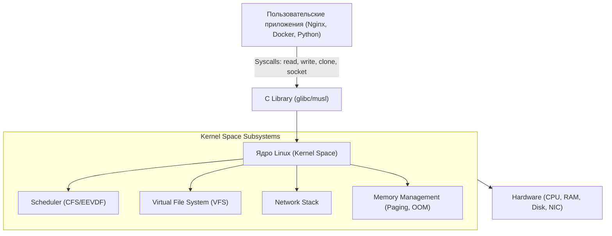
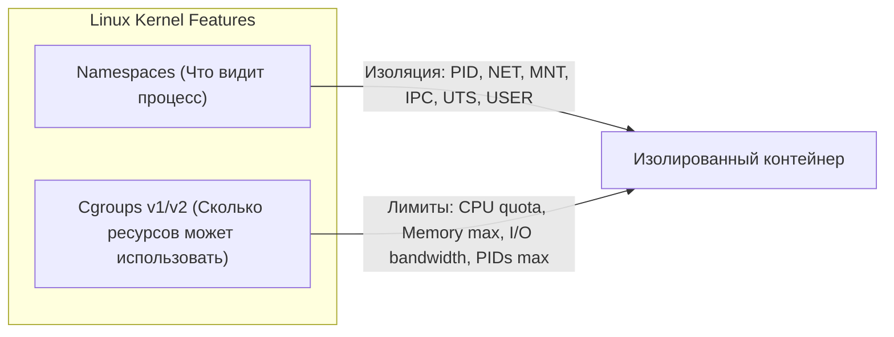

# 🐧 01. Ядро Linux, Процессы, Память и Systemd

## 🧠 Архитектура ОС и уровни абстракции

Linux разделен на два основных пространства памяти:
- **Kernel Space (Пространство ядра):** Неограниченный доступ к памяти и аппаратному обеспечению (Ring 0). Здесь работают планировщик процессов, стек TCP/IP, драйверы устройств.
- **User Space (Пользовательское пространство):** Изолированная среда выполнения пользовательских программ (Ring 3). Взаимодействие с ядром происходит исключительно через **Системные вызовы (System Calls / Syscalls)**.



---

## ⚙️ Управление процессами и жизненный цикл

### 1. Состояния процессов (Process States)
- `R (Running/Runnable)` — выполняется или готов к выполнению.
- `S (Interruptible Sleep)` — ждет события (сигнала, таймера, ввода/вывода).
- `D (Uninterruptible Sleep)` — ожидает ответа от диска/сети. Процесс нельзя убить даже `kill -9` до завершения I/O.
- `Z (Zombie)` — завершил работу, но родительский процесс еще не прочитал код возврата через `wait()`.
- `T (Stopped/Traced)` — остановлен сигналом (`SIGSTOP`, `Ctrl+Z`) или отладчиком (`gdb`/`strace`).

### 2. POSIX-сигналы (Критически важно для контейнеров и graceful shutdown)
| Сигнал | Код | Поведение | Обработка приложением |
| :--- | :--- | :--- | :--- |
| `SIGHUP` | 1 | Перезагрузка конфигурации | Перехватывается (Reload) |
| `SIGINT` | 2 | Прерывание с клавиатуры (`Ctrl+C`) | Перехватывается |
| `SIGQUIT` | 3 | Завершение с генерацией Core Dump | Перехватывается |
| `SIGKILL` | 9 | Мгновенное принудительное уничтожение ядра | **Не перехватывается и не блокируется** |
| `SIGTERM` | 15 | Запрос на штатное завершение (Default) | Перехватывается (Graceful Shutdown) |
| `SIGCHLD` | 17 | Уведомление родителю о завершении потомка | Перехватывается |

### 3. Cheat Sheet: Диагностика процессов
```bash
# Дерево процессов с PID и аргументами
ps auxf

# Топ процессов по потреблению памяти
ps aux --sort=-%mem | head -n 10

# Топ процессов по CPU
ps aux --sort=-%cpu | head -n 10

# Поиск зависших процессов в состоянии D (Uninterruptible Sleep)
ps -eo state,pid,cmd | grep "^D"

# Трассировка системных вызовов работающего процесса
strace -p <PID> -f -e trace=network,file -s 256

# Трассировка с замером времени выполнения каждого системного вызова
strace -c -p <PID>
```

---

## 💾 Память: Архитектура, Swap и OOM-Killer

### 1. Как распределяется память
- **Virtual Memory:** Выделенное процессу виртуальное адресное пространство.
- **Resident Set Size (RSS):** Физическая оперативная память, занятая процессом в данный момент (без учета выгруженного в Swap).
- **Page Cache / Buffers:** Неиспользуемая процессами RAM, которую ядро отдает под кэширование файлов с диска для ускорения чтения. При нехватке памяти ядро автоматически сбрасывает кэш.

### 2. OOM-Killer (Out of Memory Killer)
Когда в системе заканчивается физическая RAM и Swap, ядро активирует механизм OOM-Killer. Он вычисляет `oom_score` для каждого процесса:
$$\text{oom\_score} = \text{Badness Function}(\% \text{RAM}, \text{RunTime}, \text{oom\_score\_adj})$$

```bash
# Просмотр OOM Score конкретного процесса
cat /proc/<PID>/oom_score

# Логи срабатывания OOM Killer
dmesg -T | grep -i -E "oom|out of memory|killed process"
journalctl -k | grep -i "killed process"
```

---

## 🎛️ Systemd: Архитектура юнитов и управление сервисами

### 1. Шаблон Production-ready Systemd Unit
Создаем сервис: `/etc/systemd/system/myapp.service`

```ini
[Unit]
Description=Production Go Web Application
Documentation=https://wiki.company.internal/apps/myapp
After=network.target network-online.target
Wants=network-online.target

[Service]
Type=simple
User=appuser
Group=appuser
WorkingDirectory=/opt/myapp
EnvironmentFile=/etc/myapp/app.env
ExecStart=/opt/myapp/bin/server --config=/etc/myapp/config.yaml
ExecReload=/bin/kill -HUP $MAINPID
Restart=on-failure
RestartSec=5s

# Защита и лимиты безопасности (Security Hardening)
LimitNOFILE=65535
LimitNPROC=4096
PrivateTmp=true
ProtectSystem=full
ProtectHome=true
NoNewPrivileges=true

[Install]
WantedBy=multi-user.target
```

### 2. Управление сервисами (systemctl & journalctl)
```bash
# Перечитать файлы юнитов после изменения
sudo systemctl daemon-reload

# Включить автозапуск и сразу стартовать
sudo systemctl enable --now myapp.service

# Просмотр логов сервиса в реальном времени с форматированием
journalctl -u myapp.service -f -o cat

# Логи за последние 30 минут с фильтром по уровню ошибок
journalctl -u myapp.service --since "30 min ago" -p err..emerg

# Проверка времени загрузки системы (анализ узких мест)
systemd-analyze blame
systemd-analyze critical-chain
```

---

## 📦 Namespaces и Cgroups: Основа контейнеризации

Контейнеры в Linux — это не виртуальные машины, а обычные процессы, изолированные с помощью двух механизмов ядра:



| Механизм | Тип | Назначение |
| :--- | :--- | :--- |
| **Namespaces** | `pid` | Изоляция дерева процессов (внутри контейнера процесс видит себя как PID 1). |
| | `net` | Собственные сетевые интерфейсы, IP-адреса, таблицы маршрутизации и iptables. |
| | `mnt` | Собственная корневая файловая система (mount points). |
| | `ipc` | Изоляция межпроцессного взаимодействия (Shared Memory, Semaphores). |
| | `uts` | Собственный Hostname и доменное имя. |
| | `user` | Маппинг UID/GID (root внутри контейнера = non-root на хосте). |
| **Cgroups (v2)** | `cpu.max` | Ограничение квантов процессорного времени (CPU Quota / Throttling). |
| | `memory.max` | Жесткий лимит оперативной памяти (Hard Limit). |
| | `pids.max` | Защита от fork-бомб (ограничение количества процессов/тредов). |

---

## 🔬 Deep Dive: что происходит при `kill -9` и почему это опасно

1. Ядро отправляет сигнал `SIGKILL`, который **невозможно перехватить** — обработчиков не существует.
2. Процесс не выполняет очистку: временные файлы остаются, PID-файлы протухают, TCP-сокеты обрываются без `FIN`.
3. Для СУБД это риск потери транзакций (WAL не зафлашен), для очередей — дубликаты сообщений.
4. Поэтому все production-юниты должны ловить `SIGTERM` и делать graceful shutdown c таймаутом < `TimeoutStopSec`.

### Тайминг graceful shutdown в systemd

| Параметр | Дефолт | Рекомендация |
| :--- | :--- | :--- |
| `TimeoutStopSec` | 90s | = вашему максимальному времени завершения запросов |
| `KillMode` | control-group | оставлять (убивает всю группу процессов) |
| `Restart` | no | `on-failure` + `StartLimitBurst` для защиты от шторма рестартов |

## 🔥 cgroups v2 vs v1: что изменилось на практике

| Аспект | v1 | v2 |
| :--- | :--- | :--- |
| Иерархия | несколько параллельных деревьев | единое дерево `/sys/fs/cgroup` |
| Memory pressure | только OOM kill | `memory.pressure` (PSI) — предиктивные алерты |
| Делегирование | root-only | безопасная делегация юзерским юнитам |
| K8s поддержка | legacy | обязательна для `QoS` корректных эвикций |

```bash
# PSI: как давно процессы ждут память/CPU/IO (ядро ≥ 4.20)
cat /proc/pressure/memory /proc/pressure/cpu /proc/pressure/io

# Куда реально ушла память процесса (RSS map)
pmap -x $(pidof myapp) | sort -k3 -n | tail
```

---

<!-- enriched:v1 -->

## 🧨 Типовые грабли Production

| Симптом | Причина | Быстрое решение |
| :--- | :--- | :--- |
| «Работало вчера» после обновления | Дрейф конфигурации вне Git | `git diff` по инфра-репозиторию + `drift detection` |
| Падение под нагрузкой без ошибок в логах | Исчерпание лимитов (`ulimit`, conntrack, fds) | `dmesg -T \| grep -i denied`, `conntrack -S` |
| Медленный деплой | Отсутствие кэша слоев/артефактов | Включить layer cache, артефакт-репозиторий |
| «Плавающие» 502 раз в сутки | Health-check гонки при rolling update | `preStop sleep` + корректный `readinessProbe` |

!!! warning "Правило пяти почему"
    Каждый инцидент заканчивается не фиксом, а **post-mortem** с 5×Why и action items в бэклоге. Иначе грабли возвращаются через квартал — но уже в пятницу вечером.

## 🧪 Hands-on Lab (15 минут)

```bash
# 1. Воспроизведите проблему из таблицы выше на стенде (kind/k3d/VirtualBox)
# 2. Соберите диагностику одной командой:
systemd-analyze critical-chain myapp.service && \
journalctl -u myapp.service --since -1h -p err --no-pager && \
ps -eo pid,ppid,state,rss,%cpu,cmd --sort=-rss | head -15
# 3. Зафиксируйте вывод в post-mortem шаблон:
#    Что случилось / Когда заметили / Root cause / Fix / Prevention
```

## ✅ Чек-лист зрелости темы

- [ ] Конфигурации версионируются в Git, ручные правки на проде запрещены
- [ ] Есть мониторинг именно этой подсистемы (не только CPU/RAM)
- [ ] Задокументирован runbook на типовые отказы (кто/что/как)
- [ ] Проведено хотя бы одно учение Chaos/GameDay по теме
- [ ] Лимиты ресурсов и квоты осознаны, а не «дефолт из туториала»
