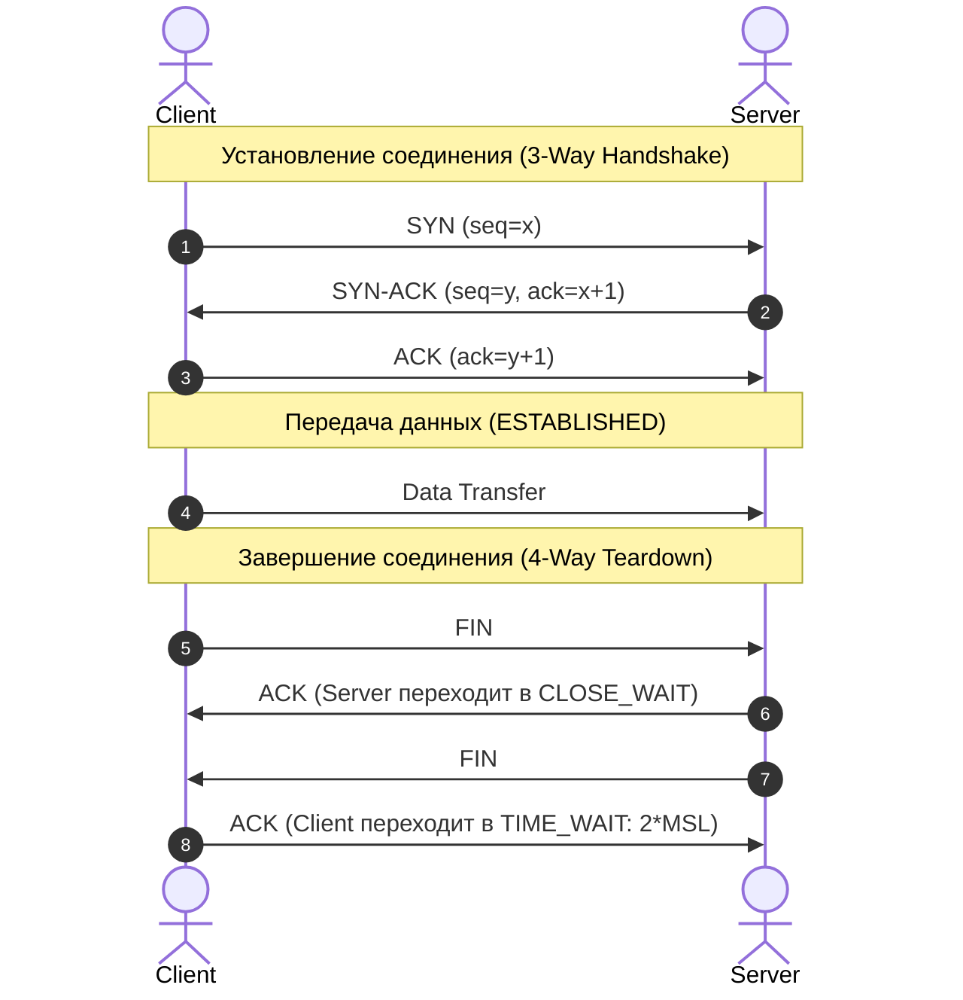
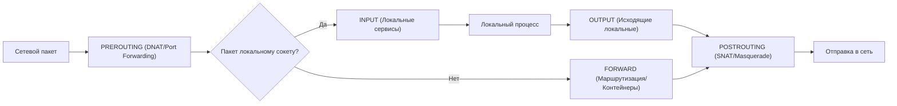

# 🌐 02. Сетевой стек, Диагностика, Файрволы и SSH

## 📡 Сетевой стек и состояния сокетов TCP

### 1. Жизненный цикл TCP соединения (3-Way Handshake и Закрытие)



### 2. Ключевые состояния сокетов и частые проблемы
- **`LISTEN`:** Сервер готов принимать входящие подключения.
- **`ESTABLISHED`:** Соединение активно, идет обмен пакетами.
- **`TIME_WAIT`:** Соединение закрыто клиентом. Сокет держится 60 секунд (2 * MSL) для защиты от запоздавших пакетов. *Много сокетов в `TIME_WAIT`?* Проверьте `sysctl net.ipv4.tcp_tw_reuse`.
- **`CLOSE_WAIT`:** Удаленная сторона закрыла соединение, а локальное приложение **забыло вызвать `close()`**. Если растет `CLOSE_WAIT` — это баг в коде бэкенда (утечка сокетов).

---

## 🛠️ Набор сетевого траблшутинга (CLI Cheat Sheet)

### 1. Исследование сокетов (`ss` вместо устаревшего `netstat`)
```bash
# Все слушающие TCP и UDP порты с именами процессов
ss -tulnp

# Количество соединений по каждому состоянию
ss -ant | awk '{print $1}' | sort | uniq -c | sort -nr

# Поиск соединений с конкретным портом или IP
ss -tn dst 10.0.0.5:5432
```

### 2. Захват и анализ сетевых пакетов (`tcpdump`)
```bash
# Перехват трафика на интерфейсе eth0 по порту 80 с выводом ASCII
tcpdump -i eth0 -nn -A 'tcp port 80'

# Захват только SYN пакетов (попытки подключения)
tcpdump -i any -n "tcp[tcpflags] & (tcp-syn) != 0 and tcp[tcpflags] & (tcp-ack) == 0"

# Сохранение трафика в pcap-файл для анализа в Wireshark
tcpdump -i eth0 -w /tmp/traffic.pcap -s 0 port 443
```

### 3. Диагностика DNS, маршрутов и портов
```bash
# Подробная трассировка DNS запроса от корневых серверов
dig +trace api.company.com @8.8.8.8

# Проверка открытого TCP порта без telnet
nc -zv 192.168.1.100 443

# Трассировка сетевых задержек и потерь пакетов на каждом узле
mtr -rwzbc 100 1.1.1.1

# Замер времени ответа HTTP с детализацией таймингов (DNS, Connect, TLS, TTFB)
curl -w "\nDNS: %{time_namelookup}s\nConnect: %{time_connect}s\nTLS: %{time_appconnect}s\nTTFB: %{time_starttransfer}s\nTotal: %{time_total}s\n" -o /dev/null -s https://api.company.com
```

---

## 🔥 Файрволы: Netfilter, iptables и nftables

### 1. Архитектура цепочек Netfilter (Packet Flow)



### 2. Примеры правил iptables
```bash
# Просмотр правил с номерами строк и счетчиками пакетов
iptables -L -n -v --line-numbers
iptables -t nat -L -n -v

# Разрешить уже установленные соединения
iptables -A INPUT -m conntrack --ctstate ESTABLISHED,RELATED -j ACCEPT

# Разрешить входящий SSH (порт 22) только с доверенной подсети
iptables -A INPUT -p tcp -s 192.168.10.0/24 --dport 22 -j ACCEPT

# Настройка NAT (Masquerading) для выхода контейнеров/локальной сети в интернет
iptables -t nat -A POSTROUTING -o eth0 -j MASQUERADE

# Проброс порта (Port Forwarding / DNAT) с внешнего порта 80 на внутренний контейнер
iptables -t nat -A PREROUTING -p tcp -d 203.0.113.1 --dport 80 -j DNAT --to-destination 172.17.0.2:8080
```

---

## 🔑 SSH: Hardening, Config и Туннели

### 1. Безопасная конфигурация `/etc/ssh/sshd_config`
```ini
Port 2222                          # Смена дефолтного порта
PermitRootLogin no                 # Запрет входа root напрямую
PasswordAuthentication no          # Отключение паролей (только по SSH ключам)
PubkeyAuthentication yes
MaxAuthTries 3                     # Защита от брутфорса
ClientAliveInterval 300            # Отключение неактивных сессий
ClientAliveCountMax 2
AllowGroups devops-engineers       # Ограничение по системным группам
```

### 2. Клиентский конфиг `~/.ssh/config` (Удобство и Jump-хосты)
```ini
# Глобальные параметры для всех хостов
Host *
    ServerAliveInterval 60
    ServerAliveCountMax 3
    IdentitiesOnly yes

# Бастион-сервер (Jump Host)
Host bastion
    HostName bastion.prod.company.com
    User admin
    IdentityFile ~/.ssh/id_ed25519

# Доступ к закрытому серверу через Бастион в одну команду (ssh k8s-master-01)
Host k8s-master-01
    HostName 10.0.10.15
    User ubuntu
    IdentityFile ~/.ssh/k8s_key
    ProxyJump bastion
```

### 3. SSH Туннели (Шпаргалка)
- **Local Port Forwarding** (Доступ к БД во внутренней сети через локальный порт 5433):
  ```bash
  ssh -L 5433:internal-postgres.db:5432 user@bastion
  ```
- **Remote Port Forwarding** (Проброс локального dev-сервера на удаленный сервер):
  ```bash
  ssh -R 8080:localhost:3000 user@public-server
  ```
- **Dynamic SOCKS Proxy** (Весь браузерный трафик через удаленный сервер):
  ```bash
  ssh -D 1080 -N -C user@bastion
  ```

---

## 🔬 Deep Dive: почему `TIME_WAIT` — это нормально, а `CLOSE_WAIT` — нет

- `TIME_WAIT` (до ~60с) существует ради двух вещей: доставка запоздавших сегментов старого соединения не смешается с новым, и финальный `ACK` можно повторить, если он потерялся. Тысячи `TIME_WAIT` — признак **отсутствия keep-alive/pooling** в клиентах, а не пожара.
- `CLOSE_WAIT` означает: peer закрыл соединение, а ваше приложение **не вызвало `close()`**. Растет линейно с утечками → исчерпание файловых дескрипторов → `accept: Too many open files`.

### Быстрая классификация «сеть тормозит»

| Слой | Инструмент | Что смотрим |
| :--- | :--- | :--- |
| DNS | `dig +stats` | время ответа, TC-бит, SERVFAIL |
| L3/L4 | `mtr -rwzbc 100` | loss/jitter на хопе, асимметрия |
| TLS | `openssl s_client -connect` | версия, cipher, время handshake |
| HTTP | `curl -w '%{time_*}'` | TTFB vs download split |

## 🧠 nftables vs iptables: что учить в 2026

```bash
# nftables: один инструмент вместо iptables/ip6tables/arptables/ebtables
nft list ruleset
nft add table inet filter
nft add rule inet filter input tcp dport { 80, 443 } accept

# Транзакционность: применяем набор правил атомарно
nft -f /etc/nftables.d/web.nft   # при ошибке откат целиком
```

!!! tip "Миграция"
    `iptables-translate -A INPUT -p tcp --dport 22 -j ACCEPT` → готовое правило nft. Старый `iptables-nft` — лишь shim поверх nftables.

---

## 🔑 SSH-ключи, ssh-agent и known_hosts deep dive

```bash
# Генерация: ed25519 быстрее и безопаснее RSA
ssh-keygen -t ed25519 -a 100 -f ~/.ssh/id_ed25519 -C "alice@company"
# -a 100 KDF раундов, фраза — в агент, не пустая

# Показать отпечаток
ssh-keygen -lf ~/.ssh/id_ed25519.pub
ssh-keygen -L -f ~/.ssh/id_ed25519-cert.pub  # если есть сертификат

# known_hosts: TOFU vs CA
ssh-keyscan github.com >> ~/.ssh/known_hosts
ssh-keygen -H -f ~/.ssh/known_hosts          # хешировать (как Chrome)
ssh-keygen -R github.com                     # удалить один хост
# StrictHostKeyChecking=accept-new (не yes/no): добавить новый, но упасть если ключ сменился

# ssh-agent: держит ключи в памяти, не на диске
eval "$(ssh-agent -s)"            # SSH_AUTH_SOCK + SSH_AGENT_PID
ssh-add ~/.ssh/id_ed25519         # ввести фразу один раз
ssh-add -l                        # список загруженных
ssh-add -x                        # lock с паролем
ssh-add -D                        # выгрузить все

# Agent forwarding: удобно но опасно (root на бастионе может увести ключ)
# В ~/.ssh/config:
Host bastion
    HostName bastion.example.com
    ForwardAgent yes              # только на доверенный бастион!
Host *
    ForwardAgent no

# Альтернатива: ProxyJump уже с агентом не нужен
# ssh -J bastion k8s-master-01  → агент на ноутбуке, ключ не на бастионе
```

```bash
# Проверка Match/authorized_keys
cat ~/.ssh/authorized_keys | head -1  # ssh-ed25519 AAAAC3... alice@company
# Ограничить ключ:
# command="rsync --server --sender -vlogDtprz /data" ssh-ed25519 AAAAC3... deploy@ci

# ~/.ssh/config Match
Match Host k8s-* User ubuntu
    StrictHostKeyChecking accept-new
    UserKnownHostsFile ~/.ssh/known_hosts.k8s

# Проверка без подключения
sshd -T | grep -iE 'PermitRootLogin|PasswordAuthentication|MaxAuthTries'
ssh -G bastion | grep -E 'hostname|user|identity'
ssh -v bastion 2>&1 | grep -E 'Offering public key|Server accepts key'
```

**Уровни безопасности:**

| Уровень | Как |
|---|---|
| Ключ + фраза + агент | `ed25519 -a 100` + `ssh-add` |
| Хвост без `known_hosts` спуфинга | `StrictHostKeyChecking accept-new` + `HashKnownHosts yes` |
| Бастион не хранит ключ | `ProxyJump` вместо `ForwardAgent` |
| Сертификаты (enterprise) | `ssh-keygen -s ca -I alice -n ubuntu -V -5m:+52w cert.pub` + `TrustedCA` |

---

<!-- enriched:v1 -->

## 🧨 Типовые грабли Production (сеть — только эта тема)

| Симптом | Причина | Быстрое решение |
| :--- | :--- | :--- |
| `ss -s` 50k `TIME_WAIT`, коннекты отклоняются | Нет pooling, `local_port_range` исчерпан | `ss -ant | grep TIME_WAIT | wc -l`, `cat /proc/sys/net/ipv4/ip_local_port_range`, `keepalive` / `http-reuse` |
| DNS `NXDOMAIN` всплеск 4× нормы | `ndots:5` + `search` домены → 4 лишних запроса | `cat /etc/resolv.conf`, `tcpdump -i any port 53`, `dnsConfig: ndots: 2` в Pod |
| 10s `curl` зависает, `tracepath` обрывается на MTU | Black Hole PMTU: VXLAN/WireGuard 50B overhead, `DF` дроп | `tracepath ya.ru`, `ip link | grep mtu`, `iptables -t mangle -p tcp --tcp-flags SYN,RST SYN -j TCPMSS --clamp-mss-to-pmtu` |
| `conntrack: table full, dropping packet` | `nf_conntrack_max` мал, `TIME_WAIT` таблица переполнена | `conntrack -C`, `dmesg | grep conntrack`, `sysctl net.netfilter.nf_conntrack_max=262144` |

!!! warning "Правило пяти почему"
    Каждый инцидент заканчивается не фиксом, а **post-mortem** с 5×Why и action items в бэклоге. Иначе грабли возвращаются через квартал — но уже в пятницу вечером.

## 🧪 Hands-on Lab (30 минут): «интернет не работает» — полный разбор

!!! abstract "Формат"
    **Стенд:** любая Linux VM с интернетом. **Легенда:** пользователь говорит «сайт не открывается». Ваша задача — за 4 шага найти, на каком уровне проблема.

### Шаг 1. Локализуйте уровень проблемы (L3 → L4 → L7)

```bash
ping -c2 8.8.8.8                       # L3: сеть жива?
nc -zv -w3 example.com 443             # L4: порт открыт?
curl -so /dev/null -w 'dns=%{time_namelookup} tcp=%{time_connect} tls=%{time_appconnect} total=%{time_total}\n' https://example.com
```

**Ожидаемый вывод:** все три зелёные — значит проблема была бы в приложении. Теперь **сломаем** каждый уровень по очереди и посмотрим, как меняется картина.

### Шаг 2. Ломаем DNS (L7-зависимость) и диагностируем

```bash
# В другой вкладке от root:
sudo iptables -A OUTPUT -p udp --dport 53 -j DROP

# Повторите curl из Шага 1. Что изменилось?
time dig +short +time=2 +tries=1 example.com     # таймаут
```

**Ключевое наблюдение:** `time_namelookup` ≈ 5с, остальное быстро. TCP/IP живы — виноват только резолвинг.

??? question "Как отличить «DNS лежит» от «сервер лежит», глядя только на curl-timing?"
    `namelookup` большой, а `connect/tls` нормальные (после кэша) → DNS. Все фазы большие или connect висит → сеть/сервер. namelookup быстрый, ttfb огромный → приложение/бэкенд.

### Шаг 3. Снимите доказательства tcpdump'ом

```bash
sudo tcpdump -i any -nn port 53 -c 6 &
curl -so /dev/null https://example.com
# Увидите исходящие запросы без ответов — чёрная дыра DNS
sudo iptables -D OUTPUT -p udp --dport 53 -j DROP   # вернуть!
```

**Критерий успеха:** вы можете прочитать вывод tcpdump и сказать «запросы уходят, ответов нет» vs «запросов нет вообще» — это два разных диагноза.

### Шаг 4. Проверь себя (ответы вслух до раскрытия)

1. Пользователь: «не работает сайт». Первые три команды? Почему именно они?
2. `ss -s` показывает 5000 TIME_WAIT — проблема или норма? А 5000 CLOSE_WAIT?
3. mtr показывает потери на первом хопе — верить?

<details><summary>Ответы</summary>

1. ping IP → nc порт → curl с timing: локализация L3/L4/L7 за 10 секунд.
2. TIME_WAIT 5000 при high RPS — норма протокола; CLOSE_WAIT 5000 — утечка сокетов в приложении (не закрыли), это баг.
3. Первый хоп может дропать ICMP-ответы, но транзит пропускать — смотрите потери дальше и на конечном хопе.
</details>

## ✅ Чек-лист зрелости темы

- [ ] Конфигурации версионируются в Git, ручные правки на проде запрещены

    ??? tip "Как закрыть пункт"
        sysctl, firewall-правила, конфиги resolver'ов — в Ansible-роли/etc-repo. Проверка: после пересоздания VM из репозитория сеть настраивается сама, без ручных команд.

- [ ] Есть мониторинг именно этой подсистемы (не только CPU/RAM)

    ??? tip "Как закрыть пункт"
        Blackbox-exporter: ICMP/DNS/HTTP пробы до критичных пиров; алерты на retransmit ratio (`node_netstat_Tcp_RetransSegs`), conntrack fill, time_namelookup синтетикой.

- [ ] Задокументирован runbook на типовые отказы (кто/что/как)

    ??? tip "Как закрыть пункт"
        Runbook «сайт недоступен» = сценарий Шага 1 этого лаба в виде таблицы симптом→уровень→действия. Прогоните на учениях из [Break-Fix №3](../17-break-fix/03-network-incident-simulations.md).

- [ ] Проведено хотя бы одно учение Chaos/GameDay по теме

    ??? tip "Как закрыть пункт"
        Дрели `dns_blackhole`, `net_packet_loss`, `net_latency` из `tools/chaos-lab.sh` (в корне репозитория) — ровно этот лаб в автоматизированном виде.

- [ ] Лимиты ресурсов и квоты осознаны, а не «дефолт из туториала»

    ??? tip "Как закрыть пункт"
        somaxconn/backlog под реальный RPS, file-max под число соединений, conntrack_max посчитан от профиля трафика (см. Break-Fix №19). Каждое значение имеет комментарий «почему столько».

---

## 🧭 Что дальше

| Шаг | Материал |
| :--- | :--- |
| 💪 Практика | [Сценарии «интернет не работает»](../17-break-fix/01-incident-simulations.md) |
| 🎤 Проверить себя | [Вопросы собесов: сети](../14-interview-prep/03-100-devops-interview-questions-bank-part1.md) |
| 🛠️ Шпаргалка | [Полный арсенал команд диагностики](05-linux-performance-diagnostics.md) |
