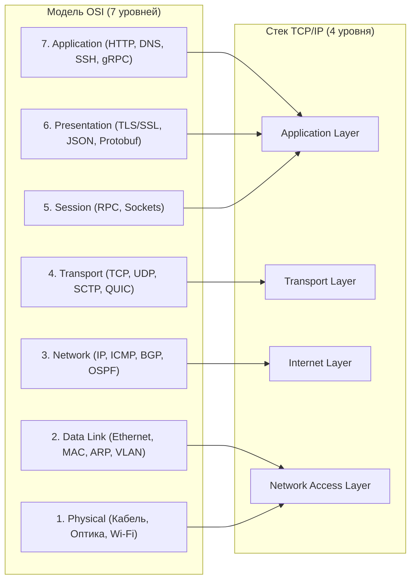
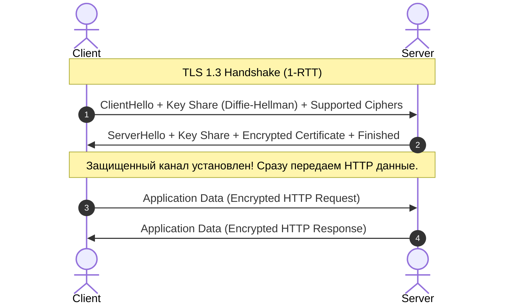
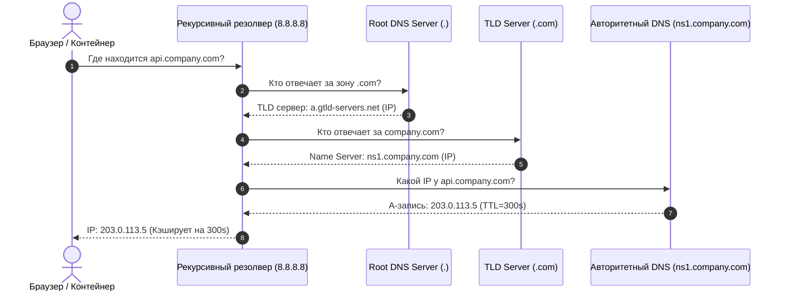
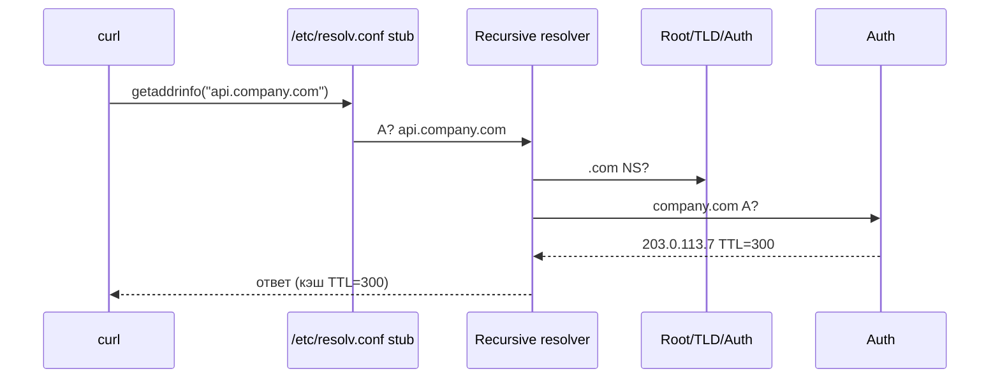
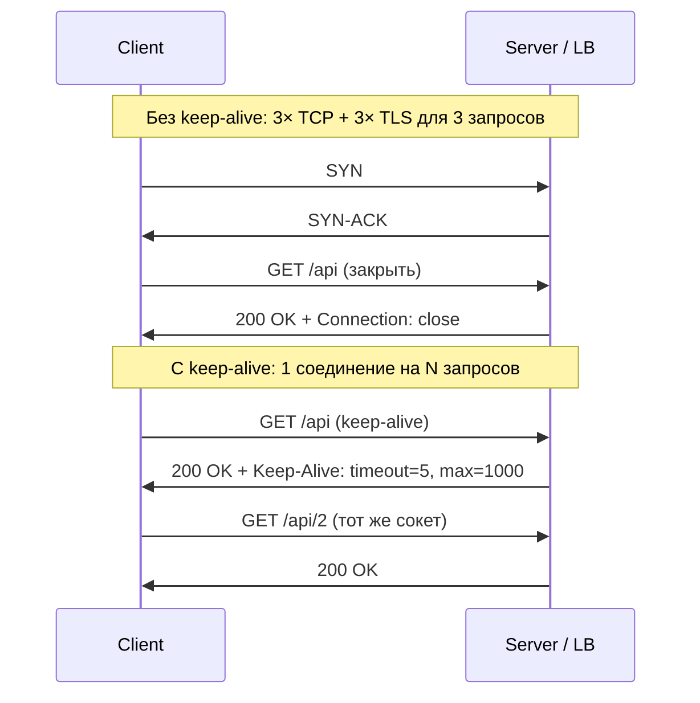
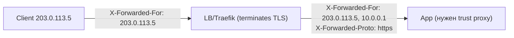

# 🌐 04. Модель OSI, Сетевые протоколы, TCP/IP, TLS и DNS

## 🏛️ Модель OSI (7 уровней) против TCP/IP (4 уровня)



### Процесс инкапсуляции данных (Encapsulation PDU):
$$\text{Data} \xrightarrow{+L4} \text{Segment (TCP)} \xrightarrow{+L3} \text{Packet (IP)} \xrightarrow{+L2} \text{Frame (Ethernet)} \xrightarrow{+L1} \text{Bits on wire}$$

---

## 📏 MTU против MSS и Фрагментация

- **MTU (Maximum Transmission Unit):** Максимальный размер Ethernet-фрейма на уровне L2. По умолчанию для Ethernet равен **1500 байт** (или **9000 байт** для Jumbo Frames в ЦОД).
- **MSS (Maximum Segment Size):** Максимальный объем полезных пользовательских данных в TCP-сегменте без учета заголовков:
$$\text{MSS} = \text{MTU} - (\text{IP Header: } 20\text{B}) - (\text{TCP Header: } 20\text{B}) = 1500 - 40 = 1460\text{ байт}$$

> [!WARNING]
> **Проблема "Black Hole" в VPN и Overlay сетях:** При использовании VXLAN, WireGuard или IPsec добавляется внешний заголовок (от 32 до 80 байт). Если пакет размером 1500 байт имеет флаг `DF (Don't Fragment)`, маршрутизатор дропнет его. В сетях с оверлеями всегда выставляйте MTU `1420-1450` байт или включайте `TCP MSS Clamping` (`iptables -A FORWARD -p tcp --tcp-flags SYN,RST SYN -j TCPMSS --clamp-mss-to-pmtu`).

---

## 🔒 Рукопожатие TLS 1.3: Сравнение с TLS 1.2

TLS 1.3 сократил установку защищенного соединения с 2 RTT (Round Trip Time) до **1 RTT**, а при повторном подключении поддерживает **0-RTT (Early Data)**:



---

## 🧭 Как работает DNS: Рекурсивная цепочка запросов



---

## 🔬 Deep Dive: TLS 1.3 — почему handshake стал быстрее и безопаснее

| Свойство | TLS 1.2 | TLS 1.3 |
| :--- | :--- | :--- |
| Round-trip до данных | 2-RTT | **1-RTT** |
| Повторное соединение | session resumption | **0-RTT** (с оговоркой anti-replay!) |
| Наборы шифров | RSA key exchange, CBC | только AEAD (AES-GCM, ChaCha20-Poly1305) |
| Forward secrecy | опционально | **обязательна** (ECDHE всегда) |
| Сжатие/renegotiation | были уязвимы | удалены из протокола |

⚠️ **0-RTT данные могут быть реплеированы злоумышленником** — их разрешают только идемпотентные запросы (GET), либо добавляют anti-replay окно на сервере.

### QUIC/HTTP3: когда это ваш выбор

- Потери пакета блокируют **только один stream**, а не всё соединение (нет HOL blocking на transport-уровне).
- Миграция соединения при смене IP (4G→WiFi) по Connection ID.
- TLS встроен в протокол — отдельного handshake нет.

### DNS: полный путь резолва и где он ломается



Типичные проблемы: negative caching (NXDOMAIN кэшируется!), round-robin без health-check, MTU-пробемы с EDNS0 (пакеты >1500 теряются молча).

---

## 🌐 HTTP/HTTPS: протокол прикладного уровня для инженера

### Запрос и ответ — что на проводах

```http
GET /api/v1/orders?status=paid HTTP/1.1
Host: shop.example.com
User-Agent: curl/8.5.0
Accept: application/json
Authorization: Bearer ey...
X-Request-Id: 550e8400-e29b-41d4-a716-446655440000
Connection: keep-alive
Content-Length: 0

HTTP/1.1 200 OK
Date: Wed, 28 Aug 2026 10:00:00 GMT
Content-Type: application/json; charset=utf-8
Content-Length: 123
Cache-Control: private, max-age=0, must-revalidate
ETag: "33a64df551425fcc55e4d42a148795d9f25f89d4"
Set-Cookie: session=abc123; Path=/; HttpOnly; Secure; SameSite=Lax
X-Request-Id: 550e8400-e29b-41d4-a716-446655440000
Keep-Alive: timeout=5, max=1000
Connection: keep-alive

{"orders": [...]}
```

| Часть | Обязательность | Что важно |
|---|---|---|
| `Host` | обязательно в HTTP/1.1 | виртуальные хосты, SNI для TLS |
| `Content-Type` | влияет на парсинг | `application/json` vs `text/html` |
| `Content-Length` vs `Transfer-Encoding: chunked` | взаимоисключающе | chunked когда длина неизвестна заранее |
| `Connection: keep-alive/close` | определяет pooling | см. ниже |

### Методы: safe / idempotent

| Метод | Safe | Idempotent | Тело | Применение |
|---|---|---|---:|---|
| `GET` | ✓ | ✓ | нет (query) | чтение, кэш, CDN |
| `HEAD` | ✓ | ✓ | нет | проверки `Content-Length` без тела |
| `POST` | ✗ | ✗ | да | создание, неидемпотентное |
| `PUT` | ✗ | ✓ | да | перезапись по ID (идемпотентна) |
| `PATCH` | ✗ | ✗/✓* | да | частичное обновление (* зависит от реализации) |
| `DELETE` | ✗ | ✓ | опц. | удаление — повтор = 404 но не меняет состояние |
| `OPTIONS` | ✓ | ✓ | нет | CORS preflight |

**Почему важно для 0-RTT/retry:** только `GET/HEAD/PUT/DELETE` безопасно ретраить автоматически; `POST` — только с `Idempotency-Key`.

### Статусы: что чинить по первой цифре

| Диапазон | Смысл | Частые коды |
|---|---|---|
| 1xx | информационные | 101 Switching Protocols (WebSocket) |
| 2xx | успех | 200 OK, 201 Created, 204 No Content, 206 Partial Content |
| 3xx | редирект | 301 Moved Permanently (кэш!), 302 Found, 304 Not Modified (If-None-Match), 307/308 preserve method |
| 4xx | клиент ошибся | 400 Bad Request, 401 Unauthorized, 403 Forbidden, 404 Not Found, 409 Conflict, 429 Too Many Requests |
| 5xx | сервер ошибся | 500 Internal, **502 Bad Gateway** (апстрим умер), **503 Service Unavailable** (overload), **504 Gateway Timeout** (апстрим молчит) |

### Ключевые заголовки

```bash
# Показать реальные заголовки
curl -I https://shop.example.com/api
# или с редиректами:
curl -IL https://shop.example.com/old
```

| Заголовок | Куда | Что делает |
|---|---|---|
| `Host: shop.example.com` | req | виртуальный хост, нужен для SNI |
| `Content-Type: application/json` | req/res | MIME + charset |
| `Content-Length: 123` | req/res | длина тела, без него — `chunked` |
| `Transfer-Encoding: chunked` | res | стрим без знания длины |
| `Connection: keep-alive` + `Keep-Alive: timeout=5, max=1000` | res | pooling (см. ниже) |
| `Cache-Control: public, max-age=60, must-revalidate` | res | кэш браузера/CDN |
| `ETag: "abc"` + `If-None-Match: "abc"` | res→req | условный запрос → 304 |
| `Set-Cookie: ... HttpOnly; Secure; SameSite=Lax` | res | состояние, XSS/CSRF защита |
| `Location: /new` | res 3xx | куда редиректить |
| `X-Forwarded-For: 203.0.113.5, 10.0.0.1` | req | цепочка IP за прокси |
| `X-Forwarded-Proto: https` | req | исходная схема (http/https) |
| `X-Real-IP: 203.0.113.5` | req | оригинал (nginx) |
| `X-Request-Id: abc-123` | req/res | трассировка сквозная |
| `Authorization: Bearer ...` | req | аутентификация |

### Keep-alive и connection pooling



- **Без пула:** `ss -ant | grep TIME_WAIT` взрывается при RPS, `conntrack` full, `local_port_range` исчерпан.
- **Проверка:** `curl -v` покажет `* Re-using existing connection` при `keep-alive`.
- **Тюнинг:** `nginx: keepalive 32; keepalive_timeout 65;`, `haproxy: http-reuse safe`, `Go: http.Transport{MaxIdleConnsPerHost:100}`.

### HTTP/1.1 vs HTTP/2 vs HTTP/3 (QUIC)

| Аспект | HTTP/1.1 | HTTP/2 | HTTP/3 (QUIC) |
|---|---|---|---|
| Мультиплекс | нет (HOL blocking) | да (streams) | да + без HOL на transport |
| Приоритет | нет | stream priority | улучшен |
| Header сжатие | нет | HPACK | QPACK |
| Шифрование | TLS опц. | TLS обязательно (h2) | QUIC+TLS1.3 встроен |
| Миграция IP | нет (TCP рест) | нет | Connection ID (4G→WiFi жива) |
| Где смотреть | `curl -v` `HTTP/1.1` | `curl -v --http2` `ALPN h2` | `curl --http3` `ALPN h3` |

**Проверка:**

```bash
curl -sv --http2 https://shop.example.com/ 2>&1 | grep -E "ALPN|HTTP/2"
curl --http3 -sv https://shop.example.com/ 2>&1 | grep -E "QUIC|h3"
nghttp -v https://shop.example.com/
```

### Сжатие, кэш, куки, редиректы

```bash
# Сжатие
curl -H "Accept-Encoding: gzip" -I https://shop.example.com/api | grep -i content-encoding
# Кэш: первый 200, второй 304?
curl -I https://shop.example.com/static/app.js | grep -iE 'cache-control|etag'
curl -H 'If-None-Match: "33a64df..."' -I https://shop.example.com/static/app.js  # 304?
# Куки
curl -c cookies.txt -b cookies.txt -L https://shop.example.com/login
# Редирект цепочка
curl -IL https://shop.example.com/old  # 301 → 302 → 200, проверить loop
```

**Cache-Control:**

| Директива | Смысл |
|---|---|
| `public, max-age=3600` | CDN+браузер кэш 1ч |
| `private, max-age=0, must-revalidate` | не CDN, браузер revalidate |
| `no-store` | не кэшировать (секреты) |
| `must-revalidate` + `ETag` | проверять 304 |

### Прокси и X-Forwarded-*



**Проблема:** без `trust proxy` app думает что `http` и делает редирект loop.

```bash
# Nginx: 
proxy_set_header X-Forwarded-For $proxy_add_x_forwarded_for;
proxy_set_header X-Forwarded-Proto $scheme;
proxy_set_header Host $host;
# Traefik: forwardedHeaders.trustedIPs
# Express (Node): app.set('trust proxy', 1)
# Django: SECURE_PROXY_SSL_HEADER = ('HTTP_X_FORWARDED_PROTO', 'https')
```

### Таймауты и TTFB

| Таймаут | Где | Симптом при превышении |
|---|---|---|
| `connect` | клиент/LB | `curl: Connection timed out` — firewall/DNS |
| `tls handshake` | LB | `curl: SSL handshake timeout` |
| `TTFB (time to first byte)` | app | `curl -w %{time_starttransfer}` большой — медленный бэкенд/БД |
| `read / send` | LB→app | `504 Gateway Timeout` — апстрим молчит |
| `keepalive` | server | `Connection: close` часто |

**Разложение curl:**

```bash
curl -so /dev/null -w 'dns=%{time_namelookup} conn=%{time_connect} tls=%{time_appconnect} ttfb=%{time_starttransfer} total=%{time_total} http=%{http_code}\n' https://shop.example.com/api
# dns 0.012 conn 0.025 tls 0.060 ttfb 0.320 total 0.325
# ttfb - tls = время приложения ~0.26с
```

---

## 🔍 Curl диагностика: 4 команды дежурного

```bash
# 1. Заголовки + редиректы + шифры
curl -ILvs https://shop.example.com/api 2>&1 | head -80
# -I HEAD, -L follow, -v verbose (TLS handshake, ALPN), -s silent

# 2. Полный трейс (как tcpdump для HTTP)
curl --trace - https://shop.example.com/api | head -100
# или --trace-ascii /tmp/trace.txt

# 3. Разложение по фазам (TTFB)
curl -so /dev/null -w 'dns=%{time_namelookup} conn=%{time_connect} tls=%{time_appconnect} ttfb=%{time_starttransfer} total=%{time_total}\n' https://shop.example.com/api

# 4. С конкретного интерфейса / резолва (обход DNS)
curl -v --resolve shop.example.com:443:10.0.0.5 https://shop.example.com/api
curl --interface eth0 https://shop.example.com/api
```

**Дополнительно:**

```bash
curl -X POST -H "Content-Type: application/json" -d '{"id":1}' -v https://shop.example.com/api
curl -H "X-Request-Id: test-123" -v https://shop.example.com/api  # трейс сквозной
curl --max-time 5 --retry 3 --retry-delay 1 https://shop.example.com/api  # таймаут
http --verbose GET https://shop.example.com/api  # httpie альтернатива
```

---

## 🚑 Troubleshooting HTTP: 8 сценариев

### 502 Bad Gateway

**Simptom:** `502` от nginx/traefik, апстрим упал mid-request.

| Гипотеза | Команда | Фикс |
|---|---|---|
| Под не Ready | `kubectl get endpoints shop-api -n shop` `ENDPOINTS <none>` | fix label/selector, `readinessProbe` |
| Под OOMKilled 137 | `kubectl get pods -n shop -o wide | grep -i oom` + `dmesg` | поднять `MemoryMax`/fix leak |
| Upstream timeout | `kubectl logs -n shop deploy/shop-api | tail` | `proxy_read_timeout` |

### 503 Service Unavailable

**Overload / no endpoints / circuit breaker.**

```bash
kubectl top pods -n shop  # CPU throttling?
kubectl get hpa -n shop   # maxReplicas достигнут?
curl -H "Host: shop.example.com" http://<LB-IP>/api -v  # LB 503 vs app 503?
# App 503 → проверить rate limit: grep -i "429" /var/log/nginx/access.log
```

### 504 Gateway Timeout

**Апстрим молчит > `proxy_read_timeout`.**

```bash
curl -w 'ttfb=%{time_starttransfer} total=%{time_total}\n' -m 10 https://shop.example.com/api
# ttfb 10.0 total 10.0 → timeout на апстриме
kubectl exec -n shop deploy/shop-api -- time curl -w '%{time_total}' http://localhost:8080/api  # внутри пода быстро?
# Да → сеть/LB, Нет → БД запрос: `EXPLAIN ANALYZE` медленный
```

### Slow TTFB (2.9с)

```bash
curl -so /dev/null -w 'dns=%{time_namelookup} tls=%{time_appconnect} ttfb=%{time_starttransfer}\n' https://shop.example.com/api
# dns 0.01 tls 0.06 ttfb 2.9 → бэкенд
# Разложить апстрим:
kubectl exec -n shop deploy/shop-api -- curl -w 'upstream=%{time_total}\n' http://localhost:8080/health
# Если upstream 0.02 → LB, если 2.8 → app/DB
```

### Wrong Host

```bash
curl -H "Host: wrong.example.com" http://<LB-IP>/ -I  # 404?
curl -H "Host: shop.example.com" http://<LB-IP>/ -I    # 200?
kubectl get ingress -A -o wide | grep shop.example.com
# Фикс: DNS или ingress.spec.rules[0].host
```

### Bad proxy headers (redirect loop)

**Simptom:** `https://shop.example.com` → 301 → `http://shop.example.com` → 301 ...

```bash
curl -IL https://shop.example.com/ 2>&1 | grep -E "Location|301|302"
# Location: http://shop.example.com/ (http, не https) → X-Forwarded-Proto не проброшен
# Nginx log: $http_x_forwarded_proto = http при https-оригинале
# Фикс: proxy_set_header X-Forwarded-Proto $scheme; + app trust proxy
```

### Connection timeout

```bash
curl -v --connect-timeout 2 https://shop.example.com/api  # Connection timed out?
ss -tulpn | grep :443          # слушает?
nc -zv shop.example.com 443    # порт открыт?
iptables -L -n | head; firewall-cmd --list-all
tcpdump -i any host shop.example.com and port 443 -c 20  # пакеты уходят?
```

### TLS failure

```bash
openssl s_client -connect shop.example.com:443 -servername shop.example.com </dev/null 2>/dev/null | openssl x509 -noout -dates -subject -issuer
# notAfter = expired? issuer = not trusted? CN != Host?
curl -v https://shop.example.com/ 2>&1 | grep -i "SSL certificate problem"
# Фикс: cert-manager renew, добавить CA в trust
```

---

<!-- enriched:v1 -->

## 🧨 Типовые грабли Production (HTTP/TLS/DNS — только эта тема)

| Симптом | Причина | Быстрое решение |
| :--- | :--- | :--- |
| `curl: (7) Failed to connect` 2с timeout | Firewall/DNS: `Host` не резолвится или порт закрыт | `dig +short`, `nc -zv host 443`, `iptables -L`, `tcpdump host` |
| `502 Bad Gateway` всплеск после деплоя | Под не `Ready`: `endpoints <none>` / `CrashLoop` | `kubectl get endpoints`, `kubectl logs --previous`, fix `readinessProbe` |
| `TLS handshake timeout` / `certificate has expired` | `notAfter` истёк или цепочка без CA | `openssl s_client -connect host:443 | openssl x509 -noout -dates`, `cert-manager renew` |
| `conntrack table full` молча режет новые SYN | `nf_conntrack_max` мал / `TIME_WAIT` шторм | `conntrack -C; conntrack -S`, увеличить `nf_conntrack_max`, pooling |

!!! warning "Правило пяти почему"
    Каждый инцидент заканчивается не фиксом, а **post-mortem** с 5×Why и action items в бэклоге. Иначе грабли возвращаются через квартал — но уже в пятницу вечером.

## 🧪 Hands-on Lab (15 минут)

```bash
# 1. Воспроизведите проблему из таблицы выше на стенде (kind/k3d/VirtualBox)
# 2. Соберите диагностику одной командой:
openssl s_client -connect api.company.com:443 -tls1_3 -brief </dev/null && \
dig +noall +stats api.company.com && \
curl -sv -o /dev/null --http3 https://api.company.com 2>&1 | grep -E 'HTTP/|ALPN'
# 3. Зафиксируйте вывод в post-mortem шаблон:
#    Что случилось / Когда заметили / Root cause / Fix / Prevention
```

## ✅ Чек-лист зрелости темы

- [ ] Конфигурации версионируются в Git, ручные правки на проде запрещены

    ??? tip "Как закрыть пункт"
        Все конфиги подсистемы живут в etc-repo/Ansible-роли и деплоятся пайплайном. Проверка зрелости: после пересоздания машины система настраивается из репозитория без ручных шагов; git log отвечает «кто и когда поменял».

- [ ] Есть мониторинг именно этой подсистемы (не только CPU/RAM)

    ??? tip "Как закрыть пункт"
        Специфичные метрики подсистемы экспортируются и имеют алерты (для systemd — failed units; для БД — connections/locks; для сети — retransmits/drops). CPU/RAM видят симптом, не причину — нужны метрики самой подсистемы.

- [ ] Задокументирован runbook на типовые отказы (кто/что/как)

    ??? tip "Как закрыть пункт"
        Шаблон из [13.2]: симптомы → команды диагностики → фикс → критерий успеха → предотвращение. Топ-3 отказа подсистемы покрыты. Прогонен хотя бы раз — дата в шапке.

- [ ] Проведено хотя бы одно учение Chaos/GameDay по теме

    ??? tip "Как закрыть пункт"
        Дрель из tools/chaos-lab.sh или Break-Fix по этой теме запущена на стенде, runbook прогнан по шагам, измерено время до восстановления. Итоги — в постмортем-журнал команды.

- [ ] Лимиты ресурсов и квоты осознаны, а не «дефолт из туториала»

    ??? tip "Как закрыть пункт"
        Каждый лимит имеет обоснование из данных (ulimit/fd по числу соединений, MemoryMax по месяцу наблюдений). Проверка: systemctl show / cgroup значения сопоставлены с фактическим потреблением за месяц, комментарий «почему» рядом со значением в коде.

---

## 🧭 Что дальше

| Шаг | Материал |
| :--- | :--- |
| 💪 Практика | [Сетевые инциденты](../17-break-fix/01-incident-simulations.md) |
| 🎤 Проверить себя | [Вопросы собесов: TCP/IP, TLS](../14-interview-prep/03-100-devops-interview-questions-bank-part1.md) |

---

## ✅ Проверь себя

**В1. Что происходит за секунду до готовности TLS 1.3-соединения?**
<details><summary>Ответ</summary>
TCP three-way handshake (SYN→SYN/ACK→ACK), затем ClientHello с SNI и списком шифров; в TLS 1.3 клиент сразу отправляет key-share — сервер отвечает ServerHello+Finished уже через 1-RTT. Плюс проверка цепочки сертификата до корневого CA и сверка hostname/SNI.
</details>

**В2. Почему DNS по умолчанию UDP/53, но иногда TCP?**
<details><summary>Ответ</summary>
UDP — быстрые запросы ≤512 байт (или EDNS). TCP нужен при усечении (TC-флаг): большие ответы (DNSSEC, много записей), зонные передачи AXFR/IXFR. Правило firewall'а: открывать оба протокола.
</details>

**В3. Разница MTU и MSS; что бывает при их рассинхроне?**
<details><summary>Ответ</summary>
MTU — максимум кадра L2 (обычно 1500); MSS — максимум полезной нагрузки TCP-сегмента (MTU − заголовки IP+TCP ≈ 1460). Рассинхрон (VXLAN съедает 50 байт, ICMP заблокирован и PMTU не работает) даёт «чёрную дыру»: мелкие пакеты ходят, крупные виснут.
</details>

**В4. Что такое conntrack и чем грозит переполнение его таблицы?**
<details><summary>Ответ</summary>
Таблица состояний соединений netfilter (nf_conntrack). При исчерпании лимита новые соединения дропаются молча: сервис «частично жив». Диагностика: conntrack -C, dmesg | grep 'table full'; лечение — nf_conntrack_max, снижение таймаутов, connection pooling.
</details>

**В5. SNAT vs DNAT и где каждый живёт в K8s?**
<details><summary>Ответ</summary>
SNAT меняет источник (masquerade исходящего трафика подов наружу); DNAT — назначение (ClusterIP → pod endpoint в kube-proxy/IPVS/eBPF). Обратный путь восстанавливается таблицей conntrack автоматически.
</details>

**В6. Почему `curl -v` показывает `Re-using existing connection` методом `keep-alive`, а без него взрывается `TIME_WAIT`?**

<details><summary>Ответ</summary>

`Connection: keep-alive` (HTTP/1.1 default) держит TCP соединение открытым для N запросов на том же сокете — нет нового SYN/TIME_WAIT. Без keep-alive каждый запрос = новый TCP (SYN → FIN → TIME_WAIT 60с). При `RPS=1000` это 60k `TIME_WAIT` + исчерпание `local_port_range`/`conntrack`. Проверка: `ss -ant | grep TIME_WAIT` и `ss -s`. Фикс: keep-alive tuning (`nginx keepalive 32`, `Go MaxIdleConnsPerHost`), мониторить `nstat`.

</details>

**В7. Как отличить 502, 503 и 504 и где искать причину каждого?**

<details><summary>Ответ</summary>

502 — апстрим начал отвечать но умер mid-stream: `kubectl get endpoints` `<none>` или `CrashLoop`. 503 — no endpoints / circuit breaker / HPA max: `kubectl top pods`, `kubectl get hpa`. 504 — апстрим молчит > `proxy_read_timeout`: `curl -w ttfb` 10с → проверить `kubectl exec deploy -- curl localhost:8080/health` внутри vs через LB. Все три — верхний LB лжет, смотреть бэкенд первым.

</details>

**В8. Что делают заголовки `X-Forwarded-For` и `X-Forwarded-Proto` и почему без них получается redirect loop?**

<details><summary>Ответ</summary>

`X-Forwarded-For` — цепочка IP за прокси (`client, proxy1`), `X-Forwarded-Proto` — исходная схема `https`. Если LB делает TLS terminate и не прокидывает `X-Forwarded-Proto: https`, app думает что `http` и ставит `Location: http://` → LB снова 301 на `https`. Фикс: `proxy_set_header X-Forwarded-Proto $scheme` + `app.set('trust proxy')`.

</details>

**В9. Чем `Cache-Control: public, max-age=3600` отличается от `ETag` и когда приходит 304?**

<details><summary>Ответ</summary>

`Cache-Control` — время кэширования без проверки (3600с). `ETag: "abc"` + `If-None-Match: "abc"` — условный запрос: сервер вернёт `304 Not Modified` без тела, если версия совпадает. `must-revalidate` заставляет проверить после `max-age`. `no-store` — не кэшировать. Проверка: `curl -I | grep Cache` затем `curl -H 'If-None-Match: "abc"' -I` → 304.

</details>

**В10. Как за 4 curl-команды полностью продиагностировать HTTP-запрос?**

<details><summary>Ответ</summary>

`curl -ILvs https://shop.example.com/api` — заголовки+редиректы+TLS `ALPN`. `curl --trace - https://...` — побайтный трейс. `curl -so /dev/null -w 'dns=%{time_namelookup} tls=%{time_appconnect} ttfb=%{time_starttransfer}\n'` — разложение фаз. `curl -v --resolve shop.example.com:443:10.0.0.5` — обход DNS, проверка конкретного upstream. `ttfb - tls` = время приложения.

</details>
