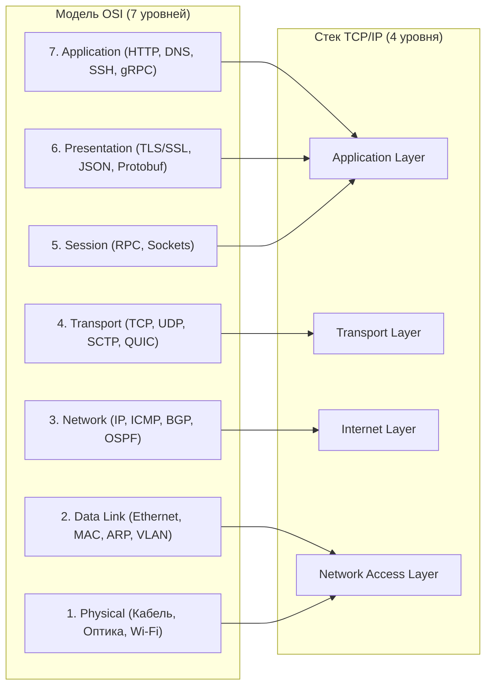
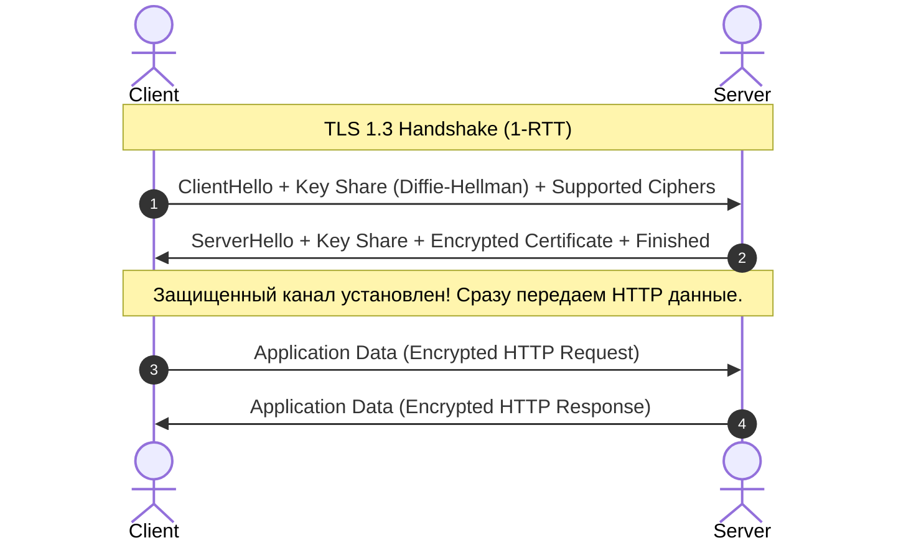
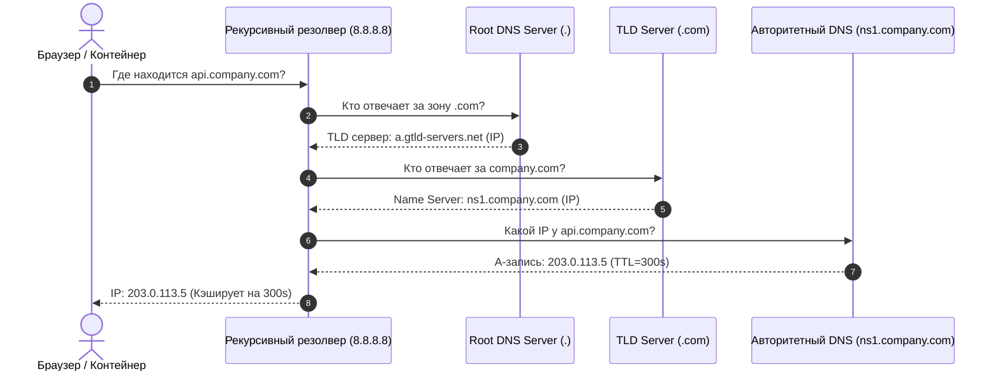
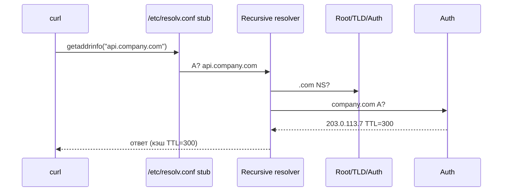

# 🌐 04. Модель OSI, Сетевые протоколы, TCP/IP, TLS и DNS

## 🏛️ Модель OSI (7 уровней) против TCP/IP (4 уровня)



### Процесс инкапсуляции данных (Encapsulation PDU):
$$\text{Data} \xrightarrow{+L4} \text{Segment (TCP)} \xrightarrow{+L3} \text{Packet (IP)} \xrightarrow{+L2} \text{Frame (Ethernet)} \xrightarrow{+L1} \text{Bits on wire}$$

---

## 📏 MTU против MSS и Фрагментация

- **MTU (Maximum Transmission Unit):** Максимальный размер Ethernet-фрейма на уровне L2. По умолчанию для Ethernet равен **1500 байт** (или **9000 байт** для Jumbo Frames в ЦОД).
- **MSS (Maximum Segment Size):** Максимальный объем полезных пользовательских данных в TCP-сегменте без учета заголовков:
$$\text{MSS} = \text{MTU} - (\text{IP Header: } 20\text{B}) - (\text{TCP Header: } 20\text{B}) = 1500 - 40 = 1460\text{ байт}$$

> [!WARNING]
> **Проблема "Black Hole" в VPN и Overlay сетях:** При использовании VXLAN, WireGuard или IPsec добавляется внешний заголовок (от 32 до 80 байт). Если пакет размером 1500 байт имеет флаг `DF (Don't Fragment)`, маршрутизатор дропнет его. В сетях с оверлеями всегда выставляйте MTU `1420-1450` байт или включайте `TCP MSS Clamping` (`iptables -A FORWARD -p tcp --tcp-flags SYN,RST SYN -j TCPMSS --clamp-mss-to-pmtu`).

---

## 🔒 Рукопожатие TLS 1.3: Сравнение с TLS 1.2

TLS 1.3 сократил установку защищенного соединения с 2 RTT (Round Trip Time) до **1 RTT**, а при повторном подключении поддерживает **0-RTT (Early Data)**:



---

## 🧭 Как работает DNS: Рекурсивная цепочка запросов



---

## 🔬 Deep Dive: TLS 1.3 — почему handshake стал быстрее и безопаснее

| Свойство | TLS 1.2 | TLS 1.3 |
| :--- | :--- | :--- |
| Round-trip до данных | 2-RTT | **1-RTT** |
| Повторное соединение | session resumption | **0-RTT** (с оговоркой anti-replay!) |
| Наборы шифров | RSA key exchange, CBC | только AEAD (AES-GCM, ChaCha20-Poly1305) |
| Forward secrecy | опционально | **обязательна** (ECDHE всегда) |
| Сжатие/renegotiation | были уязвимы | удалены из протокола |

⚠️ **0-RTT данные могут быть реплеированы злоумышленником** — их разрешают только идемпотентные запросы (GET), либо добавляют anti-replay окно на сервере.

### QUIC/HTTP3: когда это ваш выбор

- Потери пакета блокируют **только один stream**, а не всё соединение (нет HOL blocking на transport-уровне).
- Миграция соединения при смене IP (4G→WiFi) по Connection ID.
- TLS встроен в протокол — отдельного handshake нет.

### DNS: полный путь резолва и где он ломается



Типичные проблемы: negative caching (NXDOMAIN кэшируется!), round-robin без health-check, MTU-пробемы с EDNS0 (пакеты >1500 теряются молча).

---

<!-- enriched:v1 -->

## 🧨 Типовые грабли Production

| Симптом | Причина | Быстрое решение |
| :--- | :--- | :--- |
| «Работало вчера» после обновления | Дрейф конфигурации вне Git | `git diff` по инфра-репозиторию + `drift detection` |
| Падение под нагрузкой без ошибок в логах | Исчерпание лимитов (`ulimit`, conntrack, fds) | `dmesg -T \| grep -i denied`, `conntrack -S` |
| Медленный деплой | Отсутствие кэша слоев/артефактов | Включить layer cache, артефакт-репозиторий |
| «Плавающие» 502 раз в сутки | Health-check гонки при rolling update | `preStop sleep` + корректный `readinessProbe` |

!!! warning "Правило пяти почему"
    Каждый инцидент заканчивается не фиксом, а **post-mortem** с 5×Why и action items в бэклоге. Иначе грабли возвращаются через квартал — но уже в пятницу вечером.

## 🧪 Hands-on Lab (15 минут)

```bash
# 1. Воспроизведите проблему из таблицы выше на стенде (kind/k3d/VirtualBox)
# 2. Соберите диагностику одной командой:
openssl s_client -connect api.company.com:443 -tls1_3 -brief </dev/null && \
dig +noall +stats api.company.com && \
curl -sv -o /dev/null --http3 https://api.company.com 2>&1 | grep -E 'HTTP/|ALPN'
# 3. Зафиксируйте вывод в post-mortem шаблон:
#    Что случилось / Когда заметили / Root cause / Fix / Prevention
```

## ✅ Чек-лист зрелости темы

- [ ] Конфигурации версионируются в Git, ручные правки на проде запрещены

    ??? tip "Как закрыть пункт"
        Все конфиги подсистемы живут в etc-repo/Ansible-роли и деплоятся пайплайном. Проверка зрелости: после пересоздания машины система настраивается из репозитория без ручных шагов; git log отвечает «кто и когда поменял».

- [ ] Есть мониторинг именно этой подсистемы (не только CPU/RAM)

    ??? tip "Как закрыть пункт"
        Специфичные метрики подсистемы экспортируются и имеют алерты (для systemd — failed units; для БД — connections/locks; для сети — retransmits/drops). CPU/RAM видят симптом, не причину — нужны метрики самой подсистемы.

- [ ] Задокументирован runbook на типовые отказы (кто/что/как)

    ??? tip "Как закрыть пункт"
        Шаблон из [13.2]: симптомы → команды диагностики → фикс → критерий успеха → предотвращение. Топ-3 отказа подсистемы покрыты. Прогонен хотя бы раз — дата в шапке.

- [ ] Проведено хотя бы одно учение Chaos/GameDay по теме

    ??? tip "Как закрыть пункт"
        Дрель из tools/chaos-lab.sh или Break-Fix по этой теме запущена на стенде, runbook прогнан по шагам, измерено время до восстановления. Итоги — в постмортем-журнал команды.

- [ ] Лимиты ресурсов и квоты осознаны, а не «дефолт из туториала»

    ??? tip "Как закрыть пункт"
        Каждый лимит имеет обоснование из данных (ulimit/fd по числу соединений, MemoryMax по месяцу наблюдений). Проверка: systemctl show / cgroup значения сопоставлены с фактическим потреблением за месяц, комментарий «почему» рядом со значением в коде.

---

## 🧭 Что дальше

| Шаг | Материал |
| :--- | :--- |
| 💪 Практика | [Сетевые инциденты](../17-break-fix/01-incident-simulations.md) |
| 🎤 Проверить себя | [Вопросы собесов: TCP/IP, TLS](../14-interview-prep/03-100-devops-interview-questions-bank-part1.md) |

---

## ✅ Проверь себя

**В1. Что происходит за секунду до готовности TLS 1.3-соединения?**
<details><summary>Ответ</summary>
TCP three-way handshake (SYN→SYN/ACK→ACK), затем ClientHello с SNI и списком шифров; в TLS 1.3 клиент сразу отправляет key-share — сервер отвечает ServerHello+Finished уже через 1-RTT. Плюс проверка цепочки сертификата до корневого CA и сверка hostname/SNI.
</details>

**В2. Почему DNS по умолчанию UDP/53, но иногда TCP?**
<details><summary>Ответ</summary>
UDP — быстрые запросы ≤512 байт (или EDNS). TCP нужен при усечении (TC-флаг): большие ответы (DNSSEC, много записей), зонные передачи AXFR/IXFR. Правило firewall'а: открывать оба протокола.
</details>

**В3. Разница MTU и MSS; что бывает при их рассинхроне?**
<details><summary>Ответ</summary>
MTU — максимум кадра L2 (обычно 1500); MSS — максимум полезной нагрузки TCP-сегмента (MTU − заголовки IP+TCP ≈ 1460). Рассинхрон (VXLAN съедает 50 байт, ICMP заблокирован и PMTU не работает) даёт «чёрную дыру»: мелкие пакеты ходят, крупные виснут.
</details>

**В4. Что такое conntrack и чем грозит переполнение его таблицы?**
<details><summary>Ответ</summary>
Таблица состояний соединений netfilter (nf_conntrack). При исчерпании лимита новые соединения дропаются молча: сервис «частично жив». Диагностика: conntrack -C, dmesg | grep 'table full'; лечение — nf_conntrack_max, снижение таймаутов, connection pooling.
</details>

**В5. SNAT vs DNAT и где каждый живёт в K8s?**
<details><summary>Ответ</summary>
SNAT меняет источник (masquerade исходящего трафика подов наружу); DNAT — назначение (ClusterIP → pod endpoint в kube-proxy/IPVS/eBPF). Обратный путь восстанавливается таблицей conntrack автоматически.
</details>
