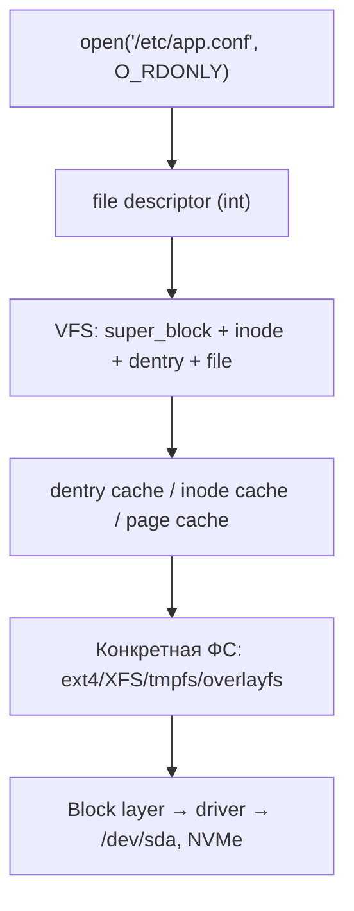
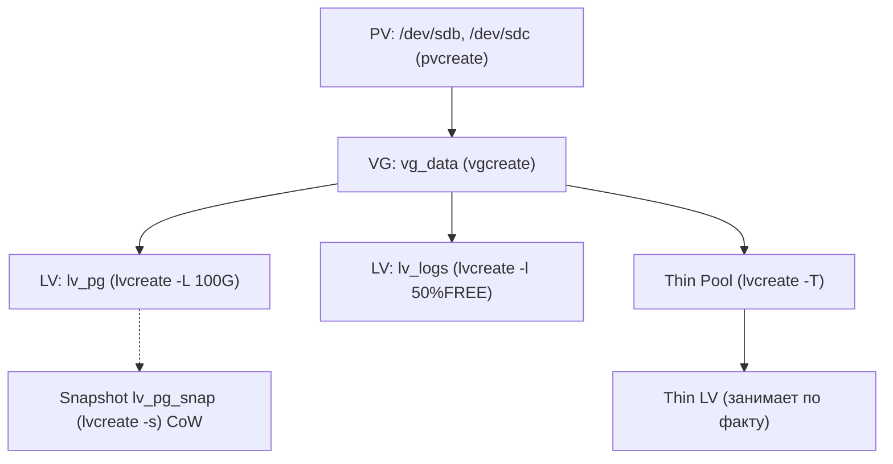

# 💾 06. Файловые Системы, LVM и Хранилище Linux

> Почему всё в Linux — файл, а «диск полон» не всегда про место. VFS → inode → ext4/XFS → LVM → overlayfs → mount namespace: от сектора до контейнера.

## 🧠 VFS: как ядро абстрагирует любые ФС



| Структура VFS | Что хранит | Где увидеть |
|---|---|---|
| **superblock** | параметры ФС: размер блока, кол-во inode, free blocks, UUID, journal state | `tune2fs -l /dev/sda1 | grep -E 'Block size|Inode count'`, `dumpe2fs -h` |
| **inode** | метаданные файла: тип, права, uid/gid, timestamps (atime/mtime/ctime), размер, указатели на блоки, линков счётчик `i_nlink`, `i_blocks` | `stat /etc/passwd`, `ls -i` (номер inode), `debugfs -R 'stat <12>' /dev/sda1` |
| **dentry** | имя → inode маппинг в директории, кэш имён `dcache` | `slabtop` строка `dentry`, `/proc/slabinfo` |
| **file** | открытый файловый дескриптор: offset, flags, `f_count`, связь с inode | `ls -l /proc/$$/fd`, `lsof -p $PID` |

**Ключевая идея:** путь `/var/log/app.log` — цепочка dentry → inode → data blocks. Удалить файл `rm` = убрать dentry и уменьшить `i_nlink`; блоки освободятся только когда `f_count==0` и `i_nlink==0` — отсюда `lsof +L1` и «диск full, а du мало».

### file descriptor и лимиты

```bash
ls -l /proc/$$/fd          # 0 stdin, 1 stdout, 2 stderr, остальное — сокеты/файлы
ls /proc/$$/fd | wc -l     # сколько держит текущий shell
cat /proc/sys/fs/file-max  # глобальный лимит всех FD в системе
ulimit -n                  # per-process soft
prlimit --pid $PID --nofile # фактический лимит процесса
```

---

## 🔗 inode, hard link, soft link, права

```bash
stat /etc/passwd
# File: /etc/passwd  Inode: 131073  Links: 1
# Access: (0644/-rw-r--r--)  Uid: 0  Gid: 0  Size: 2453
# Blocks: 8  IO Block: 4096

ls -li /bin/bash /bin/sh
# 131101 -rwxr-xr-x 1 root root 1265648 /bin/bash
# 131101 -rwxr-xr-x 1 root root 1265648 /bin/sh   # hard link: один inode, nlink 2

ln /var/log/app.log /var/log/app.log.hard   # hard link: +1 к i_nlink, нельзя между ФС, нельзя на директорию
ln -s /var/log/app.log /tmp/app.log.soft    # symlink: отдельный inode с target path, может висеть (dangling)
readlink -f /tmp/app.log.soft               # куда указывает
```

| Аспект | hard link | symlink |
|---|---|---|
| inode | тот же | новый |
| После `rm оригинал` | данные живы, пока есть хоть один hard link | `dangling`, `ENOENT` |
| Между ФС | нельзя (`Invalid cross-device link`) | можно |
| Директория | запрещено (кроме `.` и `..`) | можно |
| Видно | `ls -li` одинаковый inode, `stat Links: >1` | `ls -l` `-> target`, `l` в начале прав |

**Права классические:**
```bash
ls -l /etc/shadow
# -rw-r----- 1 root shadow  1130  # u=rw g=r o=, владелец root, группа shadow
chmod 0640 /etc/app.conf; chown appuser:appgroup /etc/app.conf
# 0o4000 setuid, 0o2000 setgid, 0o1000 sticky — для каталогов /tmp drwxrwxrwt
getfacl /srv/share; setfacl -m u:alice:rw /srv/share/file  # ACL, если нужно тоньше chmod
lsattr /etc/app.conf; chattr +i /etc/app.conf              # immutable (даже root не перепишет)
```

---

## 📂 Монтирование: mount, /etc/fstab, findmnt, lsblk, blkid, df, du

```bash
lsblk -o NAME,SIZE,TYPE,FSTYPE,MOUNTPOINT,MODEL,UUID
blkid /dev/sda1
findmnt                       # дерево всех монтов с опциями
findmnt -no OPTIONS /         # опции корня: noatime?
findmnt --verify              # проверка fstab без монтирования (systemd 239+)
df -hT                        # занятость по блокам, -T тип ФС
df -i                         # занятость по inode — вторая «ёмкость»!
du -sh /* 2>/dev/null | sort -h | tail -20
du -sh --apparent-size /var/log/app.log  # реальный размер vs блоки на диске (sparse)
```

### /etc/fstab и systemd mount units

```ini
# /etc/fstab: <fs>  <mountpoint>  <type>  <options>  <dump> <pass>
UUID=4a5f8b2c-...  /               ext4  errors=remount-ro,noatime  0 1
UUID=...          /var/lib/pgsql  xfs   defaults,noatime,nobarrier 0 2
tmpfs             /dev/shm        tmpfs defaults,size=2G          0 0
//nas/share       /mnt/nas        cifs  credentials=/etc/smb.cred,uid=1000 0 0
```

```bash
mount -a                      # применить fstab
mount -o remount,ro /         # перемонтировать read-only для fsck
umount /mnt/nas; umount -l /mnt/nas  # lazy umount, если busy
fuser -vm /mnt/nas; lsof +D /mnt/nas # кто держит mount (перед umount!)
```

**systemd mount units** — как fstab транслируется:
```bash
systemd-escape -p --suffix=mount "/var/lib/pgsql"
# var-lib-pgsql.mount
cat /run/systemd/generator/var-lib-pgsql.mount
# [Mount] What=/dev/sda2 Where=/var/lib/pgsql Type=xfs Options=noatime

# Ручной .mount unit (лучше fstab, но нужен для Requires=)
# /etc/systemd/system/var-lib-pgsql.mount
[Unit]
Description=PG data
Before=postgresql.service
Requires=systemd-fsck@dev-sda2.service
After=systemd-fsck@dev-sda2.service

[Mount]
What=/dev/disk/by-uuid/...
Where=/var/lib/pgsql
Type=xfs
Options=noatime

[Install]
WantedBy=multi-user.target
```
`systemd-fstab-generator` создаёт `.mount` и `.automount` на лету (`/run/systemd/generator/`). `x-systemd.automount` в fstab — монт по первому обращению.

---

## 🧱 ext4 vs XFS vs Btrfs

| Критерий | ext4 | XFS | Btrfs |
|---|---|---|---|
| Год/зрелость | 2008, дефолт Debian/Ubuntu | 1994 SGI, дефолт RHEL 7+ для больших ФС | 2009, CoW, в проде осторожно |
| Журнал | ordered (метаданные) | internal log, быстрый crash-recovery | CoW + checksum |
| Размер ФС | до 1EiB, файл 16TiB | до 8EiB, файл 8EiB, отлично на большой файл | до 16EiB |
| Онлайн-рост | `resize2fs` online | `xfs_growfs` online (только рост) | online рост/сжатие, сабволюмы |
| Сжатие | нет | нет | lzo/zstd на лету |
| Снимки | через LVM только | через reflink `cp --reflink`, LVM | нативные сабволюмы + snapshot |
| Когда брать | дефолт для `/`, малые файлы, простота | БД (PostgreSQL), большие файлы, `allocsize`, `nobarrier` с батарейкой | десктоп, снапшоты, но проверять kernel |

```bash
# Создать и настроить
mkfs.ext4 -L data /dev/sdb1
tune2fs -l /dev/sdb1 | grep -E 'Block size|Reserved|Inode count|Journal'
# reserved 5% для root: снизить на data диске
tune2fs -m 1 /dev/sdb1
e2label /dev/sdb1 data

mkfs.xfs -L pgdata /dev/sdc1 -f
xfs_info /var/lib/pgsql
xfs_growfs /var/lib/pgsql   # после расширения блочного устройства

mkfs.btrfs -L pool /dev/sdd1
btrfs subvolume create /pool/@snap
btrfs subvolume snapshot -r /pool/@ /pool/@snap-2026-08-28
```

**Проверки:**
```bash
fsck -n /dev/sda1            # dry-run, только на unmounted!
e2fsck -f -y /dev/sda1        # offline repair
xfs_repair -n /dev/sdc1       # dry-run; на mounted — только xfs_repair -n
btrfs check --readonly /dev/sdd1
dmesg -T | grep -iE 'ext4|xfs|btrfs|I/O error|checksum'
```

---

## 🧩 LVM: PV → VG → LV, snapshot, thin provisioning



```bash
# Базовый LVM
pvcreate /dev/sdb /dev/sdc
vgcreate vg_data /dev/sdb /dev/sdc
lvcreate -L 100G -n lv_pg vg_data
mkfs.xfs /dev/vg_data/lv_pg
mount /dev/vg_data/lv_pg /var/lib/pgsql

# Расширение без даунтайма
lvextend -L +50G /dev/vg_data/lv_pg
xfs_growfs /var/lib/pgsql   # для ext4: resize2fs /dev/vg_data/lv_pg

# Снимок для бэкапа (CoW, размер — дельта изменений)
lvcreate -L 10G -s -n lv_pg_snap /dev/vg_data/lv_pg
mkdir /mnt/snap && mount -o ro,nouuid /dev/vg_data/lv_pg_snap /mnt/snap
# ... бэкап из /mnt/snap ...
umount /mnt/snap && lvremove -f /dev/vg_data/lv_pg_snap

# Thin provisioning (оверкоммит)
lvcreate -T -L 200G vg_data/thinpool
lvcreate -V 500G -T vg_data/thinpool -n thin_lv1  # виртуально 500G, физически 200G
lvs -o lv_name,lv_size,data_percent,pool_lv

# RAID обзор (практический минимум)
mdadm --create /dev/md0 --level=1 --raid-devices=2 /dev/sdb /dev/sdc  # mirror
mdadm --detail /dev/md0; cat /proc/mdstat
# LVM RAID: lvcreate --type raid1 -m1 -L 100G -n lv_mirror vg_data
```

**RAID шпаргалка:**

| Уровень | Минимум дисков | Потеря | Применение |
|---|---|---|---|
| 0 | 2 | 0 | скорость, нет отказоустойчивости — не для прода |
| 1 | 2 | 1 | mirror, просто |
| 5 | 3 | 1 | parity, мало случайной записи |
| 6 | 4 | 2 | две parity, для больших массивов |
| 10 | 4 | до 2 | stripe+mirror, БД |

---

## ☁️ tmpfs, overlayfs, Docker Overlay2, CoW

```bash
# tmpfs: RAM + swap, пропадает при ребуте
mount -t tmpfs -o size=512M,mode=1777 tmpfs /tmp/ramdisk
df -h /tmp/ramdisk
# Использование: /dev/shm, /run, кэш сборки (BuildKit --mount=type=tmpfs)

# overlayfs вручную (как делает Docker)
mkdir -p /tmp/ov/{lower,upper,work,merged}
echo "base" > /tmp/ov/lower/file
mount -t overlay overlay -o lowerdir=/tmp/ov/lower,upperdir=/tmp/ov/upper,workdir=/tmp/ov/work /tmp/ov/merged
cat /tmp/ov/merged/file          # видит lower
echo "change" > /tmp/ov/merged/file  # CoW: копия в upper
ls /tmp/ov/upper/file; cat /tmp/ov/upper/file  # изменённая версия
echo "new" > /tmp/ov/merged/newfile   # целиком в upper
# whiteout: удаление файла из lower = создание character device 0,0 в upper
rm /tmp/ov/merged/file && ls -l /tmp/ov/upper/  # c 0,0
umount /tmp/ov/merged
```

**Docker Overlay2:**
```
 /var/lib/docker/overlay2/<id>/diff   ← upper (изменения контейнера)
                    /lower            ← образные слои (read-only)
                    /merged           ← то что видит контейнер
                    /work             ← служебный
```
```bash
docker inspect demo --format '{{.GraphDriver.Data.MergedDir}}'
ls -R /var/lib/docker/overlay2 | head -40
docker diff demo                  # какие файлы изменены (A/C/D)
# CoW цена: первый write на файл из lower = копирование всего файла в upper
```

---

## 📦 Disk-full vs inode-full: две разные ёмкости

```bash
df -h   # блоки
df -i   # inode — вторая «ёмкость»; 100% inode = нельзя создать файл, даже если место есть!

# Типичные причины inode exhaustion: миллионы мелких файлов (кэш, сессии, mail queue)
find /var/spool -xdev | head
find /tmp -type f | wc -l
for d in /var/*; do echo $(find "$d" -xdev -type f | wc -l) "$d"; done | sort -n | tail -20

# Sparse файлы: кажутся большими, занимают мало
truncate -s 10G /tmp/sparse.img
ls -lh /tmp/sparse.img        # 10G
du -h /tmp/sparse.img         # 0
du -h --apparent-size /tmp/sparse.img  # 10G
```

---

## 🔒 Mount namespace и systemd mount units deep

```bash
# Изоляция маунтов: unshare
unshare --mount --fork bash
mount -t tmpfs tmpfs /mnt
findmnt | grep /mnt   # видно только в этом namespace
ls /proc/$$/ns/mnt -l # inode namespace
nsenter --target $(pgrep -f myapp) --mount findmnt  # заглянуть в namespace контейнера/pod'а

# Systemd: автоматический mount vs automount
grep -r x-systemd.automount /etc/fstab
systemctl list-units --type=mount --type=automount
systemctl status var-lib-pgsql.mount
journalctl -u var-lib-pgsql.mount

# Зависимости: сервис не стартует без данных
# /etc/systemd/system/myapp.service.d/10-requires-mount.conf
[Unit]
Requires=var-lib-pgsql.mount
After=var-lib-pgsql.mount
```

---

## 🧨 Типовые грабли Production (файловые системы)

| Симптом | Причина | Быстрое решение |
|---|---|---|
| `No space left on device`, но `df -h` показывает 30% свободно | **Inode-full**: миллионы мелких файлов `df -i` 100% | `df -i`; найти каталог с миллионами: `find /var -xdev -type f | wc -l` пер каталог; чистить кэш/сессии, `tmpwatch` |
| `df -h` 100%, `du -sh /*` мало | **Deleted файлы** держат FD `lsof +L1` | `lsof +L1` → `truncate -s0 /proc/$PID/fd/$FD` или `systemctl restart $SERVICE`; не `rm` лога — `echo > app.log` + `logrotate` |
| `mount: /mnt/data: wrong fs type, bad option, bad superblock` | Ошибка fstab / повреждён superblock / нет модуля ФС | `findmnt --verify`; `dmesg \| tail`; `blkid`; для ext4 `e2fsck -n /dev/sdb1`, `mount -o ro` затем repair |
| Сервер не грузится после правки fstab | `pass` 1 неверный, `nofail` не указан для второстепенных маунтов | В GRUB `init=/bin/bash` или `emergency` → `mount -o remount,rw /` → поправить fstab, добавить `nofail,x-systemd.device-timeout=10` для не-критичных |
| `Input/output error` на одном каталоге | Битые блоки / NVMe ошибка / FS corruption | `dmesg -T \| grep -iE 'I/O error|checksum|EXT4-fs error'`; `smartctl -a /dev/nvme0n1`; offline `fsck`/`xfs_repair -n`; бэкап с `ddrescue` если железо |
| Docker build внезапно медленный | `overlay2` CoW: первый write копирует весь файл, `upper` разросся | `docker system df`; `docker system prune`; `ls -sh /var/lib/docker/overlay2/*/diff \| sort -h`; использовать `.dockerignore`, multi-stage, `tmpfs` для кэша |
| `ENOSPC` при записи в контейнер, на хосте место есть | `overlay2` inode-full или `dm.basesize` (devicemapper) / quota project XFS | `df -i /var/lib/docker`; `xfs_quota -x -c 'report -h' /var/lib/docker` |
| `Stale file handle` на NFS | Сервер NFS перезапущен, inode на сервере пересоздан | `umount -l /mnt/nfs && mount -a`; `fsc` кэш сбросить; смотреть `nfsstat` |

---

## 🧪 Hands-on Labs

### Lab 1. Disk full vs inode-full (10 мин, без root через loop-device либо в VM)

```bash
# Подготовим loop-файл как блочное устройство (в VM или с sudo)
truncate -s 200M /tmp/disk.img
mkfs.ext4 -F /tmp/disk.img
mkdir -p /tmp/mnt && sudo mount -o loop /tmp/disk.img /tmp/mnt
df -h /tmp/mnt; df -i /tmp/mnt

# Сценарий A: disk-full (один большой файл)
dd if=/dev/zero of=/tmp/mnt/bigfile bs=1M count=180 status=progress
df -h /tmp/mnt  # Use% ~90%
echo "test" > /tmp/mnt/should_fail  # No space left?
rm /tmp/mnt/bigfile

# Сценарий B: inode-full (миллион мелких файлов, место свободно!)
# mkfs с маленьким числом inode для демо:
sudo umount /tmp/mnt
mkfs.ext4 -F -i 2048 /tmp/disk.img   # один inode на 2К — inode закончатся раньше места
sudo mount -o loop /tmp/disk.img /tmp/mnt
for i in $(seq 1 50000); do touch /tmp/mnt/file_$i; done 2>&1 | head
df -h /tmp/mnt   # свободно 70%+
df -i /tmp/mnt   # IUse% 100% → touch: No space left
# Диагностика: findmnt, df -i, find /tmp/mnt | wc -l
sudo umount /tmp/mnt; rm /tmp/disk.img
```

### Lab 2. Bad mount и fstab failure (5 мин)

```bash
# Эмулируем неверную запись fstab
grep -v "^#" /etc/fstab | head -5
sudo findmnt --verify --verbose  # покажет ошибки без монтирования
# Добавьте фейковую строку в /etc/fstab (в VM):
# echo "/dev/nonexistent /mnt/fake ext4 defaults,nofail 0 0" | sudo tee -a /etc/fstab
# sudo findmnt --verify  # error: nonexistent device
# sudo mount -a          # с nofail — загрузка не сломается, без nofail — emergency mode
# Проверка nofail/x-systemd.device-timeout:
# UUID=... /mnt/data ext4 defaults,nofail,x-systemd.device-timeout=10 0 2
```

### Lab 3. Overlay2 investigation (5 мин, требует Docker)

```bash
docker run -d --name ovlab nginx:1.27
docker inspect ovlab --format '{{.GraphDriver.Data.LowerDir}}' | tr ':' '\n' | head
docker inspect ovlab --format '{{.GraphDriver.Data.UpperDir}}'
docker inspect ovlab --format '{{.GraphDriver.Data.MergedDir}}'
docker exec ovlab sh -c 'echo changed > /usr/share/nginx/html/index.html'
docker diff ovlab   # C /usr/share/nginx/html/index.html
ls -l $(docker inspect ovlab --format '{{.GraphDriver.Data.UpperDir}}')/usr/share/nginx/html/
docker rm -f ovlab
```

### Lab 4. LVM snapshot для горячего бэкапа (10 мин, VM или loop)

```bash
# Создаём VG на loop-устройстве
truncate -s 1G /tmp/lvm.img && sudo losetup -fP /tmp/lvm.img
LOOP=$(losetup -j /tmp/lvm.img | cut -d: -f1)
sudo pvcreate $LOOP && sudo vgcreate vg_lab $LOOP
sudo lvcreate -L 500M -n lv_data vg_lab
sudo mkfs.xfs -f /dev/vg_lab/lv_data
sudo mkdir -p /mnt/lvm_data && sudo mount /dev/vg_lab/lv_data /mnt/lvm_data
echo "important data $(date)" | sudo tee /mnt/lvm_data/file.txt

# Snapshot + бэкап
sudo lvcreate -L 100M -s -n lv_snap /dev/vg_lab/lv_data
sudo mkdir -p /mnt/snap && sudo mount -o ro,nouuid /dev/vg_lab/lv_snap /mnt/snap
cat /mnt/snap/file.txt  # консистентный снапшот даже если оригинал пишется
sudo tar -czf /tmp/backup.tgz -C /mnt/snap .
sudo umount /mnt/snap && sudo lvremove -f /dev/vg_lab/lv_snap
# Расширение
sudo lvextend -L +200M /dev/vg_lab/lv_data && sudo xfs_growfs /mnt/lvm_data
df -h /mnt/lvm_data
# Cleanup
sudo umount /mnt/lvm_data; sudo vgremove -f vg_lab; sudo pvremove $LOOP; sudo losetup -d $LOOP; rm /tmp/lvm.img
```

### Lab 5. Troubleshooting «No space left» за 60 секунд (чек-лист дежурного)

```bash
# 1) Что именно кончилось?
df -h; df -i; findmnt

# 2) Кто ест?
du -sh /* 2>/dev/null | sort -h | tail -20
ncdu /var  # интерактивно, если установлен

# 3) Deleted файлы?
lsof +L1 | head -20
# Фикс: echo > /var/log/huge.log  или  : > /proc/$PID/fd/$FD

# 4) Inode-еды?
for d in /var/*; do echo $(find "$d" -xdev -type f 2>/dev/null | wc -l) "$d"; done | sort -n | tail

# 5) Маунт жив?
findmnt --verify; dmesg -T | grep -iE 'error|I/O|ext4|xfs' | tail -20
lsblk -o NAME,FSTYPE,MOUNTPOINT | grep -v "loop"

# 6) Systemd маунты?
systemctl list-units --type=mount --failed
journalctl -u var-lib-pgsql.mount --no-pager -n 20
```

---

## ✅ Чек-лист зрелости темы

- [ ] Разделение `df -h` vs `df -i` в мониторинге (алерты по обоим, `node_filesystem_files_free`)
- [ ] fstab проверяется `findmnt --verify` в CI, второстепенные маунты с `nofail,x-systemd.device-timeout=10`
- [ ] LVM thin/snapshot стратегия задокументирована (размер снапшота, retention, `lvs data_percent`)
- [ ] Docker `overlay2` метрики: `node_filesystem_avail_bytes{mountpoint="/var/lib/docker"}` + inode
- [ ] Runbook «disk full / inode full / stale handle» с 6 командами выше рядом с кодом

---

## 🎤 Пять вопросов для повторения

**В1. Чем `df -h` отличается от `du -sh` и почему они могут показывать разный занятый объём?**

<details><summary>Ответ</summary>

`df` смотрит superblock ФС (реальное занятое место на устройстве), `du` суммирует размеры файлов через обход dentry. Расхождения: удалённые но открытые файлы (видны в `lsof +L1`, но не в `du`), sparse файлы, разные mount namespace, `du` без `-x` уходит в другие ФС. Диагностика disk-full начинается с `df -h; df -i; lsof +L1`.

</details>

**В2. Удалили лог `rm /var/log/app.log`, место не освободилось. Почему и как починить без рестарта?**

<details><summary>Ответ</summary>

Файл держит открытый FD: `i_nlink==0`, но `f_count>0` → блоки не освобождаются. Найти: `lsof +L1` или `lsof | grep deleted`. Починить: `truncate -s0 /proc/$PID/fd/$FD` или `echo > /proc/$PID/fd/$FD`, лучше `> /var/log/app.log` изначально. Правильное решение — logrotate с `copytruncate` или `postrotate: kill -USR1`.

</details>

**В3. Что такое inode exhaustion и как отличить от disk-full?**

<details><summary>Ответ</summary>

Inode — отдельная таблица метаданных, фиксированного размера при `mkfs`. `df -i` покажет 100% при `df -h` свободном. Симптом: `touch: No space left on device` при свободном месте. Причины: миллионы мелких файлов (кэш, сессии). Найти: `df -i`, затем `find /var -xdev -type f | wc -l` по каталогам. Лечить: чистка, `tmpwatch`, `tune2fs` не поможет без ре-формата.

</details>

**В4. Как работает overlayfs и почему первый write в контейнер медленный?**

<details><summary>Ответ</summary>

Overlayfs: `lowerdir` (образ, ro) + `upperdir` (изменения, rw) + `workdir` + `merged` (вид контейнера). При первой записи в файл из lower — CoW копирование всего файла в upper. Поэтому `docker diff` показывает `C`, а `upper` растёт. Whiteout удаления — char device `0,0`. Для БД — volume, а не overlay.

</details>

**В5. Чем `mount` отличается от `mount namespace` и зачем `findmnt` дежурному?**

<details><summary>Ответ</summary>

`mount` — точка монтирования в текущем namespace. `mount namespace` (`unshare --mount`) — изоляция: контейнер видит свои маунты, хост — нет. `findmnt` показывает дерево с опциями и `findmnt --verify` валидирует fstab без монтирования, `ls /proc/$PID/ns/mnt` сравнивает namespace. Systemd транслирует fstab в `.mount` units (`/run/systemd/generator/`).

</details>

---

## 🧭 Что дальше

| Шаг | Материал |
|---|---|
| 🔬 Закрепить | [Lab 01: namespaces и cgroups](../16-guided-labs/01-lab-linux-systemd-namespaces.md) + Lab 5 выше |
| 💪 Практика | [Задачи 02 — lsof +L1](../15-hands-on-practice/01-100-devops-practical-tasks-part1.md) |
| 🎤 Проверить | [K8s storage](../04-kubernetes/02-k8s-networking-and-storage.md) — CSI vs LVM |

<!-- enriched:v1 -->
