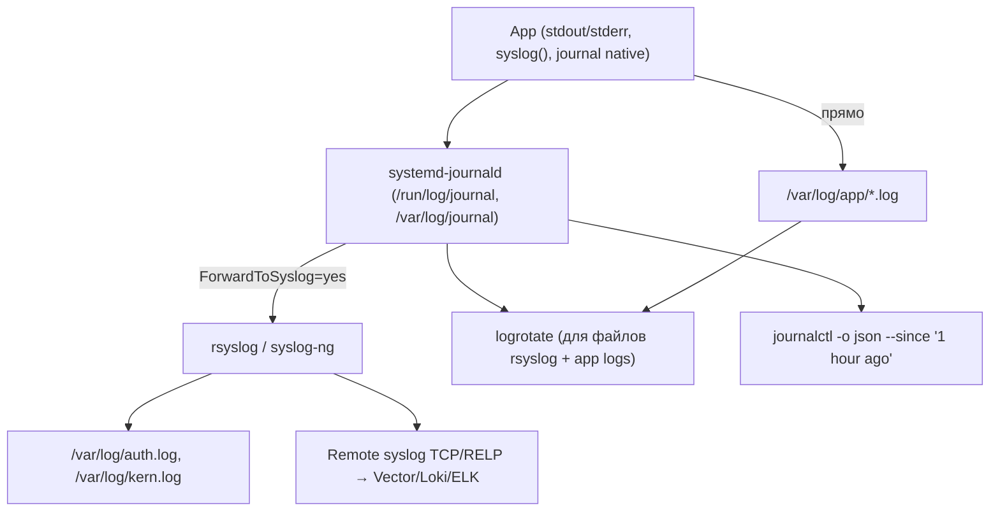

# 📝 07. Логирование Linux: journald, rsyslog и logrotate

> Куда уходят `stderr`, зачем `journalctl -o json` и как не забить диск логами за сутки.

## 🏗️ Архитектура: кто пишет, кто читает, кто ротирует



| Компонент | Роль | Где конфиг |
|---|---|---|
| **systemd-journald** | приём `stdout` всех юнитов + `syslog` socket + `journal native API`, бинарный журнал, `mmap` | `/etc/systemd/journald.conf` |
| **rsyslog** | классический syslog-демон, фильтрация `facility.priority`, forwarding | `/etc/rsyslog.conf`, `/etc/rsyslog.d/*.conf` |
| **logrotate** | ротация файлов (`copytruncate` / `postrotate kill -USR1`), ретеншн | `/etc/logrotate.conf`, `/etc/logrotate.d/*` |

---

## 📘 journald: хранение, лимиты, уровни

### journald.conf — что трогают в проде

```ini
# /etc/systemd/journald.conf
[Journal]
Storage=persistent        # auto (volatile в /run) vs persistent (/var/log/journal)
SystemMaxUse=2G           # потолок на диске, дефолт 10% FS, но 4G max
RuntimeMaxUse=512M        # в /run до монтирования /var
SystemKeepFree=1G         # оставить свободно
MaxFileSec=1month         # ротация по времени
ForwardToSyslog=yes       # дублировать в rsyslog (если он есть)
RateLimitIntervalSec=30s
RateLimitBurst=1000       # 1000 сообщений за 30с от одного сервиса → дроп
MaxRetentionSec=1month
```

```bash
# Применение
sudo mkdir -p /var/log/journal
sudo systemd-tmpfiles --create --prefix /var/log/journal
sudo systemctl restart systemd-journald

# Проверка
journalctl --disk-usage
sudo journalctl --vacuum-size=500M      # экстренно освободить
sudo journalctl --vacuum-time=7d
sudo journalctl --rotate                # принудительно новый файл
```

### Чтение: json, фильтры, корреляция

```bash
# Структурированный вывод
journalctl -o json --since "1 hour ago" | jq '.MESSAGE, .PRIORITY, ._SYSTEMD_UNIT, .CODE_FILE'
journalctl -o json-pretty -u myapp.service -n 5

# Константы уровня (PRIORITY 0 emerg … 7 debug)
journalctl -p err..emerg --since today          # только ошибки
journalctl -u myapp.service -p info -n 100
journalctl _SYSTEMD_UNIT=myapp.service _PID=12345  # по полям

# Времена
journalctl --since "2026-08-28 10:00:00" --until "2026-08-28 10:05:00"
journalctl --since "1 hour ago" --until now
journalctl -k -b -1            # логи предыдущего бута (после OOM/panic)

# Следование и корреляция
journalctl -u myapp.service -f -o cat
journalctl -o json | jq 'select(.REQUEST_ID=="550e8400-...")'

# Проверка RateLimit
journalctl --no-pager | grep -i "Suppressed.*messages"
dmesg -T | grep -i "journal"
```

### Structured logging: как писать чтобы grep работал

```bash
# Плохо:
echo "user alice failed login"  # не спарсить LEVEL, не скажи где

# Хорошо: JSON в stdout (journald поймаетMESSAGE, можно добавить поля)
logger --journald <<EOF
MESSAGE=User login failed
PRIORITY=4
USER_ID=alice
REQUEST_ID=550e8400-e29b-41d4-a716-446655440000
TRACE_ID=00-4bf92f3577b34da6a3ce929d0e0e4736-00f067aa0ba902b7-01
CODE_FILE=auth.py
EOF

# Приложение: python
import logging, json, sys
logging.basicConfig(stream=sys.stdout, level=logging.INFO, format='%(message)s')
logging.info(json.dumps({"level":"error","msg":"db timeout","request_id":"abc","duration_ms":3200,"trace_id":"4bf92..."}))

# Запрос:
journalctl -o json | jq 'select(.REQUEST_ID=="abc") | .MESSAGE | fromjson'
```

**Поля стандарта (минимум):** `timestamp` (RFC3339), `level` (`debug/info/warn/error`), `msg`, `request_id`/`trace_id`, `service`, `instance`.

---

## 📨 rsyslog: facilities, priorities, forwarding

### Архитектура и конфиг

```bash
cat /etc/rsyslog.conf
# module(load="imuxsock")  # /dev/log
# module(load="imklog")    # kernel
# module(load="imjournal") # journald → rsyslog (если ForwardToSyslog=no, то наоборот)

# Правила: facility.priority  action
# auth,authpriv.*          /var/log/auth.log
# *.*;auth,authpriv.none   -/var/log/syslog
# mail.*                   -/var/log/mail.log
# kern.*                   -/var/log/kern.log
```

**Facilities:** `kern`, `user`, `mail`, `daemon`, `auth`, `authpriv`, `syslog`, `lpr`, `news`, `uucp`, `cron`, `local0..local7` (для своих apps — берите `local5`).

**Priorities:** `debug(7) < info(6) < notice(5) < warning(4) < err(3) < crit(2) < alert(1) < emerg(0)` — `*.err` = `err..emerg`.

```ini
# /etc/rsyslog.d/10-app.conf
module(load="imuxsock")
template(name="jsonfmt" type="list") {
  constant(value="{ \"timestamp\":\"")
  property(name="timereported" dateFormat="rfc3339")
  constant(value="\",\"host\":\"")
  property(name="hostname")
  constant(value="\",\"severity\":\"")
  property(name="syslogpriority-text")
  constant(value="\",\"facility\":\"")
  property(name="syslogfacility-text")
  constant(value="\",\"msg\":\"")
  property(name="msg" format="json")
  constant(value="\"}\n")
}

# Все от local5 → файл + remote
local5.*  action(type="omfile" file="/var/log/app/app.log" template="jsonfmt")
local5.*  action(type="omfwd" target="logs.example.com" port="514" protocol="tcp"
                 template="RSYSLOG_SyslogProtocol23Format"
                 action.resumeRetryCount="-1" queue.type="LinkedList" queue.size="10000")

# Фильтр
:msg, contains, "password"  ~
:programname, isequal, "myapp"  /var/log/myapp.log
& stop
```

```bash
# Проверка
rsyslogd -N1  # синтаксис
sudo systemctl restart rsyslog
logger -p local5.info "test json via rsyslog"
tail -f /var/log/app/app.log | jq .

# Remote: TCP vs RELP
# TCP: простой, без подтверждения доставки
# RELP (Reliable Event Logging Protocol): с подтверждением, для потерь через TCP
# module(load="omrelp")
# local5.* action(type="omrelp" target="logs.example.com" port="20514")
```

**Когда нужен rsyslog, а когда нет:** `journald` достаточно если весь софт — systemd юниты и Vector/Alloy читает `journalctl -o json`. `rsyslog` нужен для legacy (`cron`, `kern`) и для `omfwd` по сети (journald remote — `systemd-journal-remote` менее популярен).

---

## 🔄 logrotate: retention и copytruncate vs postrotate

```ini
# /etc/logrotate.d/app
/var/log/app/*.log {
  daily
  rotate 14
  compress
  delaycompress
  missingok
  notifempty
  create 0640 appuser adm
  # Вариант A: создать новый файл и сказать приложению
  postrotate
    # nginx: reopen logs
    kill -USR1 $(cat /run/nginx.pid 2>/dev/null) || true
    # java: log4j без HUP — copytruncate
  endscript
  # Вариант B: обрезать на месте (если нет USR1)
  # copytruncate
  # Вариант C: systemd + journald → не нужен, vacuum вместо rotate
}

# Проверка
logrotate -d /etc/logrotate.d/app  # debug без вращения
logrotate -f /etc/logrotate.d/app  # force вращение
ls -lh /var/log/app/ | head
```

| Стратегия | Плюсы | Минусы |
|---|---|---|
| `postrotate: kill -USR1` | нет потери строк, inode меняется — `lsof` чистый | нужен сигнал в app |
| `copytruncate` | не нужен рестарт | копирует + усекает — теряется часть строк между `copy` и `truncate`, inode тот же |
| `create + compress` | атомарно | app пишет в старый FD если не HUP — «`lsof +L1` deleted» |

**Systemd интеграция:**

```bash
# Лог юнита не в /var/log/app, а в journal → vacuum вместо logrotate
journalctl --disk-usage
journalctl --vacuum-size=1G --vacuum-time=7d
# Timer для logrotate: /lib/systemd/system/logrotate.timer  daily
systemctl status logrotate.timer
```

---

## 🧪 Hands-on Labs

### Lab 1. journald persistent + RateLimit + json (5 мин)

```bash
# До
journalctl --disk-usage; ls -ld /var/log/journal
sudo mkdir -p /var/log/journal
sudo tee -a /etc/systemd/journald.conf <<'EOF'
[Journal]
Storage=persistent
SystemMaxUse=1G
RateLimitBurst=200
EOF
sudo systemctl restart systemd-journald
journalctl --disk-usage
logger --journald <<EOF
MESSAGE=Demo structured
PRIORITY=6
REQUEST_ID=demo-123
TRACE_ID=00-4bf92f3577b34da6a3ce929d0e0e4736-abc-01
EOF
journalctl -o json --since "1 min ago" | jq 'select(.REQUEST_ID=="demo-123")'
```

### Lab 2. rsyslog local5 → файл JSON + фильтр (5 мин)

```bash
sudo tee /etc/rsyslog.d/10-app.conf <<'EOF'
template(name="jsonfmt" type="list") {
  constant(value="{ \"ts\":\"") property(name="timereported" dateFormat="rfc3339")
  constant(value="\",\"msg\":\"") property(name="msg" format="json")
  constant(value="\"}\n")
}
local5.* action(type="omfile" file="/var/log/app/app.log" template="jsonfmt")
EOF
sudo mkdir -p /var/log/app && sudo rsyslogd -N1 && sudo systemctl restart rsyslog
logger -p local5.info "hello from rsyslog app"
cat /var/log/app/app.log | tail -1 | jq .
# Фильтр паролей
echo ':msg, contains, "password" ~' | sudo tee -a /etc/rsyslog.d/99-filter.conf
sudo systemctl restart rsyslog; logger -p local5.info "user password=secret should be dropped"; sleep 1; cat /var/log/app/app.log | grep password || echo "filtered"
sudo rm /etc/rsyslog.d/99-filter.conf /etc/rsyslog.d/10-app.conf; sudo systemctl restart rsyslog
```

### Lab 3. Инсценировка disk pressure от логов (5 мин, VM или loop)

```bash
# Создайте жирный лог и посмотрите vacuum
truncate -s 200M /tmp/disk.img && mkfs.ext4 -F /tmp/disk.img
mkdir -p /tmp/journal_test && sudo mount -o loop /tmp/disk.img /tmp/journal_test
sudo systemd-journal-remote --help | head  # проверка remote
journalctl --disk-usage  # baseline
# Заспамить журнал (RateLimit сработает)
for i in $(seq 1 2000); do logger "spam $i"; done
journalctl --disk-usage
sudo journalctl --vacuum-size=50M
journalctl --disk-usage
sudo umount /tmp/journal_test; rm /tmp/disk.img
```

### Lab 4. logrotate copytruncate vs USR1 (5 мин)

```bash
mkdir -p /tmp/logrotate_lab && echo "line1" > /tmp/logrotate_lab/app.log
cat > /tmp/logrotate_lab.conf <<'EOF'
/tmp/logrotate_lab/*.log {
  rotate 3
  compress
  missingok
  notifempty
  copytruncate
  size 1k
}
EOF
# Наспамить
for i in $(seq 1 100); do echo "log line $i $(date)" >> /tmp/logrotate_lab/app.log; done
ls -lh /tmp/logrotate_lab/
logrotate -f /tmp/logrotate_lab.conf
ls -lh /tmp/logrotate_lab/  # app.log + app.log.1.gz
cat /tmp/logrotate_lab/app.log | head
```

---

## 🧨 Типовые грабли логирования (только эта тема)

| Симптом | Причина | Быстрое решение |
|---|---|---|
| `journalctl --disk-usage` 4G, `/var` 100% | `SystemMaxUse` дефолт 10% FS, но на 100G диске 10G | `journalctl --vacuum-size=1G` + `SystemMaxUse=2G` в journald.conf |
| `Suppressed 3000 messages from myapp.service` | `RateLimitBurst=1000/30s` отрезал шторм | поднять `RateLimitBurst=5000` или перейти на `local5` + rsyslog queue |
| `lsof +L1` показывает `/var/log/app.log (deleted)` 2G | `rm` вместо `copytruncate/postrotate` | `truncate -s0 /proc/$PID/fd/$FD` или `kill -USR1`; чинить logrotate |
| Логи без `REQUEST_ID` → нельзя коррелировать | App пишет plain text без полей | перейти на `logger --journald` или JSON в stdout + `jq .REQUEST_ID` |
| `rsyslog` не форвардит на `logs.example.com:514` | Firewall `514/tcp` закрыт / `omfwd` без queue теряет при сети | `nc -zv logs.example.com 514`; включить `queue.type LinkedList` + `action.resumeRetryCount -1` |
| `logrotate` не ротирует ежедневно | `logrotate.timer` inactive | `systemctl status logrotate.timer`; `logrotate -d /etc/logrotate.d/app` |

---

## ✅ Чек-лист зрелости

- [ ] `journald Storage=persistent`, `SystemMaxUse` осознан (2G), `RateLimitBurst` настроен, `ForwardToSyslog` по схеме
- [ ] Каждый сервис пишет `REQUEST_ID/TRACE_ID` в journald `PRIORITY`+JSON, `journalctl -o json` парсится `jq`
- [ ] `rsyslog` facility `local5` для apps, `omfwd` с queue в remote, фильтр `password` → drop
- [ ] `logrotate` per-file: `copytruncate` только где нет `USR1`, `postrotate` HUP где есть, `rotate 14 compress`
- [ ] `journalctl --vacuum` + `logrotate -d` в runbook, алерты `journal_disk_usage >80%`

---

## 🎤 Пять вопросов для повторения

**В1. Чем `Storage=auto` отличается от `persistent` в journald.conf?**

<details><summary>Ответ</summary>

`auto` пишет в `/run/log/journal` (volatile, чистится при ребуте) если `/var/log/journal` нет. `persistent` требует каталог и пишет на диск. Для прода — создать `/var/log/journal` и `Storage=persistent`, иначе после ребута нет истории до OOM/panic (`journalctl -b -1` пуст).

</details>

**В2. Что делают `SystemMaxUse`/`SystemKeepFree` и как экстренно освободить место?**

<details><summary>Ответ</summary>

`SystemMaxUse` потолок журнала на диске (дефолт 10% FS, 4G cap), `SystemKeepFree` оставляет свободно. Экстренно: `journalctl --vacuum-size=500M` или `--vacuum-time=7d`. Постоянно — в `journald.conf` + `systemctl restart systemd-journald`.

</details>

**В3. Когда использовать `copytruncate`, а когда `postrotate kill -USR1`?**

<details><summary>Ответ</summary>

`copytruncate` — приложение не умеет переоткрывать лог (нет USR1) — копирует файл и усекает, но теряется часть строк и inode не меняется. `kill -USR1` (nginx, java log4j с HUP) — приложение само открывает новый FD, без потерь. `copytruncate` только для legacy.

</details>

**В4. Как отфильтровать пароль в rsyslog и почему это нельзя делать в app?**

<details><summary>Ответ</summary>

`:msg, contains, "password" ~` discard в `rsyslog.d/` до `omfile/omfwd`. В app тоже нужно scrub, но rsyslog — последний рубеж, если app залогировал секрет. Проверка: `logger -p local5.info "password=secret"; tail /var/log/app/app.log | grep password` — должно быть пусто. `format="json"` экранирует.

</details>

**В5. Как найти все логи одного запроса через journald?**

<details><summary>Ответ</summary>

Требуется `REQUEST_ID`/`TRACE_ID` в каждом сообщении: `REQUEST_ID=550e...` через `logger --journald` или JSON `stdout`. Затем `journalctl -o json | jq 'select(.REQUEST_ID=="550e...")'` или `journalctl REQUEST_ID=550e...`. Без ID — только по `grep` и времени `--since`.

</details>

---

## 🧭 Что дальше

| Шаг | Материал |
|---|---|
| 🔬 Закрепить | [Отладка производительности](../01-linux-and-networking/05-linux-performance-diagnostics.md) — `journalctl -k` для OOM |
| 💪 Практика | [Loki + Alloy](../09-observability/02-logging-loki-and-tracing.md) — forwarding в центр |
| 🎤 Проверить | [Файловые системы](06-linux-filesystems-and-storage.md) — `lsof +L1` vs ротация |

<!-- enriched:v1 -->
