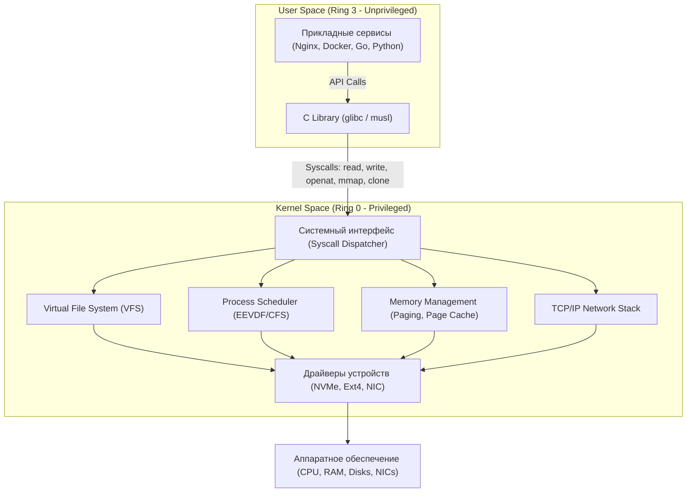
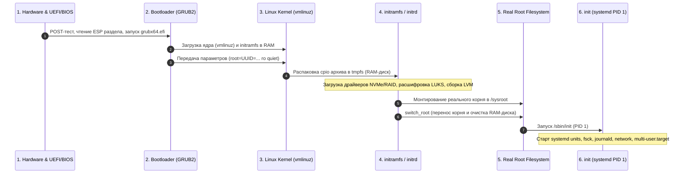

# 🚀 08. Ядро, User Space и Процесс Загрузки Linux

## 🧠 Архитектура: Kernel Space vs User Space

Операционная система Linux строго разделяет память и процессорные привилегии на два пространства:

- **Kernel Space (Кольцо 0 / Ring 0):** Пространство ядра. Имеет неограниченный прямой доступ ко всей физической памяти и аппаратному обеспечению компьютера. Здесь исполняются планировщик задач, подсистема управления памятью, сетевой стек и драйверы устройств. Любой критический сбой здесь приводит к **Kernel Panic**.
- **User Space (Кольцо 3 / Ring 3):** Пользовательское пространство. Изолированная среда с виртуальной памятью, где работают все прикладные программы (`nginx`, `postgres`, `python`, `systemd`). Приложения не имеют прямого доступа к оборудованию.
- **Системные вызовы (Syscalls):** Единственный интерфейс взаимодействия между User Space и Kernel Space. Приложение инициирует программное прерывание (`syscall`), процессор переключается в Ring 0, ядро проверяет права и валидность аргументов, выполняет операцию и возвращает результат в Ring 3.



---

## 🔄 Полный цикл загрузки Linux (Boot Sequence)

Процесс запуска Linux от нажатия кнопки питания до экрана логина состоит из 6 последовательных стадий:



---

## 📦 Зачем нужен `initramfs` (Initial RAM Filesystem)

`initramfs` решает фундаментальную **«проблему курицы и яйца»**:
> Чтобы смонтировать корневую файловую систему (`/`), ядру требуются драйверы дисковых контроллеров, модули программного RAID (`mdadm`), расшифровка LUKS (`cryptsetup`) или тома LVM. Но все эти модули и утилиты лежат на самом диске, который еще не смонтирован!

**Как устроен `initramfs`:**
1. Это сжатый архив `cpio` (например, `/boot/initrd.img-6.8.0-generic`), содержащий минимальное окружение User Space (Busybox, `udev`, скрипты инициализации и скомпилированные `.ko` модули ядра).
2. Загрузчик GRUB копирует `initramfs` в оперативную память.
3. Ядро распаковывает его в `tmpfs` (RAM-диск) и запускает скрипт `/init`.
4. Скрипт инициализирует оборудование, собирает дисковый стек, монтирует реальный диск по `UUID` в каталог `/sysroot`.
5. Выполняется системный вызов `pivot_root` (или утилита `switch_root`), переключающая корень системы на реальный SSD/HDD.

---

## 🛠️ Практика и CLI Cheat Sheet

### 1. Анализ времени загрузки системы (`systemd-analyze`)
```bash
# Общее время загрузки (ядро + initrd + userspace)
systemd-analyze

# Топ сервисов, замедляющих старт системы
systemd-analyze blame | head -n 15

# Дерево критической цепочки (самая длинная последовательная цепочка запуска)
systemd-analyze critical-chain

# Генерация SVG-графика загрузки со всеми процессами
systemd-analyze plot > /tmp/boot-analysis.svg
```

### 2. Исследование и управление ядром и initramfs
```bash
# Текущая версия ядра и параметры загрузки (Kernel Command Line)
uname -r
cat /proc/cmdline

# Просмотр содержимого initramfs без его распаковки
lsinitramfs /boot/initrd.img-$(uname -r) | grep -E "nvme|ext4|lvm"
# Для RHEL/CentOS (dracut):
lsinitrd /boot/initramfs-$(uname -r).img

# Пересборка initramfs после добавления модулей или изменения fstab
# Ubuntu/Debian:
sudo update-initramfs -u -k all
# RHEL/Rocky/Alma:
sudo dracut --regenerate-all --force

# Обновление конфигурации GRUB
# Ubuntu/Debian:
sudo update-grub
# RHEL/CentOS:
sudo grub2-mkconfig -o /boot/grub2/grub.cfg
```

### 3. Исследование системных вызовов (`strace`)
```bash
# Подсчет количества и суммарного времени всех системных вызовов процесса
strace -c -p <PID>

# Отслеживание только файловых и сетевых syscalls с сохранением в файл
strace -f -e trace=file,network -s 512 -o /tmp/trace.log ./my_app

# Поиск системных вызовов, возвращающих ошибки
strace -e 'trace=!all' -z ./my_app
```

---

## 🚨 Траблшутинг сбоев загрузки

### 1. Система не загружается: переход в аварийный shell
Если поврежден `/etc/fstab` или не найден корневой раздел, в меню GRUB нажмите `e` на нужном ядре и добавьте в конец строки `linux ...`:
* **`init=/bin/bash`** — загружает ядро сразу в командную оболочку bash в обход systemd (без ввода паролей, root смонтирован в Read-Only).
* **`rd.break`** — останавливает загрузку внутри `initramfs` прямо перед передачей управления в реальный корень (позволяет сбросить пароль root или починить драйверы).

```bash
# Перемонтирование корня в режим записи и починка:
mount -o remount,rw /sysroot
chroot /sysroot
# Исправляем /etc/fstab или меняем пароль root:
nano /etc/fstab
passwd root
exit
reboot
```

### 2. Исследование логов ядра и аварий
```bash
# Логи ядра текущей сессии с человекочитаемым временем
dmesg -T --level=err,warn

# Логи предыдущей загрузки (если сервер внезапно перезагрузился)
journalctl -k -b -1

# Проверка статуса паники ядра при нехватке памяти или зависаниях
sysctl kernel.panic
sysctl kernel.panic_on_oops
```
