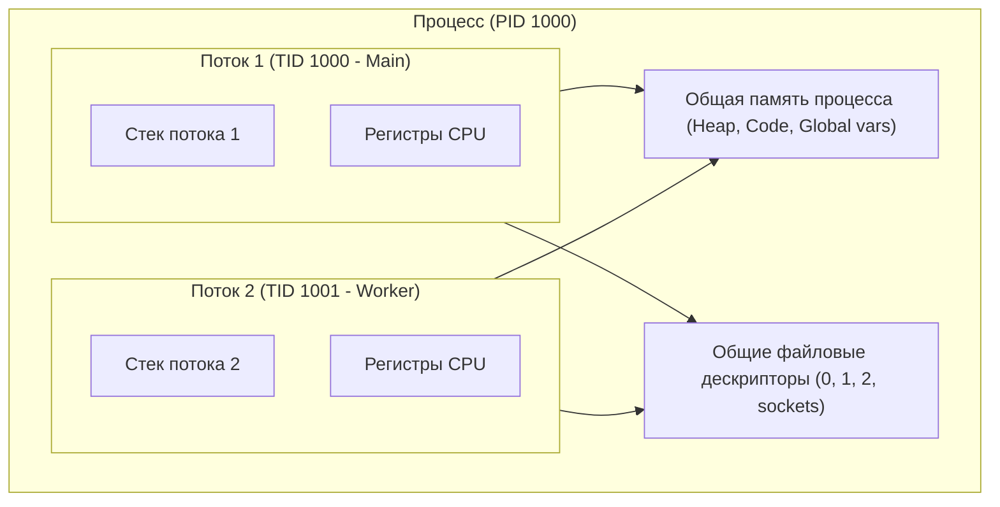
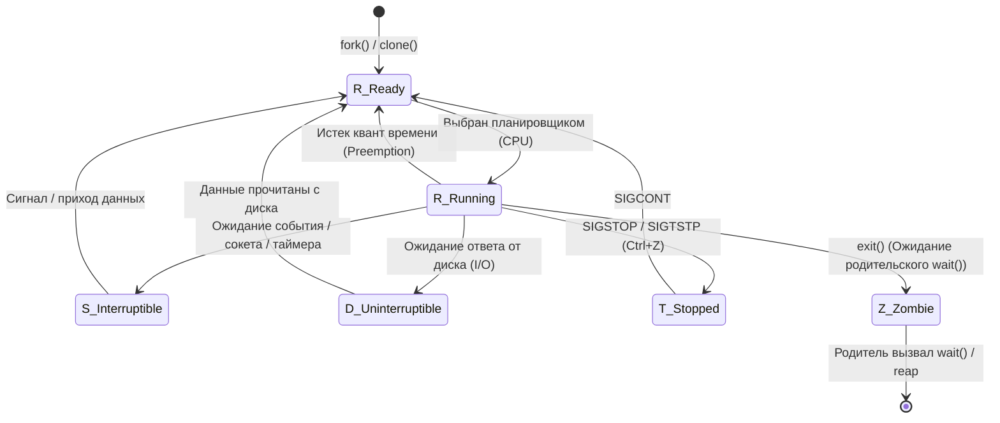

# ⚙️ 09. Процессы, Потоки и Планировщик Задач Linux

## 🧠 Процессы и Потоки: Архитектура в Ядре

В ядре Linux сущности процесса и потока унифицированы. Для ядра и процесс, и тред — это структура **`task_struct`** (Lightweight Process / LWP).

- **Процесс (Process):** Экземпляр программы с собственной изолированной виртуальной памятью, таблицей файловых дескрипторов, таблицей страниц памяти (Page Table) и пространствами имен (Namespaces). Создается через `fork()` или `clone()`.
- **Поток / Тред (Thread):** Единица планирования процессора. Потоки одного процесса **разделяют общее адресное пространство памяти**, дескрипторы открытых файлов и обработчики сигналов, но имеют **собственный стек** и регистры CPU. Создаются системным вызовом `clone()` с флагами `CLONE_VM`, `CLONE_FS`, `CLONE_FILES`, `CLONE_SIGHAND`.



---

## 📊 Состояния процессов (Process States)



| Состояние | Код | Описание | Можно ли завершить через `kill -9`? |
| :--- | :---: | :--- | :---: |
| **Running / Runnable** | `R` | Исполняется на ядре CPU прямо сейчас или ждет в очереди очереди запуска (runqueue). | Да |
| **Interruptible Sleep** | `S` | «Спит» в ожидании таймера, события или данных из сети/пайпа. | Да |
| **Uninterruptible Sleep** | `D` | **«Мертвый сон»:** процесс завис в системном вызове в ожидании дискового I/O или блокировки NFS. | **НЕТ** (только перезагрузка или завершение I/O) |
| **Zombie** | `Z` | Процесс завершился, освободил память, но запись в таблице процессов осталась, пока родитель не вызовет `waitpid()`. | **НЕТ** (нужно убить родительский процесс `PPID`) |
| **Stopped / Traced** | `T` | Остановлен сигналом остановки или находится под отладкой `gdb`/`strace`. | Да |

---

## ⏱️ Планировщик ядра (Schedulers: CFS & EEVDF)

Планировщик Linux распределяет процессорное время между миллисекундами задач:

1. **CFS (Completely Fair Scheduler):** Классический планировщик Linux (ядра до 6.5). Использовал красно-черное дерево (Red-Black Tree) и метрику **`vruntime`** (виртуальное время исполнения). Задача с наименьшим `vruntime` всегда запускалась следующей.
2. **EEVDF (Earliest Eligible Virtual Deadline First):** Новый планировщик по умолчанию (начиная с Linux 6.6+). Заменяет CFS, устраняя задержки для интерактивных и latency-sensitive задач за счет учета индивидуальных дедлайнов выполнения.
3. **Nice-значения (`nice` от -20 до +19):**
   * `-20` — максимальный приоритет (забирает максимум CPU time).
   * `0` — стандартный приоритет.
   * `+19` — минимальный приоритет («фоновая задача», уступает всем).
4. **Real-Time планирование (SCHED_FIFO, SCHED_RR):**
   * Процессы реального времени имеют жесткий приоритет от 1 до 99 и вытесняют любые обычные CFS/EEVDF процессы.

---

## 🛠️ CLI Cheat Sheet: Мониторинг и Управление

### 1. Детальный аудит процессов и потоков
```bash
# Просмотр процессов в виде дерева со всеми аргументами
ps -ef --forest
pstree -aps <PID>

# Мониторинг отдельных потоков (TID) процесса в реальном времени
pidstat -u -p ALL -t 1 5

# Топ 10 процессов по потреблению CPU
ps aux --sort=-%cpu | head -n 11

# Поиск зависших процессов в D-state (I/O wait)
ps -eo state,pid,user,cmd | awk '$1=="D"'

# Поиск процессов-зомби и их родителей (PPID)
ps -eo stat,pid,ppid,comm | grep -w "Z"
```

### 2. Изменение приоритетов и привязка к ядрам (CPU Affinity)
```bash
# Запуск команды с пониженным приоритетом
nice -n 15 tar -czf backup.tar.gz /var/log

# Изменение приоритета уже работающего процесса
renice -n -5 -p <PID>

# Привязка процесса к конкретным ядрам CPU (Core 0 и Core 1)
taskset -cp 0,1 <PID>

# Проверка текущей маски привязки к CPU
taskset -p <PID>
```

### 3. Анализ переключений контекста и очередей CPU
```bash
# Мониторинг очереди задач (r), блокировок (b) и переключений контекста (cs)
vmstat 1 10

# Мониторинг voluntary и non-voluntary context switches конкретного процесса
pidstat -w -p <PID> 1
```

---

## 🚨 Траблшутинг проблем с CPU и процессами

### 1. Высокий `Load Average` при низком `%CPU`
* **Причина:** В метрику Load Average в Linux входят не только процессы в состоянии `R` (CPU), но и процессы в состоянии `D` (ожидание диска I/O или сетевой ФС вроде NFS).
* **Диагностика:**
  ```bash
  # Проверяем %iowait в первой строке:
  top
  # Смотрим, какие процессы висят в D-state:
  ps -eo state,pid,cmd | grep "^D"
  # Проверяем дисковую очередь:
  iostat -xz 1 5
  ```

### 2. Процессы-зомби плодятся и забивают PID-таблицу
* **Причина:** Родительский процесс упал или заблокирован и не считывает код завершения дочерних процессов через `waitpid()`.
* **Решение:**
  ```bash
  # Находим родителя зомби (PPID):
  ps -o ppid= -p <ZOMBIE_PID>
  # Перезапускаем или корректно завершаем родителя:
  kill -15 <PARENT_PID>
  # Если родитель завершится, зомби будут усыновлены процессом systemd (PID 1) и мгновенно очищены.
  ```
