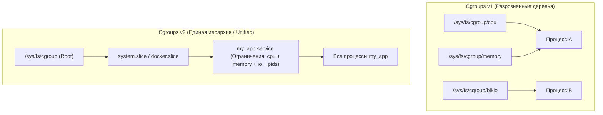

# 🎛️ 10. Cgroups v2 и Systemd Slices

## 🧠 Что такое Cgroups (Control Groups)

**Control Groups (cgroups)** — механизм ядра Linux, позволяющий объединять процессы в иерархические группы и изолированно управлять их ресурсами: **CPU, оперативной памятью, дисковым вводом-выводом (I/O), сетью и лимитом количества процессов (PIDs)**.

Cgroups — один из двух фундаментальных столпов контейнеризации (Docker, Podman, Kubernetes, systemd-nspawn) наряду с Namespaces.

---

## ⚡ Cgroups v1 vs Cgroups v2: Ключевые различия



| Характеристика | Cgroups v1 | Cgroups v2 (Современный стандарт) |
| :--- | :--- | :--- |
| **Иерархия** | Несколько независимых деревьев для каждого контроллера (CPU, Memory, Blkio). | **Единое дерево (Unified Hierarchy)** под `/sys/fs/cgroup`. |
| **Memory + I/O** | Page cache и writeback не учитывались в лимитах памяти. | **Идеальный учет:** грязные страницы и буферы I/O жестко привязаны к cgroup процесса. |
| **OOM Killer** | Убивал случайный процесс внутри cgroup. | Поддержка `memory.oom.group` (убивает **все процессы** группы разом, предотвращая полумертвое состояние). |
| **Метрики давления** | Отсутствовали. | Встроенная поддержка **PSI (Pressure Stall Information)** для CPU, Memory и IO. |

---

## 🍰 Systemd Slices, Scopes и Services

Systemd использует Cgroups v2 для автоматического распределения процессов по **срезам (Slices)**:

```text
-.slice (Корневой срез)
├── system.slice           # Все системные службы (sshd, nginx, postgres)
│   ├── nginx.service
│   └── postgresql.service
├── user.slice             # Сессии пользователей (SSH логины, desktop)
│   └── user-1000.slice
└── machine.slice          # Контейнеры и виртуальные машины (Docker, KVM, Podman)
```

* **Slice (`.slice`):** Контейнер ресурсов, задающий общие бюджеты CPU/RAM для группы сервисов.
* **Scope (`.scope`):** Набор внешних процессов, порожденных не через systemd (например, SSH-сессия пользователя).
* **Service (`.service`):** Конкретная управляемая служба.

---

## 🛠️ Настройка лимитов в Systemd Unit (Production)

Файл конфигурации: `/etc/systemd/system/api-service.service`

```ini
[Unit]
Description=Backend API Service
After=network.target

[Service]
Type=exec
ExecStart=/usr/local/bin/api-server
Restart=always

# ================================
# 🔒 ОГРАНИЧЕНИЯ РЕСУРСОВ (Cgroups v2)
# ================================
# Ограничение CPU: 2 ядра (200%)
CPUQuota=200%
# Вес в очереди CPU относительно других сервисов (1-10000, default 100)
CPUWeight=200

# Жесткий лимит памяти (OOM при превышении)
MemoryMax=2G
# Мягкий лимит памяти (ядро начинает агрессивно сбрасывать кэш до OOM)
MemoryHigh=1.8G
# Убить весь сервис целиком при срабатывании OOM
MemoryOOMGroup=true

# Лимит количества процессов/потоков (защита от fork-бомбы)
TasksMax=500

# Ограничение дискового I/O (чтение/запись на конкретный диск)
IOReadBandwidthMax=/dev/sda 50M
IOWriteBandwidthMax=/dev/sda 20M

[Install]
WantedBy=multi-user.target
```

Применение изменений:
```bash
sudo systemctl daemon-reload
sudo systemctl restart api-service
```

---

## 🔍 Мониторинг и CLI Cheat Sheet

```bash
# Просмотр потребления ресурсов cgroups в реальном времени (аналог top для cgroups)
systemd-cgtop

# Дерево cgroups со всеми процессами
systemd-cgls

# Мгновенная установка лимита памяти на лету без перезагрузки
sudo systemctl set-property nginx.service MemoryMax=1G

# Исследование параметров Cgroups v2 напрямую в ядре
cat /sys/fs/cgroup/system.slice/nginx.service/memory.current
cat /sys/fs/cgroup/system.slice/nginx.service/memory.events
cat /sys/fs/cgroup/system.slice/nginx.service/cpu.stat

# Просмотр метрик нехватки ресурсов (Pressure Stall Information - PSI)
cat /proc/pressure/memory
cat /proc/pressure/cpu
cat /proc/pressure/io
```

---

## 🚨 Траблшутинг Cgroups и контейнеров

### 1. Как понять, что контейнер или сервис троттлится по CPU (CPU Throttling)
Если контейнеру выделен лимит `cpu.max` (например, 500m в Kubernetes), при всплеске нагрузки ядро искусственно усыпляет потоки:
```bash
# Проверяем счетчик throttled_usec:
cat /sys/fs/cgroup/system.slice/docker-<CONTAINER_ID>.scope/cpu.stat

# Вывод:
# usage_usec 124500000
# nr_periods 5400
# nr_throttled 1200      <-- Сколько периодов процесс принудительно спал
# throttled_usec 4500000 <-- Суммарное время задержки из-за троттлинга
```

### 2. Сервис бесследно перезапускается: поиск Cgroup OOM
```bash
# Проверяем счетчик oom_kill внутри cgroup сервиса:
cat /sys/fs/cgroup/system.slice/api-service.service/memory.events
# oom 5
# oom_kill 3

# Смотрим системный журнал journald:
journalctl -u api-service.service -e | grep -i oom
```
