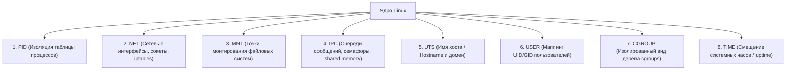

# 📦 11. Пространства Имен (Namespaces) и Контейнеры

## 🧠 Что такое Linux Namespaces

**Linux Namespaces (Пространства имен)** — фундаментальный механизм изоляции ядра, позволяющий предоставить процессу иллюзию того, что он работает на полностью выделенной независимой операционной системе.

В то время как **Cgroups** ограничивают *количество* потребляемых ресурсов (сколько CPU/RAM можно использовать), **Namespaces** ограничивают *видимость* системы (что процесс может видеть и изменять).

---

## 🧩 8 Пространств Имен Linux



| Пространство имен | Флаг `clone()` | Что изолирует | Зачем контейнерам |
| :--- | :--- | :--- | :--- |
| **PID** | `CLONE_NEWPID` | Номера процессов | Внутри контейнера процесс видит себя как `PID 1` и не видит хост-процессы. |
| **NET** | `CLONE_NEWNET` | Сетевые интерфейсы, IP, порты, таблицы маршрутизации | Контейнер получает свой виртуальный `eth0`, `lo`, стек сокетов и файрвол. |
| **MNT (Mount)** | `CLONE_NEWNS` | Дерево смонтированных файловых систем | Свой корень системы (`/`) без доступа к дискам хоста. |
| **IPC** | `CLONE_NEWIPC` | Inter-Process Communication (Shared Memory, Semaphores) | Процессы разных контейнеров не могут читать разделяемую память друг друга. |
| **UTS** | `CLONE_NEWUTS` | Hostname и NIS domain name | Позволяет задать контейнеру собственное сетевое имя (например `web-pod-1`). |
| **USER** | `CLONE_NEWUSER` | User ID (UID) и Group ID (GID) | Root внутри контейнера (`UID 0`) становится непривилегированным юзером (`UID 100000`) на хосте (Rootless containers). |
| **CGROUP** | `CLONE_NEWCGROUP`| Виртуальное дерево `/sys/fs/cgroup` | Контейнер видит только свои лимиты, не зная об иерархии хоста. |
| **TIME** | `CLONE_NEWTIME`| Системные часы (`CLOCK_MONOTONIC`, `CLOCK_BOOTTIME`)| Возможность менять время в контейнере без сдвига часов на всем сервере. |

---

## 🛠️ Практика: Создание контейнера вручную с помощью `unshare`

Вы можете создать изолированный контейнер одной системной командой без Docker:

```bash
# 1. Создаем изолированное окружение со своими PID, NET, MNT, UTS и IPC
sudo unshare --pid --net --mount --uts --ipc --fork /bin/bash

# 2. Внутри нового шелла:
# Задаем изолированное имя хоста
hostname my-isolated-container
hostname
# (На хосте имя не изменилось!)

# 3. Монтируем изолированный /proc, чтобы ps показывал только наши процессы:
mount -t proc proc /proc
ps aux
# Вывод:
# USER       PID %CPU %MEM    VSZ   RSS TTY      STAT START   TIME COMMAND
# root         1  0.0  0.0   9456  4120 pts/0    S    12:00   0:00 /bin/bash
# root         2  0.0  0.0  10234  1890 pts/0    R+   12:01   0:00 ps aux
```

---

## 🔍 Инструменты исследования: `lsns` и `nsenter`

### 1. Просмотр активных пространств имен (`lsns`)
```bash
# Список всех пространств имен в ОС и количество процессов в каждом:
lsns

# Просмотр только сетевых пространств имен:
lsns -t net
```

### 2. Подключение к пространству имен любого контейнера (`nsenter`)
Если в контейнере нет утилит `curl`, `tcpdump` или `ss`, вы можете «проникнуть» в его сетевое окружение прямо с хоста:

```bash
# 1. Находим PID главного процесса контейнера:
CONTAINER_PID=$(docker inspect --format '{{ .State.Pid }}' <CONTAINER_ID>)

# 2. Заходим в сетевой namespace контейнера и запускаем tcpdump с хоста:
sudo nsenter -t $CONTAINER_PID -n tcpdump -i any -nn port 80

# 3. Полный вход в окружение контейнера (сеть + процессы + монтирование):
sudo nsenter -t $CONTAINER_PID -m -u -i -n -p /bin/bash
```

---

## 🚨 Траблшутинг: Проблемы с изоляцией и Mount Propagation

### 1. Как работает Mount Propagation (`shared`, `slave`, `private`)
Когда контейнер или сервис монтирует папку, влияет ли это на хост?
* **`private`:** Монтирования внутри namespace не видны снаружи, монтирования на хосте не видны внутри.
* **`slave`:** Монтирования на хосте автоматически пробрасываются в контейнер, но монтирования из контейнера наружу не попадают.
* **`shared`:** Монтирования с обеих сторон синхронизируются (нужно для CSI-драйверов Kubernetes).

```bash
# Изменение режима монтирования для папки:
mount --make-rshared /mnt/data
mount --make-rslave /var/lib/docker
```
