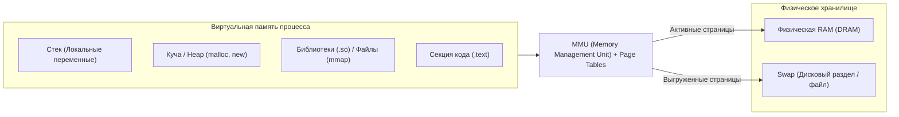

# 🧠 13. Виртуальная Память, Сегменты и Swap

## 🗺️ Архитектура Виртуальной Памяти

Каждый процесс в Linux работает в собственном **виртуальном адресном пространстве**. Процесс никогда не обращается напрямую к физическим чипам оперативной памяти (RAM).

Преобразование виртуальных адресов в физические выполняет аппаратный модуль процессора **MMU (Memory Management Unit)** с помощью **Таблицы Страниц (Page Tables)** и быстрого аппаратного кэша трансляций **TLB (Translation Lookaside Buffer)**.

* **Размер стандартной страницы памяти:** `4 КБ` (4096 байт).
* **HugePages (Большие страницы):** `2 МБ` или `1 ГБ` (используются для баз данных вроде PostgreSQL, Oracle и гипервизоров KVM для уменьшения накладных расходов TLB).



---

## 📊 Метрики Памяти: VSZ, RSS, PSS, USS

При анализе потребления памяти критически важно различать эти метрики:

| Метрика | Название | Что означает |
| :--- | :--- | :--- |
| **`VSZ`** | **Virtual Size** | Общий объем виртуального адресного пространства, который процесс запросил у ядра (включая выделенные, но еще не используемые страницы, библиотеки и swap). |
| **`RSS`** | **Resident Set Size** | **Реальная физическая память (RAM)**, которую процесс занимает прямо сейчас. Сюда входят разделяемые библиотеки (`glibc`), используемые другими процессами. |
| **`PSS`** | **Proportional Set Size** | RSS процесса + пропорциональная доля разделяемой памяти (если библиотеку в 10 МБ используют 5 процессов, каждому запишется по 2 МБ). **Самая точная метрика реального потребления памяти!** |
| **`USS`** | **Unique Set Size** | Память, занятая **исключительно** данным процессом (освободится мгновенно, если процесс убить). |

---

## 🔄 Механика Swap и параметр `vm.swappiness`

**Swap (Подкачка)** — это область на диске (файл или раздел), куда ядро сбрасывает неактивные анонимные страницы памяти при нехватке RAM.

### Параметр `vm.swappiness` (от `0` до `200` в современных ядрах):
Задает баланс для ядра: что выгоднее сбросить — неактивную анонимную память в Swap или вытеснить Page Cache (кэш файлов с диска).

* **`vm.swappiness = 0`** — максимально избегать использования Swap (сбрасывать в Swap только при абсолютной неизбежности OOM).
* **`vm.swappiness = 10`** — **рекомендуемое значение для серверов баз данных** (PostgreSQL, MySQL, Redis, Elasticsearch).
* **`vm.swappiness = 60`** — стандартное значение по умолчанию для настольных систем и серверов общего назначения.
* **`vm.swappiness = 100+`** — ядро с одинаковым приоритетом сбрасывает анонимную память в Swap и чистит Page Cache.

---

## 🛠️ CLI Практика: Диагностика и Управление Памятью

### 1. Быстрый аудит памяти сервера
```bash
# Общий статус памяти и swap в понятном виде
free -h

# Детальная статистика ядра по памяти
cat /proc/meminfo | grep -E "MemTotal|MemFree|MemAvailable|Cached|Buffers|Dirty|AnonPages|Shmem|HugePages"

# Мониторинг активности Swap (si = swap-in, so = swap-out) в реальном времени
vmstat 1 5
```
> ⚠️ **Важно:** Если колонки `si` (swap in) и `so` (swap out) в выводе `vmstat` постоянно показывают ненулевые значения (>0) — сервер испытывает **Swap Thrashing** (диск перегружен сбросом страниц, приложения катастрофически тормозят).

### 2. Исследование карты памяти процесса (`pmap`)
```bash
# Детальная раскладка адресного пространства процесса по адресам и типам:
pmap -x <PID>

# Точные метрики PSS, USS и RSS процессов через утилиту smem:
# (sudo apt install smem)
smem -t -k -p -r
```

### 3. Создание и включение файла Swap на лету
```bash
# 1. Создаем файл на 4 ГБ
sudo fallocate -l 4G /swapfile
# Если fallocate не поддерживается:
# sudo dd if=/dev/zero of=/swapfile bs=1M count=4096 status=progress

# 2. Выставляем строгие права (только root)
sudo chmod 600 /swapfile

# 3. Форматируем в структуру Swap
sudo mkswap /swapfile

# 4. Включаем файл подкачки
sudo swapon /swapfile

# 5. Добавляем в /etc/fstab для постоянного автоподключения при перезагрузке:
echo '/swapfile none swap sw 0 0' | sudo tee -a /etc/fstab

# 6. Настраиваем swappiness:
sudo sysctl -w vm.swappiness=10
echo 'vm.swappiness=10' | sudo tee -a /etc/sysctl.d/99-swappiness.conf
```

---

## 🚨 Траблшутинг: Утечки Памяти (Memory Leaks)

### Как обнаружить утечку памяти в процессе:
1. Запустите мониторинг RSS и PSS процесса во времени:
   ```bash
   while true; do
       ps -p <PID> -o %cpu,%mem,vsz,rss,comm
       sleep 5
   done
   ```
2. Если `RSS` непрерывно растет без плато под стабильной нагрузкой, а блоки `[ anon ]` в выводе `pmap -x <PID>` увеличиваются в размерах — в коде приложения (C++, Go, Node.js, Python) не освобождаются объекты или буферы.
