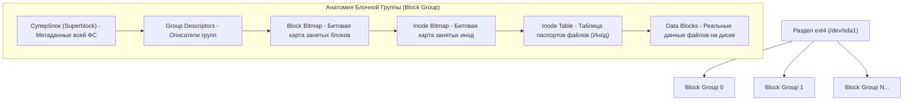

# 🗄️ 15. Файловая Система ext4, Иноды и mkfs

## 🧠 Анатомия и Структура Файловой Системы ext4

**ext4 (Fourth Extended Filesystem)** — проверенная временем, надежная журналируемая файловая система Linux.

Раздел диска в ext4 делится на независимые **Блочные Группы (Block Groups)** для уменьшения фрагментации и ускорения поиска данных:



---

## 📑 Ключевые концепции: Суперблок, Инода, Extents

### 1. Суперблок (Superblock)
Главный паспорт файловой системы. Содержит:
* Общее количество блоков и инод,
* Размер блока (стандартно `4 КБ`),
* Состояние ФС (`clean` / `error`),
* Флаги монтирования и журнал.
* *Копии суперблока дублируются в нескольких блочных группах на случай повреждения основного.*

### 2. Инода (Inode)
Каждый файл, директория, символическая ссылка, пайп или сокет в ext4 представлен **инодой (inode)** размером 256 байт.
* **Что хранится в иноде:** Тип файла, права доступа (`chmod`), владелец (`UID/GID`), размер, временные метки (`atime`, `mtime`, `ctime`, `crtime`), счетчик ссылок (`Links`), указатели на блоки данных.
* **Чего НЕТ в иноде:** **Имени файла!** Имя файла хранится исключительно внутри родительской директории (`dentry`).

### 3. Экстенты (Extents)
В старых файловых системах (ext2/ext3) для каждого блока выделялся отдельный указатель. В ext4 большие файлы описываются **экстентами** — диапазонами непрерывных блоков:
> *«Файл занимает 2048 непрерывных блоков, начиная с блока № 50000».*  
Это снижает фрагментацию и ускоряет чтение больших файлов в разы.

### 4. Режимы журналирования ext4 (`data=...`)
* **`ordered` (по умолчанию):** Данные пишутся на диск **до** записи метаданных в журнал. Оптимальный баланс надежности и скорости.
* **`journal`:** И данные, и метаданные пишутся в журнал. Максимальная надежность, но медленнее (двойная запись).
* **`writeback`:** Журналируются только метаданные без гарантии порядка записи данных. Самый быстрый режим, но есть риск мусора в файле при внезапном ребуте.

---

## 🛠️ CLI Практика: Форматирование, Настройка и Восстановление

### 1. Форматирование раздела (`mkfs.ext4`)
```bash
# Базовое форматирование с размером блока 4 КБ
sudo mkfs.ext4 -b 4096 /dev/sdb1

# Форматирование под миллионы мелких файлов (увеличение количества инод)
sudo mkfs.ext4 -i 4096 /dev/sdb1

# Быстрое форматирование без зануления блоков (lazy init)
sudo mkfs.ext4 -E lazy_itable_init=1,lazy_journal_init=1 /dev/sdb1
```

### 2. Настройка параметров смонтированной ФС (`tune2fs`)
```bash
# Просмотр детальной информации о суперблоке
sudo tune2fs -l /dev/sdb1

# Уменьшение зарезервированного для root места с 5% до 1% (освобождает десятки ГБ!)
sudo tune2fs -m 1 /dev/sdb1

# Отключение принудительной проверки fsck по количеству монтирований
sudo tune2fs -c 0 -i 0 /dev/sdb1
```

### 3. Проверка и починка файловой системы (`fsck.ext4`)
```bash
# 1. ОБЯЗАТЕЛЬНО отмонтировать диск перед проверкой!
sudo umount /mnt/data

# 2. Проверка и автоматическое исправление ошибок:
sudo fsck.ext4 -fvy /dev/sdb1

# 3. Восстановление при повреждении основного суперблока:
# Находим резервные копии суперблока:
sudo mke2fs -n /dev/sdb1
# Запускаем fsck с резервным суперблоком (например, блок 32768):
sudo fsck.ext4 -b 32768 /dev/sdb1
```

---

## 🚨 Траблшутинг: Проблема исчерпания инод (Inode Exhaustion)

### Симптом: `No space left on device`, хотя `df -h` показывает 50% свободного места
* **Причина:** Закончились иноды из-за миллионов крошечных файлов (сессии PHP, почтовая очередь, мелкие кэши).
* **Диагностика:**
  ```bash
  # Проверяем процент занятых инод:
  df -ih
  
  # Ищем директорию с наибольшим числом файлов:
  for d in /var/*; do echo $(find "$d" -xdev -type f 2>/dev/null | wc -l) "$d"; done | sort -n
  ```
* **Решение:** Удалить ненужные мелкие файлы (`find /var/spool/postfix/maildrop -type f -delete`).
