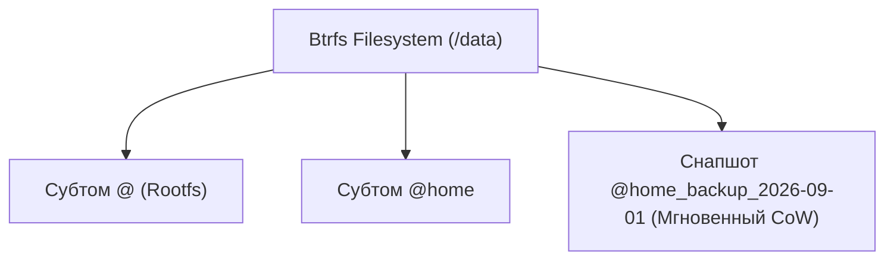

# 🌲 16. Файловые Системы XFS и Btrfs

## ⚔️ Сравнение: ext4 vs XFS vs Btrfs

В современном Linux выбор файловой системы зависит от профиля нагрузки:

| Параметр | ext4 | XFS | Btrfs |
| :--- | :--- | :--- | :--- |
| **Архитектура** | Блочные группы, иноды | **Allocation Groups (AG)**, B+ деревья | **Copy-on-Write (CoW)**, B-деревья |
| **Назначение** | Универсальная, стабильная (Debian/Ubuntu default) | Высоконагруженная, терабайтные файлы, параллельный I/O (RHEL default) | Мгновенные снапшоты, CoW, встроенный RAID, компрессия |
| **Увеличение размера (Grow)** | Да (онлайн) | **Да (онлайн)** | Да (онлайн) |
| **Уменьшение размера (Shrink)**| Да (офлайн) | ❌ **НЕЛЬЗЯ УМЕНЬШИТЬ** | Да (онлайн) |
| **Снапшоты (Snapshots)** | ❌ Нет | ❌ Нет | **Мгновенные субтома / снапшоты** |
| **Контрольные суммы данных** | ❌ Только метаданные | ❌ Только метаданные | **Да (защита от Silent Data Corruption)** |
| **Прозрачное сжатие (Zstd)** | ❌ Нет | ❌ Нет | **Да (zstd, lzo, zlib)** |

---

## 🚀 XFS: Архитектура Высокопроизводительного I/O

**XFS** изначально разработана компанией Silicon Graphics (SGI) для параллельной работы с огромными файлами на дисковых массивах.

### Ключевые фичи XFS:
1. **Allocation Groups (AG):** Диск делится на независимые группы распределения (обычно 4–32 AG). Каждая AG имеет собственные структуры блокировок и деревья свободного места. Это позволяет **сотни потоков одновременно параллельно писать на диск без блокировок**.
2. **Delayed Allocation (Отложенное выделение):** Место на диске резервируется, но фактические блоки выделяются только в момент сброса из Page Cache. Это гарантирует непрерывные экстенты без фрагментации.
3. **Reflink (CoW копии):** Мгновенное дублирование файлов без физического копирования данных (`cp --reflink=always file1.img file2.img`).

```bash
# Форматирование в XFS с 16 Allocation Groups и поддержкой reflink:
sudo mkfs.xfs -f -d agcount=16 -m reflink=1 /dev/sdb1

# Просмотр параметров смонтированной XFS:
xfs_info /mnt/data

# Увеличение размера XFS на лету (онлайн-расширение после lvextend):
sudo xfs_growfs /mnt/data

# Проверка и ремонт XFS (только в отмонтированном виде!):
sudo umount /mnt/data
sudo xfs_repair /dev/sdb1
```

---

## 🍃 Btrfs: Архитектура Copy-on-Write и Снапшоты

**Btrfs (B-tree File System)** построена по принципу **Copy-on-Write (CoW)**: при изменении блока данных новый блок записывается в свободное место на диске, а указатель в дереве переключается на новый адрес. Старый блок не перезаписывается.



### Преимущества Btrfs:
* **Мгновенные снапшоты (Snapshots):** Создание точки восстановления базы данных или системы занимает 1 миллисекунду.
* **Встроенный программный RAID:** Поддержка RAID0, RAID1, RAID10 прямо на уровне файловой системы без `mdadm`.
* **Защита от «тихого повреждения данных» (Bitrot):** Контрольные суммы SHA256/xxhash проверяются при каждом чтении. При ошибке Btrfs автоматически восстанавливает поврежденный файл со здорового зеркала RAID.

```bash
# 1. Создание Btrfs RAID1 на двух дисках со сжатием Zstandard:
sudo mkfs.btrfs -m raid1 -d raid1 /dev/sdb /dev/sdc
sudo mount -o compress=zstd:3,noatime /dev/sdb /mnt/btrfs

# 2. Создание субтомов:
sudo btrfs subvolume create /mnt/btrfs/app_data

# 3. Мгновенный снапшот субтома:
sudo btrfs subvolume snapshot -r /mnt/btrfs/app_data /mnt/btrfs/app_data_snap_$(date +%F)

# 4. Фоновая проверка целостности контрольных сумм всех файлов (Scrub):
sudo btrfs scrub start /mnt/btrfs
sudo btrfs scrub status /mnt/btrfs
```

---

## 🚨 Траблшутинг Btrfs и баз данных

### Проблема: База данных (Postgres / MySQL) жутко тормозит и фрагментирует диск на Btrfs
* **Причина:** Из-за CoW каждое случайное обновление записи (Random Write) в 8 КБ блоке СУБД создает новый фрагментированный блок.
* **Решение:** Отключите CoW для директории с базой данных до создания файлов:
  ```bash
  # Создаем папку и ставим флаг No-CoW (+C):
  mkdir -p /var/lib/postgresql/data
  chattr +C /var/lib/postgresql/data
  # Проверяем атрибут (должна быть буква C):
  lsattr -d /var/lib/postgresql/data
  ```
