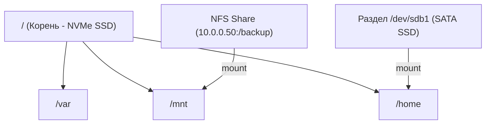

# 🔌 17. Монтирование, /etc/fstab и Автомонтирование

## 🧠 Механизм Монтирования VFS (Virtual File System)

В Linux нет понятия дисков `C:`, `D:`, `E:`. Все физические накопители, сетевые шары (NFS/CIFS) и псевдофайловые системы (`/proc`, `/sys`, `tmpfs`) объединяются в **единое дерево каталогов**, начинающееся с корня **`/`**.

**Монтирование (Mounting)** — это операция привязки файловой системы накопителя к существующему каталогу (точке монтирования). После монтирования оригинальное содержимое директории скрывается, и вместо него отображаются файлы смонтированного диска.



---

## 📑 Разбор файла `/etc/fstab` (File System Table)

Конфигурационный файл `/etc/fstab` определяет, какие разделы и с какими параметрами ядро монтирует при загрузке системы:

```text
# <file system>                  <mount point>  <type>  <options>                   <dump> <pass>
UUID=a1b2c3d4-1234-5678-90ab     /              ext4    defaults,noatime            0      1
UUID=f9e8d7c6-4321-8765-ba09     /data          xfs     defaults,noatime,nofail     0      2
/swapfile                        none           swap    sw                          0      0
10.0.0.50:/exports/share         /mnt/nfs       nfs     _netdev,auto,x-systemd.automount 0 0
```

### Разбор 6 колонок таблицы:
1. **`<file system>`:** Идентификатор накопителя. **Всегда используйте `UUID=`** (из вывода `blkid`), так как имена вроде `/dev/sda` могут измениться при добавлении дисков.
2. **`<mount point>`:** Точка монтирования (существующая папка).
3. **`<type>`:** Тип файловой системы (`ext4`, `xfs`, `btrfs`, `swap`, `nfs`, `cifs`, `tmpfs`).
4. **`<options>`:** Опции монтирования (через запятую):
   * `defaults` — `rw, suid, dev, exec, auto, nouser, async`.
   * `noatime` — **критически важно для SSD:** не обновлять время последнего чтения файла (*access time*), ускоряет работу в разы.
   * `nofail` — **главная страховка:** если диск не подключен, система **НЕ упадет в Emergency Mode**, а продолжит загрузку.
   * `_netdev` — монтировать диск только после поднятия сети (для NFS/iSCSI).
   * `ro` / `rw` — только чтение / чтение и запись.
5. **`<dump>`:** Устаревшее резервное копирование утилитой `dump`. Всегда `0`.
6. **`<pass>`:** Порядок проверки `fsck` при загрузке:
   * `1` — корневой раздел `/` (проверяется первым).
   * `2` — остальные локальные разделы.
   * `0` — не проверять (для swap, nfs, btrfs, xfs).

---

## ⚡ Автомонтирование через Systemd (x-systemd.automount)

Традиционные сетевые папки NFS часто вешают сервер при старте, если сеть еще недоступна. 

Решение — **On-Demand Automount (монтирование по требованию)**:
* Диск не монтируется при старте системы.
* Как только программа или пользователь впервые заходит в каталог `/mnt/nfs`, systemd **мгновенно монтирует диск на лету**.
* При отсутствии обращений диск автоматически отмонтируется через таймаут.

```ini
# Строка в /etc/fstab:
10.0.0.50:/data /mnt/nfs nfs _netdev,noauto,x-systemd.automount,x-systemd.idle-timeout=10min 0 0
```

---

## 🛠️ CLI Практика: Управление Монтированием

```bash
# Просмотр всех блочных устройств и их UUID:
lsblk -f
sudo blkid

# Монтирование диска с опциями:
sudo mount -o noatime,rw /dev/sdb1 /mnt/data

# Bind Mount: привязка существующей папки к другому пути (без создания ФС):
sudo mount --bind /var/log /mnt/logs_mirror

# Проверка корректности /etc/fstab БЕЗ перезагрузки (ОБЯЗАТЕЛЬНО перед ребутом!):
sudo mount -a

# Поиск процессов, блокирующих отмонтирование диска (Device or resource busy):
fuser -vm /mnt/data
lsof +f -- /mnt/data

# Принудительное / ленивое отмонтирование (Lazy Unmount):
# -l отвязывает ФС немедленно, а ресурсы очищает, когда процессы закроют дескрипторы
sudo umount -l /mnt/data
```

---

## 🚨 Траблшутинг: Ошибки fstab и Emergency Mode

### 1. Сервер не загружается после редактирования `/etc/fstab`
* **Симптом:** Сервер зависает с надписью `You are in emergency mode`.
* **Причина:** Опечатка в `UUID` или отсутствие опции `nofail` для отключенного диска.
* **Решение:**
  ```bash
  # 1. Перемонтируем корень в режим записи:
  mount -o remount,rw /
  # 2. Исправляем ошибку в /etc/fstab:
  nano /etc/fstab
  # 3. Перезагружаемся:
  reboot
  ```
