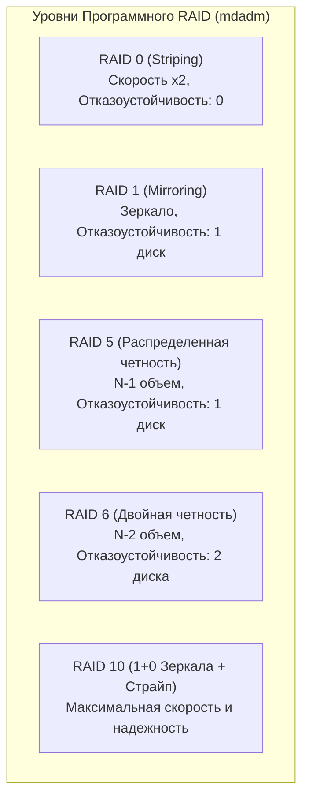
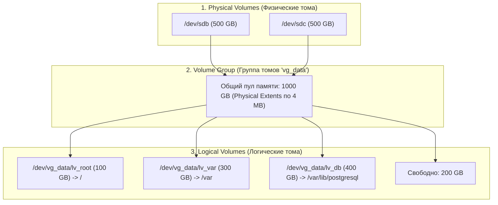

# 🗄️ 18. LVM (Logical Volume Manager) и Программный RAID (mdadm)

## 🧱 Программный RAID (mdadm)

**RAID (Redundant Array of Independent Disks)** объединяет несколько физических дисков в единый логический массив для **повышения скорости**, **отказоустойчивости** или того и другого.



### Практика работы с `mdadm`:
```bash
# 1. Создание RAID1 массива из двух дисков:
sudo mdadm --create /dev/md0 --level=1 --raid-devices=2 /dev/sdb /dev/sdc

# 2. Мониторинг состояния и синхронизации массива:
cat /proc/mdstat
sudo mdadm --detail /dev/md0

# 3. Сохранение конфигурации в mdadm.conf (чтобы массив собирался при загрузке):
sudo mdadm --detail --scan | sudo tee -a /etc/mdadm/mdadm.conf
sudo update-initramfs -u

# 4. Замена сбойного диска в RAID1:
# Помечаем диск как сбойный:
sudo mdadm --manage /dev/md0 --fail /dev/sdb
# Удаляем сбойный диск из массива:
sudo mdadm --manage /dev/md0 --remove /dev/sdb
# Вставляем новый физический диск /dev/sdd и добавляем в массив:
sudo mdadm --manage /dev/md0 --add /dev/sdd
# Начнется автоматический Rebuild (перестроение зеркала)!
```

---

## 📦 Архитектура LVM (Logical Volume Manager)

**LVM** добавляет уровень абстракции между физическими накопителями и файловыми системами, позволяя **на лету объединять диски, динамически изменять размеры томов и создавать мгновенные снапшоты**.



---

## 🛠️ Пошаговый сценарий: Создание и расширение LVM

### 1. Создание стека LVM с нуля
```bash
# Шаг 1: Инициализируем физические диски (Physical Volumes)
sudo pvcreate /dev/sdb /dev/sdc

# Шаг 2: Объединяем их в Группу Томов (Volume Group)
sudo vgcreate vg_storage /dev/sdb /dev/sdc

# Шаг 3: Создаем логический том (Logical Volume) на 200 ГБ
sudo lvcreate -n lv_database -L 200G vg_storage

# Шаг 4: Форматируем и монтируем
sudo mkfs.ext4 /dev/vg_storage/lv_database
sudo mount /dev/vg_storage/lv_database /mnt/db
```

### 2. Онлайн-расширение логического тома и ФС (без простоя!)
Когда на диске заканчивается место:
```bash
# Расширяем том на +50 ГБ И сразу растягиваем файловую систему (флаг -r):
sudo lvextend -L +50G -r /dev/vg_storage/lv_database

# Или занять ВСЕ оставшееся свободное место группы томов:
sudo lvextend -l +100%FREE -r /dev/vg_storage/lv_database
```

### 3. Создание LVM-снапшота (Freeze point перед обновлением)
```bash
# Создаем снапшот размером 10 ГБ (отслеживает только изменения CoW):
sudo lvcreate -s -n lv_database_snap -L 10G /dev/vg_storage/lv_database

# В случае неудачного апгрейда БД — мгновенный откат к снапшоту:
sudo umount /mnt/db
sudo lvconvert --merge /dev/vg_storage/lv_database_snap
sudo mount /dev/vg_storage/lv_database /mnt/db
```

---

## 🔍 Мониторинг LVM Cheat Sheet
```bash
# Краткая сводка по уровням:
sudo pvs   # Physical Volumes
sudo vgs   # Volume Groups
sudo lvs   # Logical Volumes

# Подробный статус:
sudo pvdisplay
sudo vgdisplay
sudo lvdisplay
```
