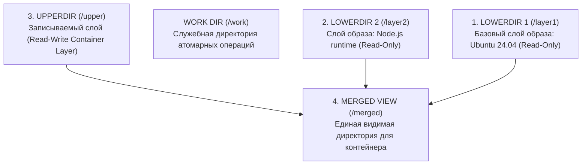

# 🥞 19. OverlayFS и tmpfs: Память и Слои Контейнеров

## 🚀 Что такое tmpfs и ramfs

**`tmpfs`** — временная файловая система, расположенная непосредственно в **оперативной памяти (RAM)**.
* **Скорость:** Скорость чтения и записи ограничена только пропускной способностью шины памяти (десятки ГБ/с с околонулевой задержкой).
* **Энергозависимость:** При перезагрузке сервера все данные в `tmpfs` безвозвратно исчезают.
* **Использование Swap:** В отличие от старого `ramfs`, `tmpfs` умеет сбрасывать неиспользуемые страницы в **Swap**, если физическая RAM заканчивается, и имеет жестко заданный лимит размера (`size=...`).

### Стандартные точки монтирования `tmpfs` в Linux:
* `/run` — рантайм-файлы демонов (PID-файлы, сокеты, `.lock`).
* `/dev/shm` — разделяемая память POSIX Shared Memory (используется браузерами, базами данных, IPC).
* `/tmp` — временные файлы (в systemd часто монтируется как `tmpfs`).

```bash
# Создание RAM-диска на 2 ГБ с ограничениями безопасности (noexec, nosuid, nodev):
sudo mount -t tmpfs -o size=2G,noexec,nosuid,nodev tmpfs /mnt/ramdisk
```

---

## 🥪 Архитектура OverlayFS (Слоистые файловые системы)

**OverlayFS** — это легковесная каскадная (Union) файловая система, позволяющая объединить несколько каталогов в одну единую точку монтирования.

Именно **OverlayFS (драйвер `overlay2`) лежит в основе всех Docker и OCI-контейнеров** (контейнерные слои образов).



---

## ⚙️ Как OverlayFS обрабатывает операции с файлами

1. **Чтение файла (Read):**
   * Если файл есть в `upperdir` (был изменен) — читается из `upperdir`.
   * Если нет — ядро ищет его сверху вниз по цепочке `lowerdir` и читает оригинальную версию.
2. **Изменение файла (Write / Copy-on-Write):**
   * Файл из `lowerdir` физически **копируется в `upperdir` целиком (Copy-up)** в момент первого вызова `write()`.
   * Все последующие изменения происходят уже только в `upperdir`. Базовый образ `lowerdir` остается неизменным!
3. **Удаление файла (Delete / Whiteout):**
   * Файл из `lowerdir` удалить физически нельзя (он Read-Only).
   * В `upperdir` создается специальный файл-заглушка — **Whiteout (символьное устройство с мажором и минором `0, 0`)**. Для пользователя файл в `/merged` перестает отображаться.

---

## 🛠️ Практика: Ручное создание слоев OverlayFS

```bash
# 1. Создаем структуру директорий
mkdir -p /tmp/overlay_demo/{lower,upper,work,merged}

# 2. Создаем файл в базовом слое (Read-Only)
echo "Hello from Base Image" > /tmp/overlay_demo/lower/base.txt

# 3. Монтируем OverlayFS
sudo mount -t overlay overlay -o \
lowerdir=/tmp/overlay_demo/lower,\
upperdir=/tmp/overlay_demo/upper,\
workdir=/tmp/overlay_demo/work \
/tmp/overlay_demo/merged

# 4. Проверяем содержимое объединенной папки:
ls -la /tmp/overlay_demo/merged/
cat /tmp/overlay_demo/merged/base.txt

# 5. Модифицируем файл в /merged:
echo "Modified by Container" >> /tmp/overlay_demo/merged/base.txt

# 6. Смотрим, что произошло под капотом:
# Исходный файл остался нетронутым:
cat /tmp/overlay_demo/lower/base.txt
# Измененный файл появился в upper:
cat /tmp/overlay_demo/upper/base.txt

# 7. Отмонтирование:
sudo umount /tmp/overlay_demo/merged
```

---

## 🚨 Траблшутинг Docker и OverlayFS

### 1. Ошибка: `No space left on device` при сборке Docker-образов
* **Причина:** Исчерпание инод на базовой файловой системе хоста из-за сотен тысяч мелких файлов в слоях `upperdir` (`/var/lib/docker/overlay2`).
* **Диагностика и очистка:**
  ```bash
  # Проверяем иноды:
  df -ih /var/lib/docker
  # Очищаем неиспользуемые контейнеры, слои и билдер-кэш:
  docker system prune -a --volumes
  ```

### 2. Ошибка: `EXDEV (Invalid cross-device link)` при переименовании файлов
* **Причина:** Системный вызов `rename()` внутри контейнера не может атомарно переместить файл между слоями `lower` и `upper`.
* **Решение:** Копировать файл (`cp + rm`), а не перемещать (`mv`).
