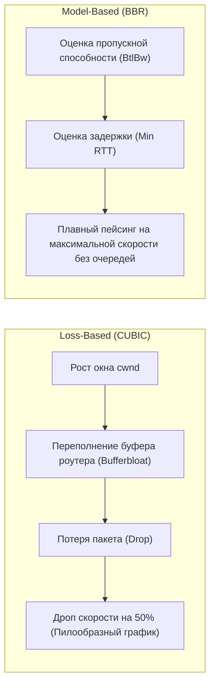

# 🚀 21. Глубокая Диагностика TCP, BBR и Буферы

## 🧠 Алгоритмы Управления Перегрузкой (TCP Congestion Control)

TCP гарантирует надежную доставку данных и управляет скоростью передачи, динамически вычисляя размер окна перегрузки **`cwnd` (Congestion Window)**.

### Эволюция алгоритмов:
1. **Loss-Based (Cubic / Reno):**  
   Классические алгоритмы считают признаком перегрузки сети **потерю пакетов (Packet Drop)**. Они линейно наращивают `cwnd`, пока сетевой буфер роутера не переполнится (**Bufferbloat**), после чего пакет теряется, и алгоритм **роняет скорость в 2 раза**. На каналах с задержками и легким процентом потерь (Wi-Fi, мобильные сети, трансконтинентальные линки) Cubic не может утилизировать канал даже на 20%.
2. **Model-Based (Google BBR — Bottleneck Bandwidth and RTT):**  
   BBR не ждет потери пакетов. Он непрерывно измеряет два параметра:
   * **Максимальную реальную пропускную способность канала ($BtlBw$)**,
   * **Минимальную круговую задержку ($RTprop$)**.  
   BBR отправляет пакеты с точной скоростью узкого места сети, **не переполняя буферы роутеров**. Это дает прирост скорости в 2–10 раз на дальних расстояниях и при потерях пакетов до 15%!



---

## ⚡ Включение BBR в Linux

BBR доступен в стандартном ядре Linux (версии 4.9+). 

```bash
# 1. Проверяем доступные алгоритмы перегрузки:
sysctl net.ipv4.tcp_available_congestion_control
# Вывод: reno cubic bbr

# 2. Включаем очередь Fair Queueing (FQ) и алгоритм BBR:
sudo sysctl -w net.core.default_qdisc=fq
sudo sysctl -w net.ipv4.tcp_congestion_control=bbr

# 3. Фиксируем в конфигурационном файле для постоянной работы:
cat << 'EOF' | sudo tee /etc/sysctl.d/99-bbr.conf
net.core.default_qdisc = fq
net.ipv4.tcp_congestion_control = bbr
EOF

# 4. Проверяем статус:
sysctl net.ipv4.tcp_congestion_control
# net.ipv4.tcp_congestion_control = bbr
```

---

## 🎛️ Тюнинг Буферов Памяти TCP для 10G/40G/100G Сетей

Формула оптимального окна TCP (BDP — Bandwidth-Delay Product):
$$\text{BDP} = \text{Bandwidth (бит/сек)} \times \text{Round Trip Time (сек)}$$

Если буфер сокета меньше BDP, сервер физически не сможет отправить больше данных, пока не получит подтверждение (ACK).

```ini
# /etc/sysctl.d/99-network-tuning.conf

# Максимальные размеры очередей и буферов ядра:
net.core.rmem_max = 67108864
net.core.wmem_max = 67108864
net.core.rmem_default = 33554432
net.core.wmem_default = 33554432

# Автотюнинг буферов TCP: min / default / max (в байтах):
# Чтение: 4 КБ / 16 МБ / 64 МБ
net.ipv4.tcp_rmem = 4096 16777216 67108864
# Запись: 4 КБ / 16 МБ / 64 МБ
net.ipv4.tcp_wmem = 4096 16777216 67108864

# Увеличение длины очереди сокетов для защиты от SYN-Flood:
net.core.somaxconn = 65535
net.ipv4.tcp_max_syn_backlog = 65535

# Быстрое повторное использование портов в TIME_WAIT:
net.ipv4.tcp_tw_reuse = 1
```
Применение настроек: `sudo sysctl --system`

---

## 🔬 CLI Практика: Глубокая Диагностика Сокетов (`ss -ti`)

Флаг `-i` утилиты `ss` выводит внутренние TCP-метрики ядра для каждого сокета:

```bash
# Диагностика установленных соединений с внутренними метриками TCP:
ss -ti dst 10.0.0.5
```

### Как читать вывод `ss -ti`:
```text
ESTAB  0  0  192.168.1.10:45234  10.0.0.5:443
     bbr wscale:7,7 rto:204 rtt:1.24/0.35 ato:40 mss:1460 rcvspace:14600 
     rcv_ssthresh:64070 cwnd:45 ssthresh:30 bytes_acked:1254300 segs_out:890 
     retrans:0/2 data_segs_out:850 pacing_rate 1.2Gbps
```

* **`bbr`** — активный алгоритм перегрузки для этого сокета.
* **`rtt:1.24/0.35`** — текущий Round-Trip Time (1.24 мс) и разброс RTT Variance (0.35 мс).
* **`cwnd:45`** — размер окна перегрузки (в пакетах MSS): сервер может отправить 45 пакетов без ожидания ACK.
* **`retrans:0/2`** — количество текущих и суммарных ретрансмитов (потерь пакетов).
* **`pacing_rate 1.2Gbps`** — рассчитанная скорость передачи пакетов ядром.
