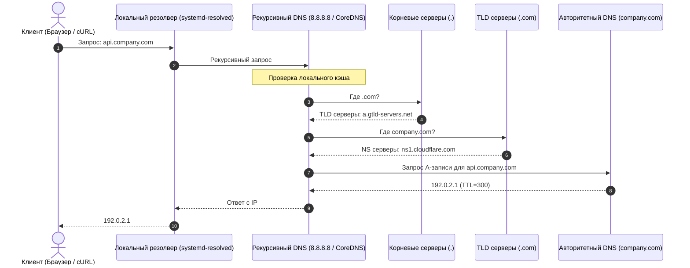

# 🌐 22. DNS, Резолвинг в Linux и CoreDNS

## 🧠 Как Устроен DNS Резолвинг

DNS (Domain Name System) — распределенная иерархическая база данных, преобразующая человекочитаемые доменные имена (`api.company.com`) в машинные IP-адреса (`192.0.2.1`).



---

## 📋 Основные Типы DNS Записей

| Тип записи | Назначение | Пример значения |
| :--- | :--- | :--- |
| **`A`** | Преобразование домена в IPv4 | `api.example.com -> 192.0.2.1` |
| **`AAAA`** | Преобразование домена в IPv6 | `api.example.com -> 2001:db8::1` |
| **`CNAME`** | Канонический алиас (псевдоним) на другое имя | `www.example.com -> example.com` |
| **`MX`** | Почтовый сервер для домена (с приоритетом) | `10 mail.example.com` |
| **`TXT`** | Текстовые данные (SPF, DKIM, DMARC, SSL верификация)| `"v=spf1 include:_spf.google.com ~all"` |
| **`SRV`** | Обнаружение сервисов (Service Discovery: порт + вес) | `_http._tcp.example.com -> 0 5 8080 srv1` |
| **`PTR`** | Обратный DNS (IP -> Имя хоста / Reverse DNS) | `1.2.0.192.in-addr.arpa -> api.example.com` |
| **`NS`** | Авторитетный сервер имен для зоны | `ns1.cloudflare.com` |
| **`SOA`** | Начало зоны полномочий (серийный номер, тайминги) | `admin.example.com 2026090101 7200...` |

---

## ⚙️ Резолвинг в Linux: `/etc/resolv.conf` и `systemd-resolved`

В современном Linux цепочка разрешения имен выглядит так:
1. **`/etc/nsswitch.conf`:** Определяет порядок поиска (`hosts: files dns myhostname`).
2. **`/etc/hosts`:** Статические локальные записи `IP -> Имя`.
3. **`/etc/resolv.conf`:** Содержит адрес DNS-сервера (часто `127.0.0.53` — локальный заглушечный резолвер `systemd-resolved`).

```bash
# Просмотр статуса и DNS-серверов по каждому сетевому интерфейсу:
resolvectl status

# Сброс локального кэша DNS:
sudo resolvectl flush-caches

# Запрос конкретного домена через системный резолвер:
resolvectl query google.com
```

---

## ☸️ CoreDNS: Архитектура DNS в Kubernetes

**CoreDNS** — модульный и быстрый DNS-сервер, являющийся стандартом Service Discovery в Kubernetes. 

Его поведение настраивается через цепочку плагинов (**Corefile**):

```text
# Пример production Corefile в Kubernetes:
.:53 {
    errors                         # Логирование ошибок
    health {                       # Healthcheck endpoint (localhost:8080/health)
       lameduck 5s
    }
    ready                          # Readiness probe endpoint (:8181/ready)
    kubernetes cluster.local in-addr.arpa ip6.arpa {
       pods insecure
       fallthrough in-addr.arpa ip6.arpa
       ttl 30
    }
    prometheus :9153              # Экспорт метрик для Prometheus
    forward . 8.8.8.8 1.1.1.1     # Форвардинг внешних доменов
    cache 30                       # Кэширование ответов на 30 секунд
    loop                           # Защита от бесконечных циклов резолвинга
    reload                         # Автоматическая перезагрузка Corefile при изменении
    loadbalance                    # Round-robin балансировка A/AAAA записей
}
```

---

## 🛠️ CLI Практика: Трассировка DNS (`dig`)

```bash
# 1. Быстрый запрос IP домена:
dig +short google.com

# 2. Полная трассировка всех уровней DNS от корня (.) до ответа:
dig +trace api.github.com

# 3. Запрос к конкретному DNS-серверу (например, Cloudflare 1.1.1.1):
dig @1.1.1.1 example.com A

# 4. Проверка обратной DNS-записи (Reverse Lookup):
dig -x 8.8.8.8 +short

# 5. Запрос всех TXT-записей домена (SPF/DKIM):
dig example.com TXT +noall +answer
```

---

## 🚨 Траблшутинг: 5-секундные задержки DNS в Kubernetes (`ndots:5`)

### Проблема: Запросы к внешним сервисам из подов Kubernetes периодически зависают ровно на 5 секунд
* **Причина:**
  1. В `/etc/resolv.conf` пода по умолчанию выставлен параметр `ndots:5`. Если имя содержит менее 5 точек (например, `api.stripe.com`), `glibc` сначала пытается разрешить его во внутренних суффиксах (`api.stripe.com.default.svc.cluster.local`, `api.stripe.com.svc.cluster.local` и т.д.).
  2. Параллельные запросы A и AAAA записей создают гонку в `conntrack` ядра Linux, что приводит к дропу UDP-пакета и 5-секундному таймауту повтора.
* **Решение в Kubernetes Pod Spec:**
  ```yaml
  spec:
    dnsConfig:
      options:
        - name: ndots
          value: "2"
        - name: single-request-reopen  # Закрывает сокет после первого ответа
  ```
