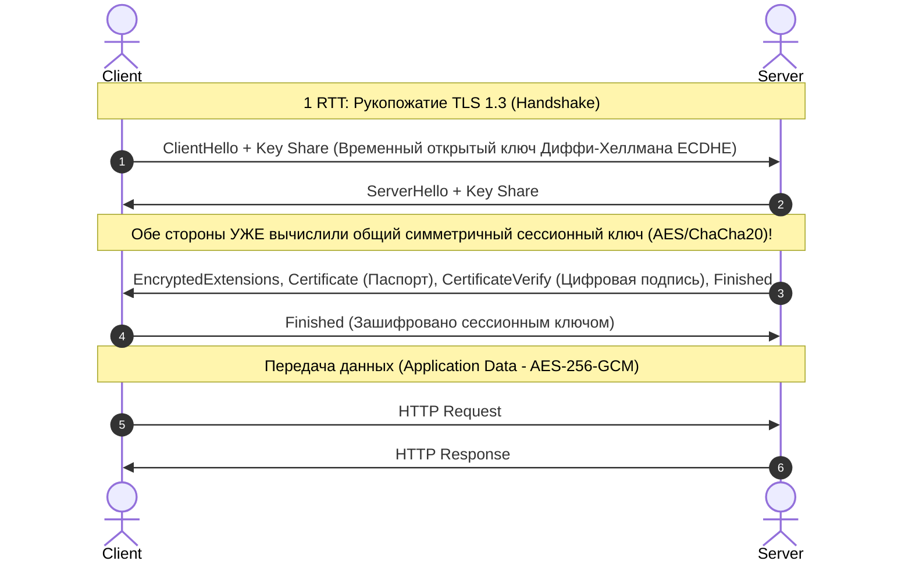
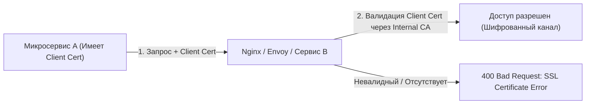

# 🔐 23. HTTP, TLS 1.3, mTLS и PKI

## 🌐 Эволюция Протокола HTTP

* **HTTP/1.1 (1997):** Текстовый протокол. Одно соединение TCP на один одновременный запрос. Проблема **Head-of-Line (HoL) Blocking** на уровне приложений (браузеры вынуждены открывать по 6 параллельных TCP-соединений к одному домену).
* **HTTP/2 (2015):** Бинарный протокол. **Мультиплексирование** (сотни параллельных запросов/ответов внутри одного TCP-соединения), сжатие заголовков HPACK, Server Push. Сохраняется HoL Blocking на уровне TCP (потеря одного TCP-пакета блокирует все потоки).
* **HTTP/3 (2022+):** Работает поверх протокола **QUIC (на базе UDP)** вместо TCP. Нулевой HoL Blocking, встроенный TLS 1.3, мгновенная миграция соединений при смене сети (например, переход с Wi-Fi на LTE без разрыва сессии).

---

## 🔒 Архитектура TLS 1.3: Скорость и Безопасность

**TLS 1.3 (RFC 8446)** сократил время установки защищенного соединения с 2 RTT (в TLS 1.2) до **всего 1 RTT** (а при возобновлении сессии — **0 RTT**).



### Ключевые принципы безопасности TLS:
1. **Perfect Forward Secrecy (PFS):** Трафик шифруется одноразовыми эфемерными ключами Диффи-Хеллмана (`ECDHE`). Даже если хакер украдет приватный ключ сертификата через 5 лет, он не сможет расшифровать прошлый записанный трафик.
2. **Аутентификация через PKI (Public Key Infrastructure):** Сертификат сервера подписан доверенным удостоверяющим центром (CA), публичные ключи которого уже вшиты в хранилище доверия ОС (`Trust Store`).

---

## 🛡️ mTLS (Mutual TLS): Двусторонняя Аутентификация

В стандартном TLS сервер подтверждает свою подлинность клиенту, а клиент остается анонимным.  
В **mTLS (Mutual TLS)** **клиент также обязан предъявить собственный валидный SSL-сертификат**, подписанный доверенным внутренним CA.

mTLS — стандарт безопасности **Zero Trust**, Service Mesh (Istio, Linkerd) и межбанковского API взаимодействия.



---

## 🛠️ Практика: Настройка mTLS в Nginx

### 1. Генерация внутреннего CA, сертификатов сервера и клиента (OpenSSL)
```bash
# 1. Создаем Root CA (Приватный ключ + Самоподписанный сертификат)
openssl ecparam -name prime256v1 -genkey -noout -out ca.key
openssl req -new -x509 -sha256 -key ca.key -subj "/CN=Internal-Root-CA" -days 3650 -out ca.crt

# 2. Сертификат Сервера (Server Cert)
openssl ecparam -name prime256v1 -genkey -noout -out server.key
openssl req -new -key server.key -subj "/CN=api.internal.company" -out server.csr
openssl x509 -req -in server.csr -CA ca.crt -CAkey ca.key -CAcreateserial -out server.crt -days 365

# 3. Сертификат Клиента (Client Cert)
openssl ecparam -name prime256v1 -genkey -noout -out client.key
openssl req -new -key client.key -subj "/CN=service-payments-client" -out client.csr
openssl x509 -req -in client.csr -CA ca.crt -CAkey ca.key -CAcreateserial -out client.crt -days 365
```

### 2. Конфигурация Nginx с проверкой клиентского сертификата:
```nginx
# /etc/nginx/conf.d/mtls_api.conf
server {
    listen 443 ssl;
    server_name api.internal.company;

    # Сертификат и ключ самого сервера:
    ssl_certificate /etc/ssl/certs/server.crt;
    ssl_certificate_key /etc/ssl/private/server.key;

    # Настройки TLS 1.3:
    ssl_protocols TLSv1.3;
    ssl_prefer_server_ciphers off;

    # ================================
    # 🔒 ВКЛЮЧЕНИЕ mTLS (Mutual TLS)
    # ================================
    # Доверенный CA для проверки сертификатов клиентов:
    ssl_client_certificate /etc/ssl/certs/ca.crt;
    # Требовать обязательный клиентский сертификат (on):
    ssl_verify_client on;
    ssl_verify_depth 2;

    location / {
        # Передаем имя аутентифицированного сервиса в бэкенд:
        proxy_set_header X-Client-DN $ssl_client_s_dn;
        proxy_pass http://localhost:8080;
    }
}
```

### 3. Тестирование mTLS через cURL:
```bash
# Запрос БЕЗ клиентского сертификата (ожидаем ошибку 400):
curl -k https://api.internal.company
# <html><center><h1>400 No required SSL certificate was sent</h1></center></html>

# Запрос С клиентским сертификатом (успех):
curl --cacert ca.crt --cert client.crt --key client.key https://api.internal.company
```

---

## 🔍 Инспекция Сертификатов OpenSSL Cheat Sheet

```bash
# Проверка цепочки сертификатов удаленного сервера:
openssl s_client -connect google.com:443 -servername google.com -showcerts

# Просмотр срока действия и данных локального файла сертификата:
openssl x509 -in /etc/ssl/certs/server.crt -noout -text

# Проверка, подходит ли приватный ключ к сертификату (хэши модулей должны совпасть):
openssl x509 -noout -modulus -in server.crt | openssl md5
openssl rsa -noout -modulus -in server.key | openssl md5
```
