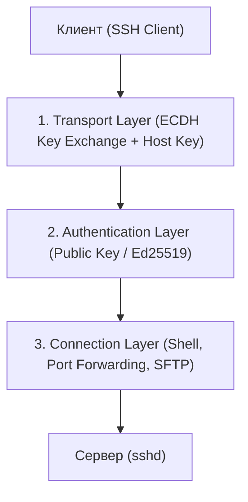

# 🔑 24. SSH: Протокол, Ключи, SSH-Agent и Безопасность

## 🧠 Архитектура Протокола SSH (Secure Shell)

Протокол SSH (RFC 4251) состоит из трех независимых уровней:

1. **SSH Transport Layer (Транспортный уровень):** Обеспечивает шифрование, аутентификацию сервера по `host key`, проверку целостности данных и сжатие.
2. **SSH User Authentication Protocol (Уровень аутентификации):** Аутентификация клиента перед сервером (по публичному ключу, паролю или GSSAPI).
3. **SSH Connection Protocol (Уровень соединений):** Мультиплексирование нескольких логических каналов внутри одного шифрованного туннеля (интерактивный shell, SFTP, выполнение удаленных команд, перенаправление портов / SSH Tunneling).



---

## 🔐 Сравнение Алгоритмов Ключей SSH

| Алгоритм | Стойкость | Скорость | Рекомендация |
| :--- | :---: | :---: | :--- |
| **`Ed25519`** (Эллиптическая кривая 25519) | **Максимальная** | **Сверхбыстрый** | **Золотой стандарт в 2026 году.** Короткий ключ (68 символов), защита от timing-атак. |
| **`RSA 4096`** | Высокая | Медленный | Использовать **только** для совместимости с древними legacy-серверами. |
| **`ECDSA`** (NIST кривые) | Средняя | Быстрый | ⚠️ Не рекомендуется (сомнения в случайности констант NIST, уязвим при плохом генераторе случайных чисел). |
| **`DSA` / `RSA 1024`** | ❌ **Взломано** | — | **Запрещены** и отключены в современных версиях OpenSSH. |

---

## 🛠️ CLI Практика: Генерация Ключей и SSH-Agent

### 1. Генерация современного ключа Ed25519
```bash
# Генерация с защищенным шифрованием приватного ключа (100 раундов KDF):
ssh-keygen -t ed25519 -a 100 -C "alex@company.internal" -f ~/.ssh/id_ed25519

# Копирование публичного ключа на удаленный сервер:
ssh-copy-id -i ~/.ssh/id_ed25519.pub deploy@192.168.1.50
```

### 2. Работа с SSH-Agent (Менеджер ключей в памяти)
SSH-Agent хранит расшифрованные приватные ключи в оперативной памяти, чтобы вам не приходилось вводить пароль от ключа при каждом подключении:

```bash
# 1. Запуск агента в текущей сессии:
eval "$(ssh-agent -s)"

# 2. Добавление ключа в память с ограничением времени жизни (например, на 4 часа):
ssh-add -t 4h ~/.ssh/id_ed25519

# 3. Список активных ключей в агенте:
ssh-add -l

# 4. Удаление всех ключей из памяти при уходе с рабочего места:
ssh-add -D
```

---

## ⚙️ Файл Конфигурации `~/.ssh/config` (Production Настройка)

Файл `~/.ssh/config` автоматизирует алиасы, мультиплексирование и проброс через бастион-хост (Jump Host):

```text
# Общие настройки для всех подключений:
Host *
    ServerAliveInterval 30
    ServerAliveCountMax 3
    AddKeysToAgent yes
    IdentitiesOnly yes

# Подключение к закрытому серверу БД через Бастион (Jump Host):
Host db-prod
    HostName 10.0.1.25
    User postgres
    IdentityFile ~/.ssh/id_ed25519
    # Мгновенный прыжок через бастион без агент-форвардинга (безопасно!):
    ProxyJump bastion.company.com

# Бастион-хост:
Host bastion.company.com
    HostName 203.0.113.10
    User jumpuser
    Port 2222
    IdentityFile ~/.ssh/id_bastion

# Мультиплексирование соединений (Повторные подключения открываются за 10 мс!):
Host speed-server
    HostName 192.168.1.100
    User root
    ControlMaster auto
    ControlPath ~/.ssh/control-%r@%h:%p
    ControlPersist 10m
```

---

## 🔒 Харденинг Сервера `/etc/ssh/sshd_config`

Для максимальной безопасности на всех серверах продакшна:

```ini
# /etc/ssh/sshd_config.d/99-security.conf

# Запретить вход по паролям (только SSH-ключи!):
PasswordAuthentication no
ChallengeResponseAuthentication no
KbdInteractiveAuthentication no

# Запретить вход под root напрямую:
PermitRootLogin prohibit-password

# Запретить пустые пароли:
PermitEmptyPasswords no

# Отключить устаревшие небезопасные алгоритмы:
KexAlgorithms curve25519-sha256,curve25519-sha256@libssh.org
Ciphers chacha20-poly1305@openssh.com,aes256-gcm@openssh.com
MACs hmac-sha2-512-etm@openssh.com

# Таймауты неактивности:
ClientAliveInterval 300
ClientAliveCountMax 2
```
Перезапуск демона: `sudo systemctl restart sshd`

---

## 🚨 Траблшутинг SSH

```bash
# Запуск с максимальным уровнем отладки (показывает каждую стадию рукопожатия и поиск ключей):
ssh -vvv user@server.com

# Ошибка "Too many authentication failures":
# SSH-agent предлагает серверу все ключи подряд. Укажите жесткую привязку:
ssh -o IdentitiesOnly=yes -i ~/.ssh/id_ed25519 user@server.com

# Ошибка "Host key verification failed" (Сервер переустановили, ключ изменился):
# Удаляем старый отпечаток хоста:
ssh-keygen -R server.company.com
```
