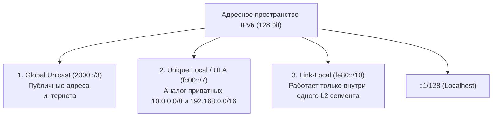
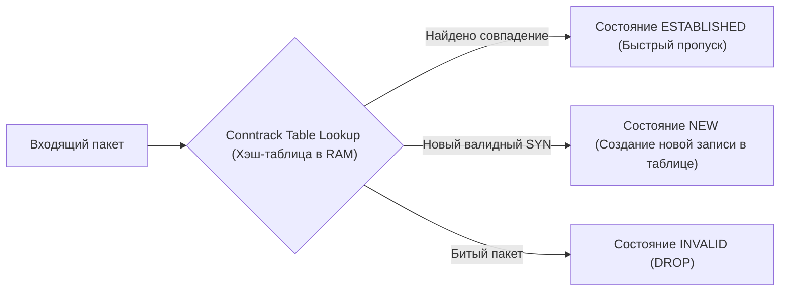

# 🌐 25. IPv6, Маршрутизация и Conntrack Таблица Ядра

## 🧠 Архитектура IPv6: Ключевые Отличия от IPv4

IPv6 решает проблему исчерпания адресов (128 бит против 32 бит в IPv4) и кардинально упрощает сетевой стек:

1. **Нет широковещательных пакетов (Broadcast):** Broadcast полностью заменен на эффективный **Multicast** и **Anycast**.
2. **Нет обязательного NAT:** Каждый сервер и контейнер может иметь глобальный маршрутизируемый IPv6-адрес (End-to-End Connectivity).
3. **Автоконфигурация SLAAC (Stateless Address Autoconfiguration):** Хост настраивает IP и маршруты автоматически через сообщения **ICMPv6 Router Advertisement (RA)** и Neighbor Discovery Protocol (NDP), без необходимости в DHCP-сервере!



---

## 🔍 Механизм Conntrack (Connection Tracking)

**Conntrack** — подсистема ядра Linux (часть Netfilter), которая отслеживает состояние всех активных сетевых соединений (TCP, UDP, ICMP).

Для каждого потока пакетов conntrack создает запись (Tuple: `src_ip, dst_ip, src_port, dst_port, protocol`) и присваивает статус:
* **`NEW`:** Первое появление пакета (например, TCP SYN).
* **`ESTABLISHED`:** Соединение подтверждено в обе стороны.
* **`RELATED`:** Вспомогательное соединение (например, FTP data channel или ICMP Unreachable).
* **`INVALID`:** Пакет не соответствует ни одному известному состоянию (обычно сразу дропается файрволом).



---

## 🛠️ CLI Практика: Мониторинг Conntrack и IPv6

### 1. Управление Conntrack (`conntrack-tools`)
```bash
# Просмотр общего количества активных соединений прямо сейчас:
cat /proc/sys/net/netfilter/nf_conntrack_count

# Максимально допустимый лимит соединений:
cat /proc/sys/net/netfilter/nf_conntrack_max

# Статистика дропов и коллизий хэш-таблицы:
sudo conntrack -S

# Просмотр 10 самых активных соединений (IP и порты):
sudo conntrack -L | head -n 10

# Принудительный сброс отслеживания соединений для конкретного IP:
sudo conntrack -D -s 192.168.1.100
```

### 2. Настройка и диагностика IPv6
```bash
# Добавление статического IPv6 адреса на интерфейс:
sudo ip -6 addr add 2001:db8:acad::10/64 dev eth0

# Просмотр таблицы маршрутизации IPv6:
ip -6 route show

# Проверка соседей в L2 сегменте (IPv6 NDP вместо ARP):
ip -6 neigh show

# Трассировка маршрута по IPv6:
traceroute6 google.com
# или mtr -6 google.com
```

---

## 🚨 Траблшутинг: Переполнение Conntrack (Table Full, Dropping Packet)

### Симптом: Сервер внезапно перестает принимать любые входящие соединения, в логах `dmesg`:
```text
nf_conntrack: table full, dropping packet
```

* **Причина:** Под высокой нагрузкой или во время DDoS-атаки количество открытых соединений превысило `nf_conntrack_max`. Ядро начинает дропать все новые пакеты!
* **Решение 1: Увеличение размера таблицы Conntrack:**
  ```bash
  # Увеличиваем лимит соединений до 1 миллиона:
  sudo sysctl -w net.netfilter.nf_conntrack_max=1048576
  
  # Увеличиваем размер хэш-ведер (Hashsize = Max / 4):
  echo 262144 | sudo tee /sys/module/nf_conntrack/parameters/hashsize
  ```

* **Решение 2: Отключение отслеживания Conntrack для высоконагруженных stateless сервисов (Nginx, DNS, Load Balancers):**
  В таблице `raw` используйте действие `NOTRACK`:
  ```bash
  sudo iptables -t raw -A PREROUTING -p tcp --dport 80 -j NOTRACK
  sudo iptables -t raw -A OUTPUT -p tcp --sport 80 -j NOTRACK
  ```
