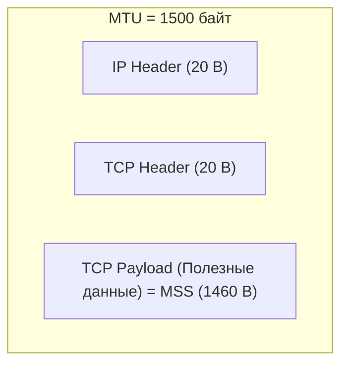
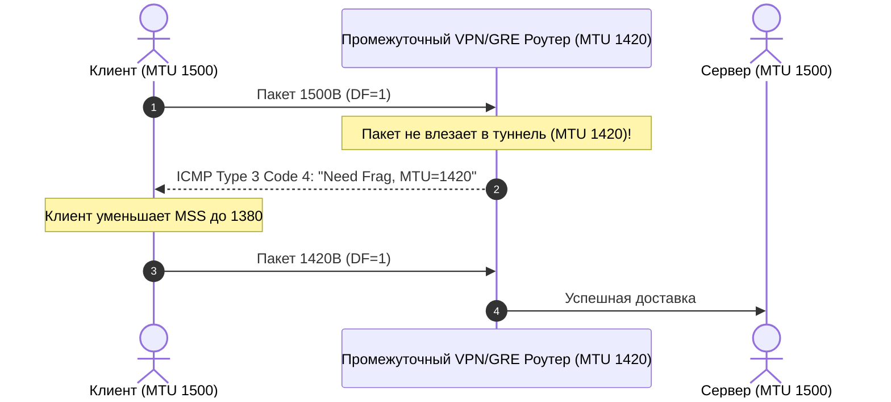

# 📦 26. MTU, MSS, Фрагментация и PMTUD

## 🧠 Анатомия Размеров Сетевых Пакетов

* **MTU (Maximum Transmission Unit):** Максимальный размер пакета (включая заголовки IP и TCP/UDP), который может быть передан через физический сетевой интерфейс без фрагментации.
  * Стандартный MTU для Ethernet: **`1500 байт`**.
  * Jumbo Frames (в дата-центрах / SAN): **`9000 байт`**.
* **MSS (Maximum Segment Size):** Максимальный объем полезных пользовательских данных (*payload*) в одном TCP-сегменте.
  $$\text{MSS} = \text{MTU} - 20\text{ (IPv4 Header)} - 20\text{ (TCP Header)} = \mathbf{1460\text{ байт}}$$



---

## 💥 Проблема Фрагментации и Path MTU Discovery (PMTUD)

Если размер пакета превышает MTU промежуточного маршрутизатора в интернете:
1. Если флаг **`DF (Don't Fragment) = 0`**: Роутер разбивает пакет на мелкие куски. Фрагментация резко увеличивает нагрузку на CPU, и потеря хотя бы одного фрагмента приводит к потере всего пакета!
2. Если флаг **`DF (Don't Fragment) = 1`** (стандарт для TCP): Роутер **дропает пакет** и отправляет отправителю служебное сообщение **ICMP Type 3, Code 4 («Destination Unreachable, Fragmentation Needed, MTU=X»)**.
3. Отправитель получает ICMP-ответ и уменьшает размер своего MSS. Этот механизм называется **PMTUD (Path MTU Discovery)**.



---

## 🕳️ Ловушка: Черная Дыра MTU (PMTUD Black Hole)

### Симптом: 
Вы подключаетесь по SSH к серверу за VPN/WireGuard/IPsec. Мелкие команды (`ls`, `pwd`, `date`) работают идеально, но при выводе большой команды (`cat large_file.log`, `docker logs`) или при TLS Handshake **сессия намертво зависает!**

### Причина:
1. Заголовки VPN/VXLAN туннеля съедают часть MTU (например, MTU туннеля стал 1420).
2. Сервер отправляет большой TLS-сертификат (пакет 1500 байт с флагом DF=1).
3. Туннельный роутер дропает пакет и шлет назад ICMP «Need Frag».
4. **Неграмотно настроенный корпоративный файрвол блокирует весь ICMP трафик!**
5. Сервер не получает сообщение об ошибке, бесконечно шлет ретрансмиты, а клиент бесконечно ждет — возникает **«Черная дыра MTU»**.

---

## 🛠️ Решение: TCP MSS Clamping (Зажим MSS)

Чтобы навсегда решить проблему с черными дырами MTU на туннельных шлюзах, маршрутизаторах и нодах Kubernetes (Calico, Flannel), настраивают **MSS Clamping**:  
Файрвол перехватывает пакеты рукопожатия TCP SYN и принудительно уменьшает объявленный MSS до размера MTU туннеля.

### 1. Включение MSS Clamping в iptables:
```bash
sudo iptables -t mangle -A FORWARD -p tcp --tcp-flags SYN,RST SYN -j TCPMSS --clamp-mss-to-pmtu
```

### 2. Включение MSS Clamping в nftables:
```bash
nft add rule inet my_firewall forward tcp flags syn tcp option maxseg size set rt mtu
```

---

## 🔬 CLI Практика: Определение Path MTU вручную

Вы можете узнать точный размер MTU до любого сервера в интернете с помощью `ping`:

```bash
# Флаг -M do запрещает фрагментацию (DF=1).
# Размер 1472 байт + 28 байт (20B IP + 8B ICMP) = ровно 1500 байт MTU:
ping -M do -s 1472 -c 2 8.8.8.8

# Если возвращается ошибка "Frag needed and DF set":
# Уменьшаем размер -s (например, 1420, 1400, 1372), пока пинг не пройдет:
ping -M do -s 1392 -c 2 8.8.8.8
# Если пинг прошел на 1392 -> Реальный Path MTU = 1392 + 28 = 1420 байт!
```

```bash
# Изменение MTU на локальном сетевом интерфейсе:
sudo ip link set dev eth0 mtu 1420
```
