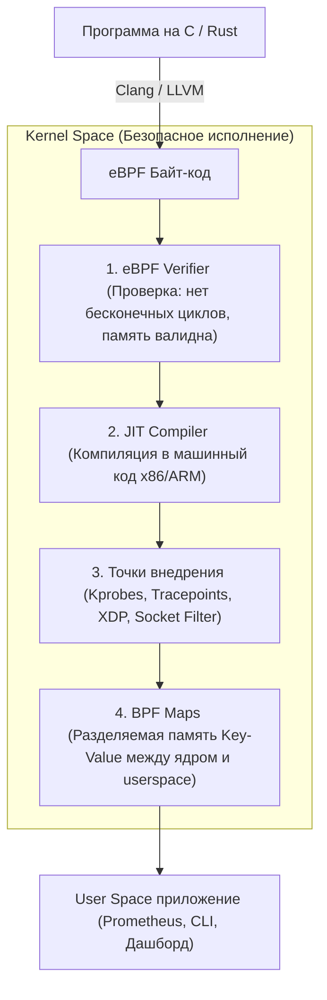

# ⚡ 27. eBPF, Трассировка и Наблюдаемость (Observability)

## 🧠 Что такое eBPF (Extended Berkeley Packet Filter)

**eBPF** — революционная технология ядра Linux, позволяющая безопасно запускать пользовательский скомпилированный байт-код прямо внутри ядра Linux **без изменения исходного кода ядра и без загрузки нестабильных модулей (`.ko`)**.

eBPF превратил ядро Linux в программируемую платформу и стал новым стандартом для:
* **Сетевой безопасности и маршрутизации (Cilium, Calico, Cloudflare DDoS mitigation)**,
* **Глубокой наблюдаемости и профилирования (BCC, bpftrace, Pixie, Pyroscope)**,
* **Безопасности рантайма (Falco, Tetragon)**.



---

## 🎯 Точки внедрения eBPF программ (Hook Points)

| Точка внедрения | Где работает | Применение |
| :--- | :--- | :--- |
| **`XDP (eXpress Data Path)`** | На самом раннем уровне сетевого драйвера сетевой карты (до создания `sk_buff`). | Дроп миллионов пакетов в секунду (DDoS защита), сверхбыстрый L4 балансировщик. |
| **`Socket Layer / tc`** | Сетевой стек Linux (Traffic Control, sockops). | Мгновенный роутинг в Service Mesh (Cilium bypass TCP stack). |
| **`Kprobes / Kretprobes`** | Динамический перехват входа и выхода из **любой функции ядра Linux**. | Отладка и трассировка поведения ядра. |
| **`Tracepoints`** | Статические стабильные точки трассировки ядра (гарантируют обратную совместимость между версиями Linux). | Анализ планировщика, дискового I/O, сетевых событий. |
| **`Uprobes / Uretprobes`** | Динамический перехват функций в **User Space приложениях** (например, функции `malloc` в glibc или OpenSSL `SSL_write`). | Прослушивание HTTPS-трафика без сертификатов, профилирование Go/Python. |

---

## 🛠️ CLI Практика: Инструменты BCC и bpftrace

### 1. Готовые утилиты трассировки BCC (BPF Compiler Collection)
```bash
# Установка (Ubuntu/Debian):
sudo apt install bpfcc-tools linux-headers-$(uname -r)

# 1. Отслеживание запуска абсолютно всех новых процессов в системе в реальном времени:
sudo execsnoop-bpfcc

# 2. Отслеживание всех открываемых файлов с временем задержки:
sudo opensnoop-bpfcc

# 3. Топ процессов по дисковому I/O (в реальном времени, как iotop, но без накладных расходов):
sudo biotop-bpfcc

# 4. Гистограмма задержек дискового ввода-вывода (показывает дисковые лаги):
sudo biolatency-bpfcc -m 10

# 5. Мониторинг входящего/исходящего TCP трафика по процессам:
sudo tcptop-bpfcc
```

---

## 🔬 Магия однострочников `bpftrace`

`bpftrace` — это высокоуровневый скриптовый язык для eBPF (аналог DTrace в Solaris):

```bash
# 1. Подсчет количества системных вызовов по типам за 5 секунд:
sudo bpftrace -e 'tracepoint:raw_syscalls:sys_enter { @[comm] = count(); }'

# 2. Отслеживание медленных дисковых запросов (> 10 миллисекунд):
sudo bpftrace -e 'kprobe:vfs_read { @start[tid] = nsecs; } 
kretprobe:vfs_read /@start[tid]/ { 
    $lat = (nsecs - @start[tid]) / 1000000; 
    if ($lat > 10) { printf("Slow read: %s (PID %d) took %d ms\n", comm, pid, $lat); }
    delete(@start[tid]); 
}'

# 3. Перехват незашифрованного HTTP/HTTPS трафика через OpenSSL в реальном времени:
sudo bpftrace -e 'uprobe:/lib/x86_64-linux-gnu/libssl.so.3:SSL_write { printf("PID %d writes: %s\n", pid, str(arg1, arg2)); }'
```

---

## 💡 eBPF в Современном Cloud Native

* **Cilium:** Полная замена `kube-proxy` и `iptables` в Kubernetes. Обеспечивает прямую коммутацию между сокетами подов в памяти через eBPF sockops, снижая сетевые задержки на 40%.
* **Tetragon / Falco:** Обнаружение вторжений и вредоносных действий (попытка побега из контейнера, запуск несанкционированного shell) в реальном времени на уровне ядра.
