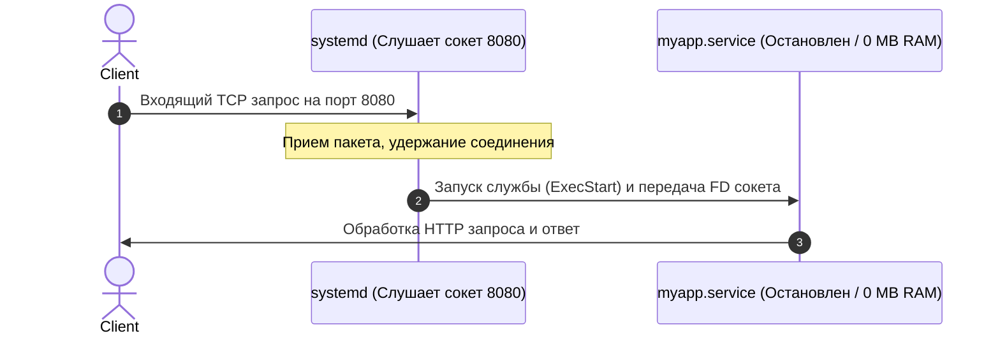

# 🎛️ 28. Systemd Углублённо: Таймеры, Сокеты и Песочницы

## 🧠 Архитектура Юнитов Systemd

Systemd — это не просто система инициализации (PID 1), а комплексная платформа управления системой:

* **`.service`:** Управление фоновыми службами и демонами.
* **`.timer`:** Современная замена устаревшему `cron` с поддержкой монотонных таймеров и календаря.
* **`.socket`:** **Socket Activation** — открытие сетевого или UNIX-сокета процессом systemd *до* запуска самого приложения.
* **`.path`:** Запуск действий при изменении файлов/каталогов (на базе подсистемы ядра `inotify`).
* **`.target`:** Группировка юнитов для задания состояний системы (`multi-user.target`, `graphical.target`).

---

## ⚡ Socket Activation (Запуск по первому обращению)

Systemd умеет слушать сокет (порт 80 или UNIX-сокет) от лица сервиса. Сам сервис может быть выключен и не потреблять память. 

Как только приходит первый входящий сетевой пакет, systemd мгновенно запускает сервис и передает ему уже готовый дескриптор сокета!



### Конфигурация Socket Activation:

**1. Файл сокета:** `/etc/systemd/system/myapp.socket`
```ini
[Unit]
Description=Socket for MyApp

[Socket]
ListenStream=0.0.0.0:8080
# Или UNIX-сокет: ListenStream=/run/myapp.sock

[Install]
WantedBy=sockets.target
```

**2. Файл службы:** `/etc/systemd/system/myapp.service`
```ini
[Unit]
Description=MyApp Service
Requires=myapp.socket
After=myapp.socket

[Service]
ExecStart=/usr/local/bin/myapp
NonBlocking=true
```

---

## ⏰ Systemd Timers вместо Crontab

Systemd таймеры превосходят `cron` за счет:
* Точного логирования в `journalctl`,
* Возможности запуска пропущенных задач после сна сервера (`Persistent=true`),
* Гибких монотонных таймеров (например, «через 15 минут после завершения прошлой итерации»).

### Пример создания таймера для бэкапа:

**1. Служба:** `/etc/systemd/system/db-backup.service`
```ini
[Unit]
Description=Database Daily Backup Task

[Service]
Type=oneshot
ExecStart=/usr/local/bin/backup-script.sh
```

**2. Таймер:** `/etc/systemd/system/db-backup.timer`
```ini
[Unit]
Description=Run DB Backup Every Night at 03:00

[Timer]
# Запуск каждый день в 03:00 ночи:
OnCalendar=*-*-* 03:00:00
# Если сервер был выключен в 3 ночи, запустить сразу после включения:
Persistent=true
# Размытие времени запуска на +-5 минут (защита от Thundering Herd в кластере):
RandomizedDelaySec=300

[Install]
WantedBy=timers.target
```

```bash
# Включение таймера:
sudo systemctl daemon-reload
sudo systemctl enable --now db-backup.timer

# Просмотр расписания и времени следующего запуска всех таймеров:
systemctl list-timers
```

---

## 🛡️ Безопасность и Sandboxing в Systemd

Systemd позволяет изолировать любую службу на уровне контейнера без Docker:

```ini
# /etc/systemd/system/secure-app.service
[Service]
ExecStart=/usr/local/bin/app

# 1. Запрет повышения привилегий через SUID биты:
NoNewPrivileges=true

# 2. Изолированная файловая система:
ProtectSystem=strict              # Вся ФС доступна только на чтение (Read-Only)
ReadWritePaths=/var/log/app /var/lib/app  # Разрешить запись только сюда
ProtectHome=true                  # Папки /home, /root полностью скрыты
PrivateTmp=true                   # Изолированная пустая папка /tmp только для этого сервиса

# 3. Изоляция ядра и устройств:
ProtectKernelTunables=true        # Запрет изменения sysctl
ProtectControlGroups=true         # Запрет изменения cgroups
PrivateDevices=true               # Запрет прямого доступа к дискам (/dev/sda)

# 4. Ограничение системных возможностей (Capabilities):
CapabilityBoundingSet=CAP_NET_BIND_SERVICE # Разрешить только привязку к портам
```

### Аудит безопасности любого юнита:
```bash
# Проверка уровня защищенности службы от 0.0 (безопасно) до 10.0 (небезопасно):
systemd-analyze security nginx.service
```

---

## 🔧 Переопределение юнитов через Drop-in файлы

**Никогда не редактируйте файлы в `/lib/systemd/system/` напрямую!** При обновлении пакета они перезапишутся.

Используйте механизм **Drop-in**:
```bash
# Открывает оверлей для изменения конкретных директив:
sudo systemctl edit nginx.service
```
Это создаст файл `/etc/systemd/system/nginx.service.d/override.conf`, который переопределит только нужные параметры.
