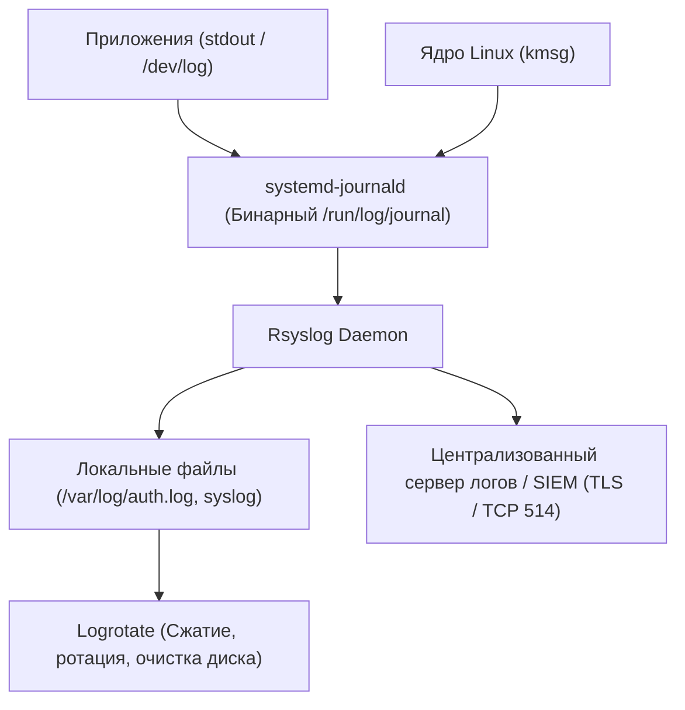

# 📜 29. Логирование: Rsyslog, Journald и Logrotate

## 🧠 Архитектура Сбора Логов в Linux

В современном дистрибутиве Linux логирование разделено на две взаимодополняющие подсистемы:

1. **`systemd-journald` (Бинарный журнал):** Собирает все системные события, вывод `stdout`/`stderr` сервисов и логи ядра `kmsg`. Хранит метаданные (PID, UID, Unit Name) в индексированном бинарном формате.
2. **`rsyslog` (Текстовый демон + Сетевой транспорт):** Читает сообщения из журнала (через модуль `imjournal`) или UNIX-сокета (`/dev/log`), фильтрует их, раскладывает по классическим текстовым файлам (`/var/log/syslog`, `/var/log/auth.log`) и пересылает по сети по протоколам Syslog / RELP / TLS в SIEM (Elasticsearch, OpenSearch, Graylog, Splunk).



---

## 📑 Rsyslog: Модули, Фасилити и Уровни Важности

Rsyslog классифицирует логи по двум координатам: **Facility (Источник)** и **Severity (Важность)**.

### Уровни важности (Severity / Priority):
`0: emerg` $\rightarrow$ `1: alert` $\rightarrow$ `2: crit` $\rightarrow$ `3: err` $\rightarrow$ `4: warning` $\rightarrow$ `5: notice` $\rightarrow$ `6: info` $\rightarrow$ `7: debug`.

### Конфигурация пересылки логов по сети:
Файл `/etc/rsyslog.d/50-remote-forward.conf`:

```text
# 1. Включаем очередь в памяти и на диске на случай обрыва сети:
$ActionQueueType LinkedList
$ActionQueueFileName remote_queue
$ActionResumeRetryCount -1
$ActionQueueSaveOnShutdown on

# 2. Пересылка всех логов уровня warning и выше на центральный сервер по TCP:
*.warning @@logs.company.internal:514

# 3. Пересылка только логов аутентификации (auth, authpriv) по защищенному TLS:
auth,authpriv.* @@(o)secure-siem.company.internal:6514
```

---

## 🔄 Logrotate: Ротация, Сжатие и Очистка Логов

**`logrotate`** предотвращает переполнение диска текстовыми логами. Он запускается ежедневно через cron/systemd timer, считывает статус из `/var/lib/logrotate/status` и производит ротацию.

### Production-шаблон конфигурации: `/etc/logrotate.d/myapp`

```text
/var/log/myapp/*.log {
    # Ротировать ежедневно
    daily
    # Хранить 14 архивных файлов (за последние 2 недели)
    rotate 14
    # Не выдавать ошибку, если файла лога нет
    missingok
    # Не ротировать пустые файлы
    notifempty
    # Сжимать старые логи gzip-ом
    compress
    # Отложить сжатие на 1 цикл (текущий вчерашний лог .1 остается несжатым для надежности)
    delaycompress
    # Создать новый пустой файл лога с правами 0640 для пользователя www-data
    create 0640 www-data adm
    # Выполнить postrotate-скрипт один раз для всей папки, а не для каждого файла
    sharedscripts
    # Уведомляем сервис о переоткрытии файловых дескрипторов:
    postrotate
        systemctl kill -s HUP myapp.service >/dev/null 2>&1 || true
    endscript
}
```

---

## ⚠️ copytruncate vs create + postrotate

Это главная дилемма при настройке ротации:

| Режим | Как работает | Плюсы | Минусы / Риски |
| :--- | :--- | :--- | :--- |
| **`create + postrotate`** *(Рекомендуется)* | Переименовывает старый файл, создает новый и шлет сервису сигнал `SIGHUP` / `SIGUSR1`. | **100% гарантия отсутствия потери строк логов.** | Приложение обязано уметь переоткрывать файлы по сигналу. |
| **`copytruncate`** | Копирует лог в архивный файл, а затем очищает текущий файл на лету (`> file.log`). | Работает с любыми кривыми приложениями, не умеющими переоткрывать логи. | **Есть риск потери логов!** Данные, записанные между операцией копирования и обрезания файла, теряются навсегда. |

---

## 🛠️ CLI Практика: Отладка и Тестирование Ротации

```bash
# 1. Запуск logrotate в тестовом режиме (Dry-Run / Debug) БЕЗ реального изменения файлов:
sudo logrotate -d /etc/logrotate.d/myapp

# 2. Принудительная ротация прямо сейчас (Force):
sudo logrotate -f /etc/logrotate.d/myapp

# 3. Просмотр файла статуса последнего запуска:
cat /var/lib/logrotate/status | grep myapp
```
