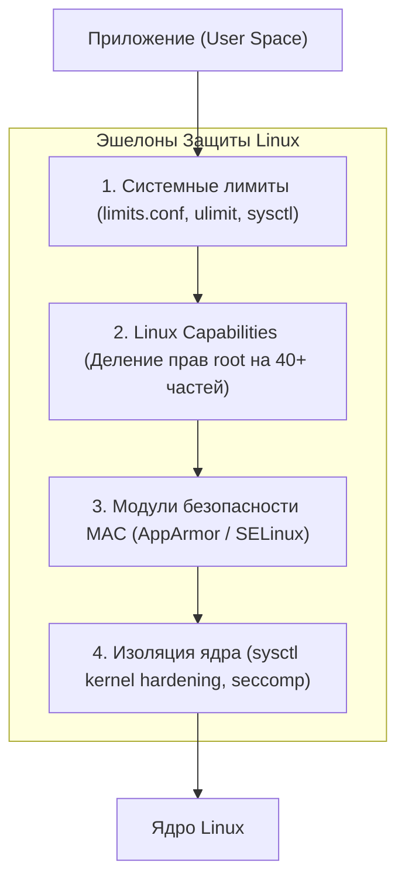

# 🛡️ 30. Харденинг Linux, Системные Лимиты и Безопасность

## 🧠 Принцип Эшелонированной Защиты (Defense in Depth)

Харденинг (укрепление) серверов Linux строится на снижении поверхности атаки (*Attack Surface Reduction*) и следовании **Принципу Наименьших Привилегий (Principle of Least Privilege)**:



---

## 📊 Системные Лимиты Ресурсов (`limits.conf` и `sysctl`)

В Linux каждый процесс и пользователь ограничены количеством открытых файловых дескрипторов (сокетов, файлов) и количеством потоков.

### 1. Уровни лимитов файлов:
* **`fs.file-max`:** Глобальный лимит открытых файлов **для всей операционной системы**.
* **`fs.nr_open`:** Максимальный лимит файлов **на один процесс**.
* **`nofile (ulimit -n)`:** Пользовательский лимит (Soft и Hard).
  * **Soft limit:** Текущий активный лимит (процесс может поднять его сам до уровня Hard).
  * **Hard limit:** Максимальный потолок, который может поднять только root.

### Конфигурация для высоконагруженных серверов (Highload / DB / Nginx):
Файл `/etc/security/limits.d/99-nofile.conf`:
```text
# <domain>      <type>  <item>  <value>
*               soft    nofile  1048576
*               hard    nofile  1048576
*               soft    nproc   65535
*               hard    nproc   65535
root            soft    nofile  1048576
root            hard    nofile  1048576
```

Файл системных лимитов ядра `/etc/sysctl.d/99-limits.conf`:
```ini
fs.file-max = 2097152
fs.nr_open = 1048576
kernel.pid_max = 4194304
```

---

## 🔑 Linux Capabilities (Разделение полномочий Root)

Традиционно в UNIX права делились бинарно: пользователь (`UID != 0`) или всемогущий суперпользователь root (`UID == 0`).  
**Linux Capabilities** разбивают права root на более чем 40 независимых гранулярных привилегий:

| Капабилити | Что разрешает | Зачем нужно |
| :--- | :--- | :--- |
| **`CAP_NET_BIND_SERVICE`** | Привязка сокетов к привилегированным портам (**`< 1024`**, например 80, 443). | Позволяет запускать Nginx/Node.js на 80 порту **без прав root**! |
| **`CAP_NET_RAW`** | Создание RAW и PACKET сокетов. | Нужно для утилиты `ping` и `tcpdump`. |
| **`CAP_SYS_ADMIN`** | «Новый root»: монтирование ФС, загрузка eBPF, управление namespaces. | Давать контейнерам **крайне опасно** (эквивалентно root на хосте). |
| **`CAP_SYS_PTRACE`** | Трассировка любых процессов (`gdb`, `strace`). | Опасно: позволяет читать память чужих процессов. |
| **`CAP_CHOWN` / `CAP_SETUID`** | Смена владельца файлов и UID процессов. | Базовые системные операции. |

### Практика: Запуск Node.js / Go на 80 порту без root:
```bash
# Выдаем исполняемому файлу капабилити привязки к портам:
sudo setcap 'cap_net_bind_service=+ep' /usr/local/bin/node

# Проверяем назначенные права:
getcap /usr/local/bin/node
# /usr/local/bin/node cap_net_bind_service=ep

# Теперь непривилегированный пользователь может запустить сервис на порту 80!
```

---

## 🔒 Базовый Sysctl Харденинг Ядра

Файл конфигурации `/etc/sysctl.d/99-security.conf`:

```ini
# 1. Защита от SYN Flood атак:
net.ipv4.tcp_syncookies = 1

# 2. Запрет маршрутизации от источника (Source Routing):
net.ipv4.conf.all.accept_source_route = 0
net.ipv4.conf.default.accept_source_route = 0

# 3. Запрет приема ICMP Redirects (защита от MITM):
net.ipv4.conf.all.accept_redirects = 0
net.ipv4.conf.default.accept_redirects = 0

# 4. Включение Reverse Path Filtering (защита от спуфинга IP-адресов):
net.ipv4.conf.all.rp_filter = 1
net.ipv4.conf.default.rp_filter = 1

# 5. Скрытие информации о ядре и адресах в памяти:
kernel.kptr_restrict = 2
kernel.dmesg_restrict = 1

# 6. Запрет ptrace для неродственных процессов (защита от чтения секретов из RAM):
kernel.yama.ptrace_scope = 2

# 7. Запрет создания символических и жестких ссылок в /tmp для атак:
fs.protected_symlinks = 1
fs.protected_hardlinks = 1
```
Применение параметров: `sudo sysctl --system`

---

## 🛠️ CLI Практика: Проверка и Аудит Безопасности

```bash
# 1. Просмотр текущих лимитов конкретного работающего процесса (PID):
cat /proc/<PID>/limits

# 2. Проверка капабилити запущенного процесса:
getpcaps <PID>

# 3. Поиск всех бинарников с установленным SUID-битом в системе:
find / -perm -4000 -type f 2>/dev/null

# 4. Проверка статуса подсистемы MAC (AppArmor / SELinux):
sudo aa-status    # Ubuntu/Debian (AppArmor)
sestatus          # RHEL/CentOS (SELinux)
```
