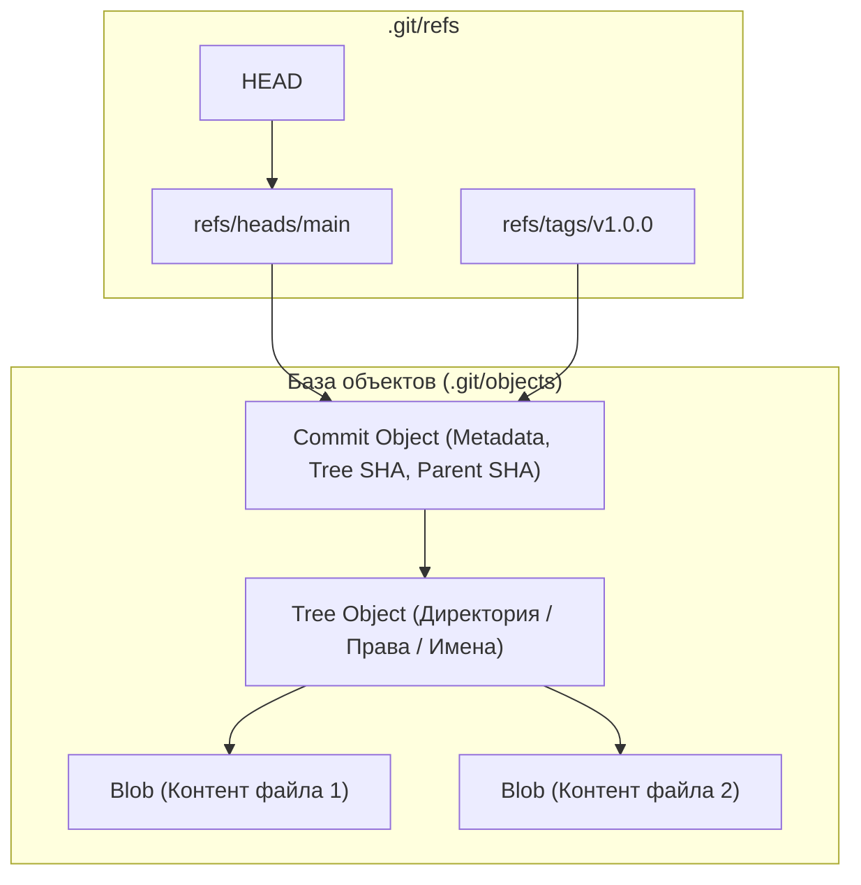
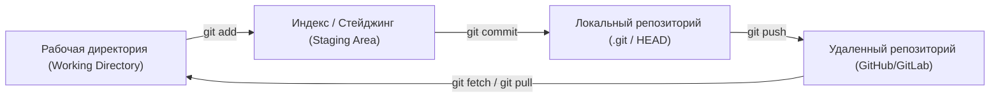

# 🐙 01. Архитектура Git, Ветвление и Стратегии релиза

## 🔍 Архитектура Git: Как Git устроен изнутри

Git — это не просто система контроля версий, это **адресуемая по контенту файловая система (Content-Addressable Storage)** на базе направленного ациклического графа (DAG).



### 4 типа объектов в Git:
1. **Blob:** Содержит только сырые бинарные данные файла (без имени файла и без прав доступа).
2. **Tree:** Представляет директорию. Связывает имена файлов, права доступа (`100644`, `100755`) и SHA-хэши соответствующих Blob или дочерних Tree.
3. **Commit:** Содержит ссылку на корневой Tree, хеши родительских коммитов (Parents), имя автора, коммитера, timestamp и сообщение.
4. **Annotated Tag:** Постоянный указатель на коммит с собственным автором, датой и PGP/GPG подписью.

---

## 🚦 Три области состояния файлов в Git



---

## 🌿 Стратегии ветвления (Branching Strategies)

### 1. Trunk-Based Development (Золотой стандарт CI/CD & DevOps)
- Все разработчики коммитят в одну основную ветку (`main`/`trunk`) или используют очень короткоживущие Feature-ветки (живут < 1-2 дней).
- **Плюсы:** Отсутствие "Merge Hell", постоянная интеграция кода, быстрый Time-to-Market.
- **Инструменты:** Использование **Feature Flags / Toggles** для скрытия незавершенного функционала в production.

### 2. GitFlow (Для проектов со строгим релизным циклом)
- Ветки: `main` (production), `develop` (интеграция), `feature/*`, `release/*`, `hotfix/*`.
- **Минусы для DevOps:** Сложные слияния, задержки релиза, тяжело автоматизировать полный непрерывный деплой (CD).

---

## 🏷️ Семантическое версионирование и Conventional Commits

### 1. Semantic Versioning (SemVer 2.0.0)
Формат: **`v<MAJOR>.<MINOR>.<PATCH>`** (например, `v2.4.1`)
- **`MAJOR`:** Критические несовместимые изменения API (Breaking Changes).
- **`MINOR`:** Добавление новой функциональности с сохранением обратной совместимости.
- **`PATCH`:** Исправление багов с сохранением обратной совместимости.

### 2. Спецификация Conventional Commits
Используется для автоматической генерации Changelog и автоматического вычисления версии в CI/CD:

```
<тип>[необязательный контекст]: <краткое описание>

[необязательное тело коммита]

[необязательные футеры: BREAKING CHANGE, Closes #123]
```

**Основные типы:**
- `feat:` Новая функциональность (триггерит подъем `MINOR`).
- `fix:` Исправление бага (триггерит подъем `PATCH`).
- `chore:` Обновление зависимостей, рутинные задачи.
- `ci:` Изменение файлов пайплайнов (GitLab CI, GitHub Actions).
- `docs:` Изменение документации.
- `refactor:` Рефакторинг кода без изменения логики.
- `BREAKING CHANGE:` В теле коммита или восклицательный знак `feat!: ...` (триггерит `MAJOR`).

---

## 🔬 Deep Dive: анатомия коммита и три дерева Git

Каждый коммит = снимок **всего** проекта (не диффы!), плюс ссылки на родителя:

```text
commit ──> tree ──> blob (файл)
   │         └────> blob
   └──> parent commit(s)
```

| Команда | Что делает с деревьями |
| :--- | :--- |
| `git add` | Working Dir → Index (staging) |
| `git commit` | Index → Repository (новый tree+commit объект) |
| `git checkout` | Repository → Working Dir |

### Выбор workflow: честное сравнение

| Стратегия | Когда подходит | Главный минус |
| :--- | :--- | :--- |
| GitFlow | релизы с версиями, on-prem | тяжеловесная, merge hell |
| GitHub Flow | continuous delivery, web | нет стадий окружений |
| Trunk-Based | high-deploy-frequency, feature flags | требует зрелых тестов + flags |
| Release Branches | SaaS с патчами старых версий | стоимость backport'ов |

!!! tip "Trunk-Based + Feature Flags"
    Современный стандарт для CI/CD: короткоживущие ветки (<1 день), незаконченный функционал прячется за флагом (Unleash/Flagsmith), релиз = декоративный тег.

---

<!-- enriched:v1 -->

## 🧨 Типовые грабли Production

| Симптом | Причина | Быстрое решение |
| :--- | :--- | :--- |
| «Работало вчера» после обновления | Дрейф конфигурации вне Git | `git diff` по инфра-репозиторию + `drift detection` |
| Падение под нагрузкой без ошибок в логах | Исчерпание лимитов (`ulimit`, conntrack, fds) | `dmesg -T \| grep -i denied`, `conntrack -S` |
| Медленный деплой | Отсутствие кэша слоев/артефактов | Включить layer cache, артефакт-репозиторий |
| «Плавающие» 502 раз в сутки | Health-check гонки при rolling update | `preStop sleep` + корректный `readinessProbe` |

!!! warning "Правило пяти почему"
    Каждый инцидент заканчивается не фиксом, а **post-mortem** с 5×Why и action items в бэклоге. Иначе грабли возвращаются через квартал — но уже в пятницу вечером.

## 🧪 Hands-on Lab (15 минут)

```bash
# 1. Воспроизведите проблему из таблицы выше на стенде (kind/k3d/VirtualBox)
# 2. Соберите диагностику одной командой:
git log --graph --oneline --decorate --all -20 && \
git cat-file -p HEAD^{tree} | head && git count-objects -vH
# 3. Зафиксируйте вывод в post-mortem шаблон:
#    Что случилось / Когда заметили / Root cause / Fix / Prevention
```

## ✅ Чек-лист зрелости темы

- [ ] Конфигурации версионируются в Git, ручные правки на проде запрещены
- [ ] Есть мониторинг именно этой подсистемы (не только CPU/RAM)
- [ ] Задокументирован runbook на типовые отказы (кто/что/как)
- [ ] Проведено хотя бы одно учение Chaos/GameDay по теме
- [ ] Лимиты ресурсов и квоты осознаны, а не «дефолт из туториала»
