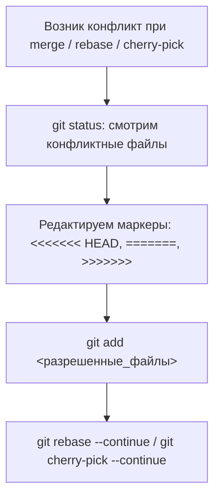

# 🛠️ 02. Cheat Sheet, Rebase, Cherry-pick и Git Hooks

## 🔄 Продвинутый Rebase (Интерактивная очистка истории)

Интерактивный Rebase позволяет переписать локальную историю перед отправкой Pull Request, объединить мелкие коммиты и исправить опечатки.

```bash
# Начать интерактивный rebase последних 4 коммитов
git rebase -i HEAD~4
```

В открывшемся текстовом редакторе доступны команды:
```text
pick e4b12a1 feat: add user authentication
squash a89c11f fix typo in auth controller      # Объединить с предыдущим коммитом (с запросом сообщения)
fixup 7c231bb fix test cases for auth           # Объединить с предыдущим коммитом (выбросить сообщение)
reword 3d91b40 feat: connect postgres database  # Изменить только сообщение коммита
drop 9a11ef0 temporary debug log               # Полностью удалить этот коммит
```

> [!WARNING]
> **Золотое правило Rebase:** Никогда не делайте `rebase` веток, которые уже отправлены в общий публичный доступ (`main`, `master`, `release/*`) и на которые завязаны другие разработчики!

---

## 🍒 Cherry-pick и разрешение конфликтов

### 1. Перенос конкретных коммитов
```bash
# Перенести коммит с хэшем abc1234 в текущую ветку
git cherry-pick abc1234

# Перенести диапазон коммитов (не включая start_hash)
git cherry-pick start_hash..end_hash

# Перенести коммит без автоматического создания коммита (только в стейджинг)
git cherry-pick -n abc1234
```

### 2. Алгоритм разрешения конфликтов


---

## 🛟 Спасение удаленных коммитов через `git reflog`

`git reflog` ведет журнал абсолютно всех перемещений указателя `HEAD`. Даже если вы удалили ветку или выполнили жесткий `git reset --hard`, коммит все еще хранится в Git минимум 30-90 дней.

```bash
# 1. Просматриваем историю всех действий
git reflog

# Вывод:
# 3a1f94a HEAD@{0}: reset: moving to HEAD~3 (Случайно удалили 3 коммита!)
# 8c2d119 HEAD@{1}: commit: feat: crucial payment feature

# 2. Восстанавливаем состояние на момент коммита 8c2d119
git reset --hard HEAD@{1}
# Или создаем новую ветку из потерянного коммита:
git branch recovered-feature 8c2d119
```

---

## 🕵️ Поиск багов бинарным поиском (`git bisect`)

Если в коде появился баг, но неизвестно, какой из 200 коммитов его внес:

```bash
# Старт поиска
git bisect start

# Указываем плохой коммит (где баг уже есть, например текущий)
git bisect bad

# Указываем заведомо хороший коммит (где бага точно не было)
git bisect good v1.0.0

# Git сам будет переключать коммиты по принципу бинарного поиска.
# Тестируем и помечаем:
git bisect good   # если все работает
git bisect bad    # если баг воспроизвелся

# Автоматический поиск через тест:
git bisect run pytest tests/test_payment.py

# Завершение поиска и возврат в исходную ветку
git bisect reset
```

---

## 🪝 Автоматизация проверок: Git Hooks & Pre-commit

Использование фреймворка `pre-commit` гарантирует, что в репозиторий не попадут секреты, неотформатированный код и синтаксические ошибки:

Создаем `.pre-commit-config.yaml` в корне репозитория:
```yaml
repos:
  - repo: https://github.com/pre-commit/pre-commit-hooks
    rev: v4.5.0
    hooks:
      - id: trailing-whitespace
      - id: end-of-file-fixer
      - id: check-yaml
      - id: check-json
      - id: check-added-large-files
        args: ['--maxkb=1024']

  - repo: https://github.com/gitleaks/gitleaks
    rev: v8.18.2
    hooks:
      - id: gitleaks

  - repo: https://github.com/antonbabenko/pre-commit-terraform
    rev: v1.88.0
    hooks:
      - id: terraform_fmt
      - id: terraform_tflint
```

Установка хуков:
```bash
pip install pre-commit
pre-commit install
pre-commit run --all-files
```

---

## 🔬 Deep Dive: rebase vs merge на пальцах

```bash
# Merge сохраняет историю «как было», добавляя merge-commit:
A---B---C-------F   (main)
     \         /
      D---E---´       git merge feature

# Rebase переписывает D,E поверх C — история линейна:
A---B---C---D'---E'  (main)
```

**Золотое правило:** не ребейзить публичные ветки, над которыми работают другие. Переписанный SHA ≠ тот же коммит для коллег.

### Спасательные инструменты, которые должны быть в мышечной памяти

```bash
# «Я сделал reset --hard и потерял работу»
git reflog                     # найти SHA до катастрофы
git reset --hard HEAD@{2}

# «Заккомитил в master, надо было в ветку»
git branch feature-x           # зафиксировать позицию
git reset --hard origin/master && git switch feature-x

# Найти коммит, сломавший тест (бисекция автоматом)
git bisect start HEAD v1.0.0
git bisect run pytest -x

# Удалить секрет из ВСЕЙ истории (после ротации ключа!)
git filter-repo --path secrets.env --invert-paths
```

!!! danger "Секрет утек в push?"
    Rotация ключа **всегда** раньше чистки истории. Force-push не удаляет данные из форков/кэшей/GitHub API.

---

<!-- enriched:v1 -->

## 🧨 Типовые грабли Production

| Симптом | Причина | Быстрое решение |
| :--- | :--- | :--- |
| «Работало вчера» после обновления | Дрейф конфигурации вне Git | `git diff` по инфра-репозиторию + `drift detection` |
| Падение под нагрузкой без ошибок в логах | Исчерпание лимитов (`ulimit`, conntrack, fds) | `dmesg -T \| grep -i denied`, `conntrack -S` |
| Медленный деплой | Отсутствие кэша слоев/артефактов | Включить layer cache, артефакт-репозиторий |
| «Плавающие» 502 раз в сутки | Health-check гонки при rolling update | `preStop sleep` + корректный `readinessProbe` |

!!! warning "Правило пяти почему"
    Каждый инцидент заканчивается не фиксом, а **post-mortem** с 5×Why и action items в бэклоге. Иначе грабли возвращаются через квартал — но уже в пятницу вечером.

## 🧪 Hands-on Lab (15 минут)

```bash
# 1. Воспроизведите проблему из таблицы выше на стенде (kind/k3d/VirtualBox)
# 2. Соберите диагностику одной командой:
git reflog -10 && git status && git stash list && \
git log --oneline --author="$(git config user.name)" -5
# 3. Зафиксируйте вывод в post-mortem шаблон:
#    Что случилось / Когда заметили / Root cause / Fix / Prevention
```

## ✅ Чек-лист зрелости темы

- [ ] Конфигурации версионируются в Git, ручные правки на проде запрещены

    ??? tip "Как закрыть пункт"
        Все конфиги подсистемы живут в etc-repo/Ansible-роли и деплоятся пайплайном. Проверка зрелости: после пересоздания машины система настраивается из репозитория без ручных шагов; git log отвечает «кто и когда поменял».

- [ ] Есть мониторинг именно этой подсистемы (не только CPU/RAM)

    ??? tip "Как закрыть пункт"
        Специфичные метрики подсистемы экспортируются и имеют алерты (для systemd — failed units; для БД — connections/locks; для сети — retransmits/drops). CPU/RAM видят симптом, не причину — нужны метрики самой подсистемы.

- [ ] Задокументирован runbook на типовые отказы (кто/что/как)

    ??? tip "Как закрыть пункт"
        Шаблон из [13.2]: симптомы → команды диагностики → фикс → критерий успеха → предотвращение. Топ-3 отказа подсистемы покрыты. Прогонен хотя бы раз — дата в шапке.

- [ ] Проведено хотя бы одно учение Chaos/GameDay по теме

    ??? tip "Как закрыть пункт"
        Дрель из tools/chaos-lab.sh или Break-Fix по этой теме запущена на стенде, runbook прогнан по шагам, измерено время до восстановления. Итоги — в постмортем-журнал команды.

- [ ] Лимиты ресурсов и квоты осознаны, а не «дефолт из туториала»

    ??? tip "Как закрыть пункт"
        Каждый лимит имеет обоснование из данных (ulimit/fd по числу соединений, MemoryMax по месяцу наблюдений). Проверка: systemctl show / cgroup значения сопоставлены с фактическим потреблением за месяц, комментарий «почему» рядом со значением в коде.

---

## 🧭 Что дальше

| Шаг | Материал |
| :--- | :--- |
| 💪 Практика | [Задачи по rebase/hooks](../15-hands-on-practice/01-100-devops-practical-tasks-part1.md) |
| 🛠️ Шпаргалка | [Cheat sheet рядом с терминалом](02-git-cheatsheet-and-rebase.md) |
