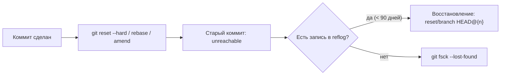

# 🧬 03. Git Internals Deep Dive: Packfiles, Refs, Reflog и GC

## 📦 Аnatomy `.git`: что лежит в каталоге

```text
.git/
├── HEAD                  # указатель на текущую ветку/коммит (ref: refs/heads/main)
├── index                 # бинарный файл стейджинга (что войдёт в следующий commit)
├── config                # локальные настройки репозитория
├── objects/              # БД объектов: loose + pack
│   ├── aa/bb3d...        # loose-объект: имя = SHA-1(сжатый контент), dir = первые 2 символа
│   └── pack/*.pack|*.idx # packfile + индекс для быстрого поиска
├── refs/
│   ├── heads/            # ветки (файл = SHA коммита)
│   ├── remotes/origin/   # remote-tracking ветки
│   └── tags/             # теги
├── packed-refs           # «упакованные» ссылки (оптимизация)
└── logs/HEAD, logs/refs/ # reflog — журнал перемещений ссылок
```

**Ключевой факт:** SHA объекта = `sha1("blob <size>\0<content>")`. Git хранит *снимки*, а не диффы; дельта-сжатие появляется только в packfiles.

```bash
# Собрать объект руками: тот же хеш, что у git
printf 'hello\n' | git hash-object --stdin          # ce01362...
echo "hello" | git hash-object -w --stdin           # записать в objects/
git cat-file -p ce01                                # прочитать содержимое
git cat-file -t ce01                                # тип: blob | tree | commit | tag
git cat-file -s ce01                                # размер
git ls-tree HEAD                                    # дерево коммита
```

## 🗜️ Packfiles и дельта-сжатие

Loose-объекты (zlib по одному) медленны и раздувают каталог. При `gc`, `push` или достижении порога Git упаковывает объекты в **packfile**:

1. Объекты сортируются по (типу, имени, размеру).
2. Похожие объекты ищутся через **sliding window** (по умолчанию 10, `pack.window`) — базовый объект кодируется дельтой.
3. Дельты строятся от *новых к старым* внутри окна.

```bash
git count-objects -vH              # статистика: size-pack, count (loose), in-pack
git verify-pack -v .git/objects/pack/*.idx | sort -k3 -n -r | head   # самые тяжёлые объекты
git gc                             # собрать loose → pack, удалить недостижимое
git repack -ad                     # полный repack в один packfile
git fsck --full --unreachable      # найти битые/висячие объекты
```

!!! tip "Почему push/pack медленный"
    Сервер и клиент договариваются («want/have»), кто что имеет; клиент генерирует thin-pack только с отсутствующими объектами. Тормоза на больших репо почти всегда = пересчёт дельт → лечится `git config pack.threads 0`, protocol v2, partial clone.

## 🏷️ Refs: ветки — это просто файлы

Ветка в Git — **41-байтовый текстовый файл с SHA**. Отсюда мгновенное создание веток (vs SVN/Mercurial).

```bash
cat .git/HEAD                       # ref: refs/heads/main
cat .git/refs/heads/main            # a1b2c3...
git rev-parse main HEAD             # разрешить ссылку в SHA
git update-ref refs/heads/main abc123   # атомарно двигать ссылку (так работает rebase!)
git symbolic-ref HEAD refs/heads/dev    # переключить ветку без checkout файлов
git for-each-ref --sort=-committerdate refs/heads \
  --format='%(refname:short) %(committerdate:relative) %(subject)'  # красивый список веток
```

**Detached HEAD** = HEAD указывает прямо на коммит, не на ветку. Коммиты отсюда станут unreachable при переключении — спасает только reflog или немедленное `git switch -c newbranch`.

## 🪂 Reflog: машина времени уровня ниже reset

Reflog — локальный журнал каждого перемещения HEAD/ref (живёт 90 дней, expire 30 для unreachable). Это **страховка почти любого «потерянного» состояния**:

```bash
git reflog                          # история перемещений HEAD
git reflog show branch-name         # журнал конкретной ветки
git reset --hard HEAD@{2}           # вернуться в состояние «2 шага назад»
git log --walk-reflogs --oneline    # читать как лог
git branch rescue $(git rev-parse HEAD@{5})  # спасти «потерянный» коммит веткой
```



!!! warning "Ограничение"
    Reflog **не пушится** — это локальная история. Восстановить так можно только то, что когда-то существовало на этой машине.

## 🧠 Index (staging area): третье дерево

Git фактически оперирует **тремя деревьями**: Working Directory → Index → HEAD. Понимание index объясняет половину «странного» поведения:

```bash
git ls-files --stage                # посмотреть содержимое index (mode sha stage path)
git restore --staged file           # HEAD → index (разстейджить)
git restore file                    # index → workdir (откатить правки)
git checkout HEAD -- file           # HEAD → index И workdir сразу
git add -p                          # интерактивный выбор ханков — главный навык чистых коммитов
git diff                            # workdir vs index
git diff --cached                   # index vs HEAD
git diff HEAD                       # workdir vs HEAD (всё вместе)
git stash push --keep-index         # спрятать незастейдженное
git stash push -m "wip auth" -- path/  # stash только выбранных путей
```

## 🧹 GC: сборка мусора и настройка

Unreachable-объекты (после reset/amend/rebase) чистятся `git gc` автоматически (auto threshold 6700 loose / 50 packs). Настройка под большие команды:

```ini
[gc]
    auto = 8000                     # порог запуска авто-gc
    reflogExpire = 90 days
    reflogExpireUnreachable = 30 days
[fetch]
    prune = true                    # git fetch заодно удалит gone-remote-ветки
[core]
    repositoryformatversion = 0     # не трогать вручную
```

```bash
git maintenance start               # фоновая поддержка (fetch, gc, commit-graph) по расписанию
git commit-graph write --reachable  # ускоряет log/ревизии на порядки в больших репо
git multi-pack-index write          # индекс поверх многих packfiles
```

## ❓ Пять вопросов для самопроверки

---


## ✅ Проверь себя

> Отвечай вслух до раскрытия ответа. Если «не помню» — вернись к разделу.


**В1. Чем blob отличается от содержимого файла на диске?**
<details><summary>Ответ</summary>
Blob хранит только байты контента + zlib-сжатие: без имени, без прав, без пути. Имя и права (`100644/100755/120000 symlink/160000 gitlink`) живут в tree-объекте. Поэтому одинаковые файлы в разных местах = один blob (дедупликация по хешу).
</details>

**В2. Как Git вычисляет SHA объекта?**
<details><summary>Ответ</summary>
`sha1("<тип> <размер_в_байтах>\0<контент>")`, например `blob 6\0hello\n`. Хеш зависит от типа и размера — подделать контент, не изменив хеш, нельзя. В новых версиях есть переходный режим на SHA-256 (`objectFormat=sha256`).
</details>

**В3. Коммит «пропал» после `git reset --hard HEAD~3`. Как вернуть?**
<details><summary>Ответ</summary>
`git reflog` → найти SHA до сброса → `git reset --hard HEAD@{1}` (или создать ветку на него). Если reflog истёк — `git fsck --lost-found` покажет dangling-коммиты.
</details>

**В4. Что такое delta compression и где она живёт?**
<details><summary>Ответ</summary>
Только внутри packfiles. Похожие объекты (окно 10) кодируются как дельта от базового объекта. Loose-объекты всегда полные (zlib). Поэтому `git gc`/repack уменьшает размер репо в разы.
</details>

**В5. Чем `git restore` отличается от `git checkout HEAD --`?**
<details><summary>Ответ</summary>
`git restore file` копирует из index в workdir (откатывает правки, но НЕ разстейдживает). `git restore --staged file` — из HEAD в index. `git checkout HEAD -- file` обновляет оба дерева сразу. Checkout перегружен смыслами — restore/cleaner появился в 2.23 именно чтобы это разделить.
</details>

---

*Что дальше:* [04. Branching стратегии и release engineering](04-branching-strategies-and-release-engineering.md) · практика: Lab 04, задачи раздела [15](../15-hands-on-practice/01-100-devops-practical-tasks-part1.md)
