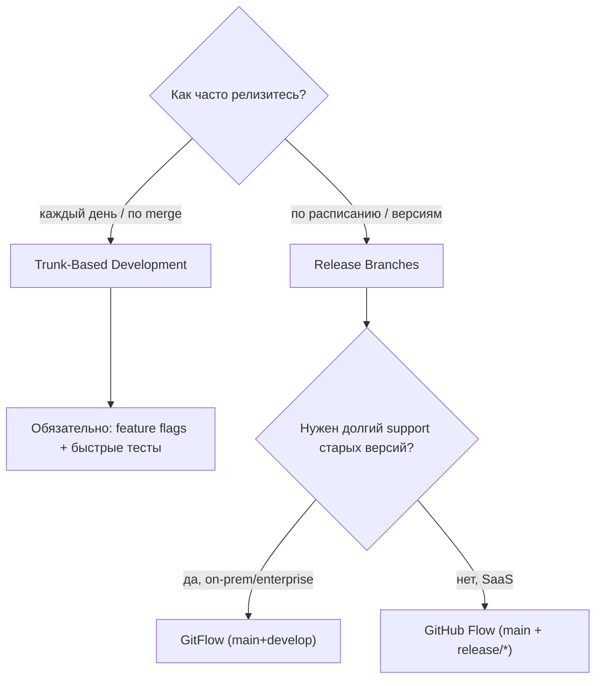

# 🌿 04. Branching-стратегии и Release Engineering

## 🗺️ Карта стратегий: что выбрать и почему



| Стратегия | Ветки | Релиз | Кому подходит |
|---|---|---|---|
| **Trunk-Based** | main + короткоживущие (<1–2 дня) | каждый merge → deploy | web/SaaS, CI/CD-зрелые команды |
| **GitHub Flow** | main + feature/* | merge в main = релиз-кандидат | небольшие сервисы |
| **Release Branches** | main + release/x.y | ветка замораживается, только багфиксы | SaaS с патчами версий |
| **GitFlow** | main + develop + feature/release/hotfix | через develop→release→main | on-prem, версии у клиентов |

!!! tip "Правило выбора"
    Чем выше частота деплоя — тем короче живёт ветка. Trunk-based невозможен без: (1) тестов <10 мин, (2) feature flags, (3) готовности к откату. Если любого из трёх нет — начните с GitHub Flow.

## 🚂 Release branches: механика поддержки версий

```bash
# Заморозка релиза
git switch -c release/2.4 main
# ... стабилизация, только bugfix'и ...

# Релиз: тег на ветке + merge обратно (фиксы не теряются)
git tag -a v2.4.0 -m "Release 2.4" && git switch main && git merge --no-ff release/2.4

# Hotfix старой версии
git switch -c hotfix/2.4.1 v2.4.0
git commit -am "fix: race in scheduler"
git tag v2.4.1 && git push origin v2.4.1
# ОБЯЗАТЕЛЬНО донести фикс в main, иначе он потеряется:
git switch main && git cherry-pick hotfix/2.4.1
```

**Backport-политика:** фиксы сначала попадают в main, затем cherry-pick в support-ветки (`fix → forwardport`), а не наоборот. Обратный порядок рождает расхождения.

Автоматизация cherry-pick: GitLab `~backport` label + CI job; GitHub — backport-action по label.

## 🏷️ Автоверсионирование из истории коммитов

Conventional Commits + SemVer позволяют считать следующую версию **из самих коммитов**:

```bash
# Python: python-semantic-release / commitizen
pipx install commitizen
cz bump --changelog --increment=auto   # feat→minor, fix→patch, feat!→major
# Go/универсально: git-cliff для changelog
git cliff -o CHANGELOG.md
```

```yaml
# GitLab CI: тег версии при мерже в main
semantic-release:
  stage: release
  image: python:3.12-slim
  script: pipx run --spec python-semantic-release semantic-release version-and-publish
  rules: [{ if: '$CI_COMMIT_BRANCH == "main"' }]
```

## 🔀 Merge vs Rebase на уровне релизов

| Ситуация | Что использовать | Почему |
|---|---|---|
| Feature → main (защищённая) | **merge commit / squash** | история честная, revert одним коммитом |
| Актуализация фичи из main | **rebase** | чистая история внутри PR |
| Фикс в release/x.y | **cherry-pick** | точечный перенос |
| Публичные общие ветки | **НЕ rebase** | переписанная история = конфликт у всех |

Squash vs merge vs rebase-merge — настройка репозитория:

```yaml
# .gitlab-ci.yaml нет; это настройка проекта в UI/GitLab API:
# PUT /projects/:id → merge_method: ff | merge_commit_squash ...
```

- **merge commit** — сохраняет все коммиты ветки, нужен `--no-ff`.
- **squash** — один коммит на MR: чистый main, но теряется гранулярность (revert = один большой откат).
- **fast-forward only** — строгая линейная история; требует дисциплины rebase перед merge.

## 🚩 Feature Flags как часть branching

Trunk-based заменяет долгие ветки на **флаги**:

| Инструмент | Где крутится | Особенность |
|---|---|---|
| Unleash / Flagsmith / OpenFeature | self-hosted, SDK в коде | kill-switch, percentage rollout |
| GitLab Feature Flags | интеграция с Unleash | нативно из MR |
| LaunchDarkly | SaaS | эксперименты, сегменты |

Паттерн: код смёржён и выключен флагом → включается постепенно (5%→50%→100%) → флаг удаляется. Релиз (deploy) отделён от выката фичи (release).

## 📋 Чек-лист release engineer'а

- [ ] Защищённый main: запрет push, только MR с approvals + green pipeline.
- [ ] Версия считается автоматически (SemVer из Conventional Commits).
- [ ] Changelog генерируется (git-cliff / semantic-release).
- [ ] Теги подписаны и аннотированные (`git tag -s`).
- [ ] Поддерживаемые ветки зафиксированы (сколько версий поддерживаем?).
- [ ] Откат релиза отрепетирован: `git revert -m 1 <merge-sha>` или redeploy прошлого тега.
- [ ] Release notes собираются из MR, а не пишутся руками в ночь релиза.

## ❓ Пять вопросов для самопроверки

---


## ✅ Проверь себя

> Отвечай вслух до раскрытия ответа. Если «не помню» — вернись к разделу.


**В1. Почему hotfix в release-ветку обязательно cherry-pick'ают в main?**
<details><summary>Ответ</summary>
Иначе при следующем мерже release→main (или просто со временем) фикс останется только в старой ветке, и баг вернётся в будущих версиях. Правило: «фикс рождается в main, потом едет назад» (forwardport вместо backport) либо немедленный cherry-pick после backport.
</details>

**В2. Что сломает fast-forward-only main?**
<details><summary>Ответ</summary>
Любая ветка, отставшая от main без rebase: FF невозможен, если история main ушла вперёд. Требует обязательного `git pull --rebase` перед merge. Зато даёт идеально линейную историю без merge-коммитов.
</details>

**В3. Как безопасно откатить уже смёрженный squash-MR?**
<details><summary>Ответ</summary>
`git revert -m 1 <merge_sha>` — для merge-коммита флаг `-m 1` выбирает родителя основной ветки как базу отката. Для squash это обычный revert одного коммита. Повторное попадание изменений требует revert-the-revert или нового коммита.
</details>

**В4. Как Conventional Commits автоматизирует версию?**
<details><summary>Ответ</summary>
Парсер читает коммиты с последнего тега: `feat:` → MINOR, `fix:` → PATCH, `BREAKING CHANGE:`/`!:` → MAJOR. Инструмент (semantic-release/commitizen) сам считает следующий SemVer, ставит тег, генерит changelog и публикует.
</details>

**В5. Зачем trunk-based нужны feature flags, если есть короткие ветки?**
<details><summary>Ответ</summary>
Ветка прячет незаконченный код до мерджа, но после мерджа он сразу в проде. Флаг отделяет deploy от release: недоделанный код можно мержить ежедневно, держа его выключенным в проде, и включать постепенно/убивать одной кнопкой.
</details>

---

*Что дальше:* [05. Merge/Rebase мастерская](05-merge-rebase-conflicts-masterclass.md) · [06. Hooks и pre-commit](06-hooks-automation-pre-commit.md)
