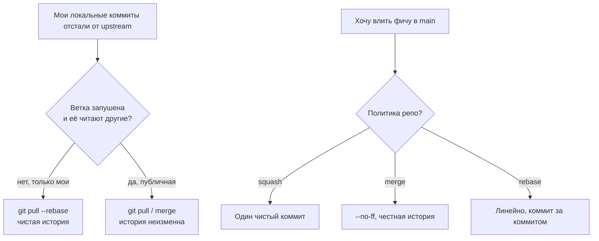

# ⚔️ 05. Merge, Rebase и Разрешение Конфликтов: Мастерская

## 🧭 Дерево решений: merge или rebase?



## 🔬 Как именно работает merge

Трёхстороннее слияние (3-way): Git ищет **merge-base** (общего предка), сравнивает три снимка:

```text
      base ──┬── theirs (main): изменил файл A, файл B не тронут
             │
        ours (feature): изменил файл B
             ↓ merge result
A берём от theirs, B от ours, конфликта нет
```

Конфликт возникает **только** когда одну и ту же строку (или соседние) меняли обе стороны относительно base.

```bash
git merge feature                     # обычное слияние
git merge --no-ff feature            # принудительный merge-коммит
git merge --squash feature           # изменения в index БЕЗ коммита и связи истории
git merge --abort                    # вернуть всё как было
git merge -X ours feature            # авто-разрешение в нашу пользу (осторожно!)
git checkout --ours path             # вручную взять «нашу» версию файла
git checkout --theirs path
git merge-file ours base theirs      # слияние трёх файлов вне git (в скриптах!)
```

## ♻️ Rebase: перезапись истории под капотом

Rebase = последовательность cherry-pick ваших коммитов поверх новой базы. Каждый коммит получает **новый SHA** — потому публичную историю переписывать нельзя.

```bash
git rebase main                      # перенести свои коммиты на main
git rebase --continue / --skip / --abort
git rebase -i HEAD~5                 # интерактив: reorder/squash/edit/drop
git rebase --autosquash              # + фикс-коммиты fixup!/squash! сложатся сами
git commit --fixup <sha>             # пометить коммит-дополнение заранее
git rebase --onto new-base old-base branch  # перенос диапазона на новую базу
git pull --rebase --autostash        # fetch + rebase, спрятав незакоммиченное
git config rebase.autoStash true     # всегда автостэшить при rebase
git config rerere.enabled true       # ЗАПОМИНАТЬ решения конфликтов!
```

### `--onto`: хирургия истории

Задача: из ветки `feature`, построенной на устаревшем `old-base`, забрать только последние 3 коммита на новый `main`:

```bash
git rebase --onto main old-base feature
#        ^куда      ^откуда(искл.) ^что двигаем
```

Типичный кейс: из длинной фичевой ветки выделили часть в отдельный MR.

## 🥊 Конфликты: системный протокол разрешения

```bash
git status                          # оба modified: список конфликтных файлов
git diff                            # combined diff: <<<<<<< ours ||||||| base ======= theirs >>>>>>>
git log --merge -p path             # ЧТО менял каждый из родителей — главный инструмент понимания
git mergetool                       # vimdiff/meld/vscode
```

**Протокол (без паники):**
1. `git log --merge -p <file>` — понять *намерение* обеих сторон, а не просто выбрать текст.
2. Собрать итог, который удовлетворяет обоим намерениям (не «наш» и не «их», а третий вариант).
3. Прогнать тесты затронутого модуля — конфигурационные конфликты (yaml/json) не ловятся компилятором.
4. `git add <file>` → continue. Для целого файла: `checkout --ours/--theirs` + add.
5. Не уверены → `git merge --abort`, начать заново с меньшими шагами.

```bash
# Массовые операции при сотне конфликтных файлов одного типа:
grep -rl '<<<<<<<' . | xargs -I{} sh -c 'git checkout --theirs "{}" && git add "{}"'
```

!!! warning "Бинарные и lock-файлы"
    package-lock.json/poetry.lock сливайте регенерацией: возьмите любую сторону → удалите маркеры → выполните установку зависимостей заново → закоммитьте свежий lockfile. Ручное слияние lockfile почти всегда ломает его структуру.

## 🧲 Rerere: Git помнит ваши решения

`rerere` (reuse recorded resolution) записывает пару «конфликтный ханк → решение». При повторном том же конфликте (типично при долгих сериях rebase или cherry-pick между ветками) разрешит автоматически.

```bash
git config rerere.enabled true       # глобально: git config --global rerere.enabled true
git rerere status                    # какие пути сейчас под наблюдением
git rerere diff                      # записанные решения
git rerere forget path               # забыть решение для пути (решили неправильно)
```

## ❓ Пять вопросов для самопроверки

---


## ✅ Проверь себя

> Отвечай вслух до раскрытия ответа. Если «не помню» — вернись к разделу.


**В1. Почему после rebase нельзя делать force-push в общую ветку?**
<details><summary>Ответ</summary>
Rebase пересоздаёт коммиты с новыми SHA. У коллег останутся старые копии тех же коммитов; их следующий merge/rebase натянет дубликаты и конфликты на пустом месте. Публичные ветки — только append-only история.
</details>

**В2. Что делает `git rebase --onto main dev feature`?**
<details><summary>Ответ</summary>
Возьмёт коммиты feature, которые идут ПОСЛЕ dev (диапазон dev..feature), и применит их поверх main. Используется, чтобы «переездить» часть ветки на другую базу, отсекая старое основание.
</details>

**В3. Как посмотреть, чем именно отличаются две стороны конфликта относительно общего предка?**
<details><summary>Ответ</summary>
`git log --merge -p <path>` показывает коммиты обеих сторон, затрагивающие файл (MERGE_HEAD vs HEAD). Плюс `git show :1:path` (base), `:2:` (ours), `:3:` (theirs) — три стадии файла в index.
</details>

**В4. Чем `merge --squash` отличается от squash-merge кнопкой в GitLab?**
<details><summary>Ответ</summary>
`--squash` кладёт изменения в index без создания коммита и БЕЗ ссылки на исходную историю (нельзя revert по MR автоматически). Кнопка создаёт полноценный коммит с привязкой MR — revert работает штатно.
</details>

**В5. Как заставить Git автоматически разрешать повторяющиеся конфликты?**
<details><summary>Ответ</summary>
Включить `rerere.enabled`. Git запомнит, как вы разрешили конкретный ханк, и при повторной встрече того же конфликта применит решение сам. Полезно в long-lived ветках и при периодических cherry-pick между release-ветками.
</details>

---

*Что дальше:* [06. Hooks и pre-commit](06-hooks-automation-pre-commit.md) · [03. Internals](03-git-internals-deep-dive.md)
