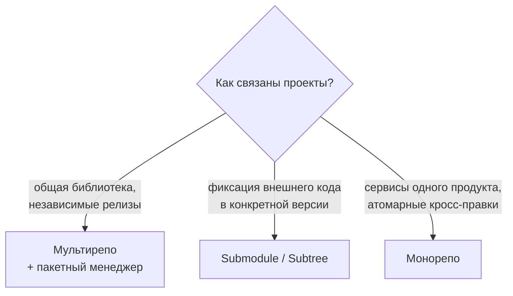

# 🗂️ 07. Submodules, Subtrees и Монорепозитории

## 🧩 Три стратегии структурирования кода



| Подход | Плюсы | Минусы |
|---|---|---|
| Мультирепо | независимые права/CI/релизы | кросс-правки = N PR, версии рассинхронизируются |
| Submodule | точная фиксация чужого SHA, стандартность | сложен для новичков (init/update/detached) |
| Subtree | обычные файлы в вашем репо, нет спецкоманд у коллег | раздувание истории, мержить upstream тяжелее |
| Монорепо | атомарные рефакторинги, единый CI, один lockfile | нужен инструментальный CI (по путям), большие checkout'ы |

## 📎 Submodules: правильная эксплуатация

Submodule = запись в `.gitmodules` + gitlink (специальный tree-entry `160000`) с SHA внешнего репо.

```bash
git submodule add https://gitlab.local/infra/common-lib libs/common
git clone --recurse-submodules <url>          # сразу с подмодулями
git submodule update --init --recursive       # после обычного clone (забывают все!)
git submodule update --remote libs/common     # подтянуть свежий upstream
git submodule status                          # SHA и состояние каждого

# Обновить и ЗАКОММИТИТЬ новый указатель (иначе CI соберёт старое!):
cd libs/common && git fetch && git switch main && git pull && cd -
git add libs/common && git commit -m "chore: bump common-lib"
```

!!! warning "Три классические ловушки"
    1. `detached HEAD` внутри submodule — всегда `git switch main` перед работой.
    2. Изменённый submodule надо коммитить **дважды**: внутри него, затем в родителе.
    3. CI/клонирование без `--recurse-submodules` даёт пустые каталоги — добавьте `GIT_SUBMODULE_STRATEGY: recursive` в GitLab CI.

```yaml
# .gitlab-ci.yml — обязательное для репо с submodules
variables:
  GIT_SUBMODULE_STRATEGY: recursive
  GIT_SUBMODULE_DEPTH: "1"        # shallow — быстрее
```

## 🌳 Subtree: чужой код как свои файлы

```bash
# Втянуть проект в подкаталог (один раз):
git subtree add --prefix=libs/helm-charts https://gitlab.local/platform/charts.git main --squash

# Забрать апстрим-обновления:
git subtree pull --prefix=libs/helm-charts https://gitlab.local/platform/charts.git main --squash

# Отдать свои правки обратно в upstream:
git subtree push --prefix=libs/helm-charts https://gitlab.local/platform/charts.git contribution
```

Отличие от submodule: у разработчиков нет специальных команд и пустых каталогов, история — ваша. Цена: `--squash` обязателен, иначе история upstream замусорит ваш log.

## 🏙️ Монорепо: инструменты масштабирования

Проблемы монорепо растут с размером: скорость клонов, время CI, права доступа.

### Sparse checkout + partial clone: берем только нужное

```bash
git clone --filter=blob:none --no-checkout https://gitlab.local/org/monorepo.git
cd monorepo
git sparse-checkout init --cone            # cone-mode: каталоги, а не паттерны
git sparse-checkout set services/api deploy/k8s docs
git switch main                            # скачаются blobs только выбранных путей
git sparse-checkout list                   # посмотреть текущий набор
```

`--filter=blob:none` (blobless clone): деревья/коммиты грузятся сразу, blobs — по требованию. Для огромных репо ещё радикальнее `--filter=tree:0` (treeless, только для CI-разового билда).

### Разделение CI по изменённым путям

```python
# scripts/affected.py — какие сервисы затронул MR (упрощённо)
import subprocess, pathlib, json, sys
diff = subprocess.run(["git", "diff", "--name-only", "origin/main...HEAD"],
                      capture_output=True, text=True).stdout.split()
services = {p.split("/")[1] for p in diff if p.startswith("services/") and "/" in p}
print(json.dumps(sorted(services)))       # → child pipeline запускает только их тесты
```

Зрелые решения: Bazel/Buck2 (контентно-адресный кэш сборки), Nx/Turborepo (JS), Pants (Python), GitLab `rules:changes`, GitHub `paths-filter`.

### История монорепо: кто владеет чем

```bash
CODEOWNERS (GitLab/GitHub): обязательные ревьюеры по путям
/services/payments/**   @payments-team
/deploy/**              @platform-team
/docs/**                @any-developer
```

## 🔄 Переезд между стратегиями

```bash
# Вынести подкаталог монорепо в отдельный репо С ИСТОРИЕЙ (git-filter-repo!)
pipx install git-filter-repo
git clone --no-local monorepo.git split-api && cd split-api
git filter-repo --subdirectory-filter services/api

# Склеить несколько репо в монорепо с сохранением истории:
git remote add api ../api.git && git fetch api
git merge --allow-unrelated-histories api/main --no-edit   # затем перенести в services/api
```

⚠️ После любого filter-repo все SHA меняются — делайте это в fresh clone и предупредите команду.

## ❓ Пять вопросов для самопроверки

---


## ✅ Проверь себя

> Отвечай вслух до раскрытия ответа. Если «не помню» — вернись к разделу.


**В1. Что произойдёт, если закоммитить изменения внутри submodule, но не обновить ссылку в родительском репо?**
<details><summary>Ответ</summary>
Родитель продолжит указывать на старый SHA: ваши изменения существуют только локально, CI/коллеги получат прежнюю версию. Нужно два коммита: внутри submodule → затем `git add <путь>` в родителе.
</details>

**В2. Почему в CI обязательно `GIT_SUBMODULE_STRATEGY: recursive`?**
<details><summary>Ответ</summary>
Обычный checkout создаёт пустые каталоги вместо содержимого submodule. Переменная заставляет runner выполнить эквивалент `submodule update --init --recursive`; вложенные submodule требуют именно recursive.
</details>

**В3. Когда выбрать subtree вместо submodule?**
<details><summary>Ответ</summary>
Когда потребители кода не должны знать о внешнем репо (vendoring helm-чартов, JS-библиотеки без npm, форкнутый инструмент). Файлы физически в вашем репо, работают обычные clone/pull; цена — сложнее синхронизация с upstream.
</details>

**В4. Что даёт `git clone --filter=blob:none` + sparse-checkout в монорепо?**
<details><summary>Ответ</summary>
Blobless clone скачивает коммиты/деревья, но не содержимое файлов до необходимости; sparse-checkout ограничивает рабочую копию нужными каталогами. Вместе это превращает клон 50-ГБ монорепо в сотни мегабайт за минуты.
</details>

**В5. Как вынести сервис из монорепо в отдельный репозиторий, сохранив историю?**
<details><summary>Ответ</summary>
Fresh clone → `git filter-repo --subdirectory-filter services/api` — останутся только коммиты, касающиеся пути, пути станут корневыми. Все SHA переписываются, поэтому новый репо начинают с чистого push, а старый помечают archived.
</details>

---

*Что дальше:* [08. Большие репозитории и LFS](08-large-repos-performance-lfs.md) · [09. Git Security](09-security-signing-secret-scanning.md)
