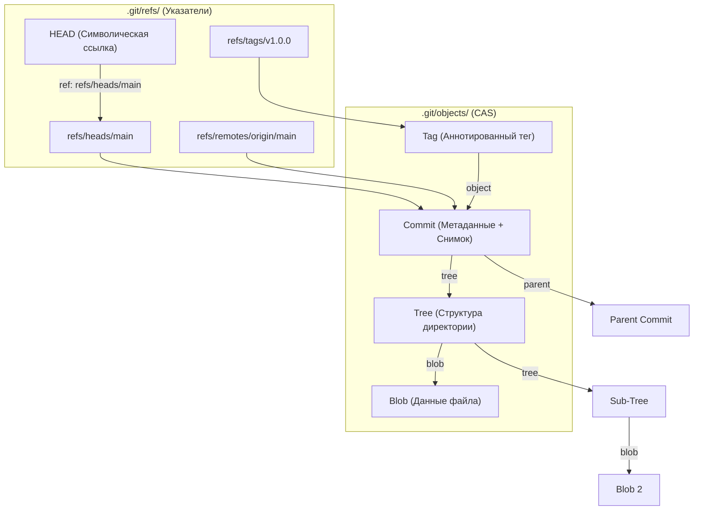
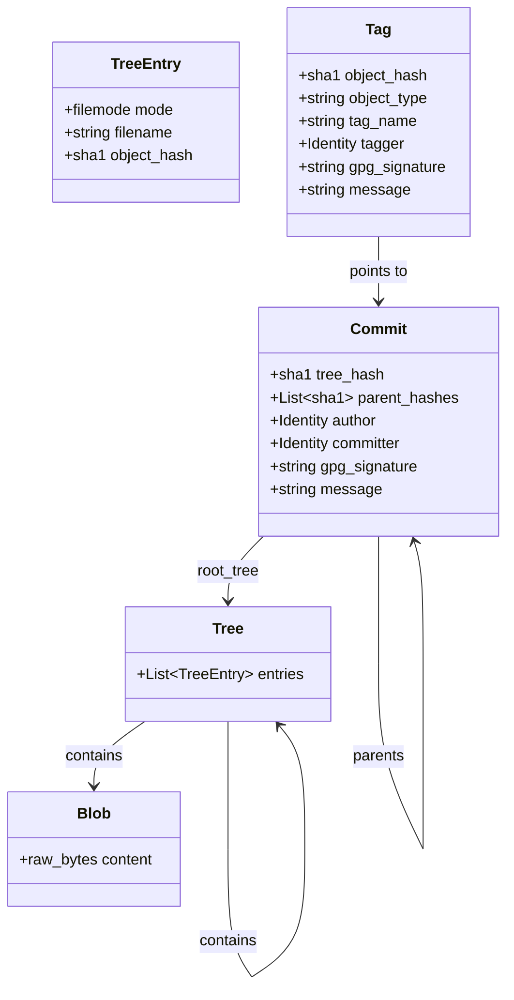

# 📦 11. Git Object Model: Blobs, Trees, Commits, Tags и References

Git — это не просто система контроля версий с дельта-компрессией изменений, а распределенная **контентно-адресуемая файловая система (Content-Addressable Storage, CAS)**, поверх которой построен направленный ациклический граф (Directed Acyclic Graph, DAG).

Каждая сущность в Git — файл, каталог, коммит или тег — идентифицируется неизменяемым криптографическим хэшем ее содержимого вместе со служебным заголовком.

---

## 🏛️ 1. Архитектура хранилища объектов (`.git/objects`)

Хранилище объектов Git (`Object Database`, ODB) находится в директории `.git/objects/`. По умолчанию объекты хранятся в виде свободных файлов (**loose objects**), сжатых алгоритмом `zlib deflate`.



### Формат Loose Object
Любой объект перед сжатием и хэшированием оборачивается в строгий бинарный заголовок:
```text
<тип-объекта> <размер-в-байтах>\0<бинарное-содержимое>
```

- **Хэширование:** Git вычисляет хэш `SHA-1` (160 бит / 40 шестнадцатеричных символов) или `SHA-256` (256 бит / 64 символа в новых репозиториях).
- **Путь на диске:** Первые 2 символа хэша становятся именем поддиректории (`.git/objects/4b/`), оставшиеся 38 символов — именем файла (`825dc642cb6eb9a060e54bf8d69288fbee4904`). Это предотвращает деградацию производительности файловой системы из-за десятков тысяч файлов в одном каталоге.

---

## 🧩 2. Четыре базовых типа объектов



### 1. `blob` (Binary Large Object)
Хранит исключительно «сырое» содержимое файла. Blob не содержит метаданных: ни имени файла, ни прав доступа, ни даты создания. Если 100 файлов разного имени имеют одинаковое содержимое, в Git появится ровно один blob.

### 2. `tree` (Директория)
Связывает имена файлов, права доступа и SHA-хэши объектов. Запись в объекте `tree` состоит из:
- **File Mode (восьмеричный):**
  - `100644` — обычный файл (non-executable).
  - `100755` — исполняемый файл (executable).
  - `120000` — символическая ссылка (symlink).
  - `040000` — подкаталог (ссылка на другой `tree`).
  - `160000` — gitlink (ссылка на коммит подмодуля `submodule`).
- **Имя файла / подкаталога**.
- **Двоичный хэш объекта (20 байт для SHA-1)**.

### 3. `commit` (Снимок состояния проекта)
Неизменяемый снимок состояния репозитория. Содержит:
- `tree <sha>` — хэш корневого объекта `tree`.
- `parent <sha>` — хэш одного или нескольких родительских коммитов (0 для начального коммита, 1 для обычного, 2+ для merge-коммитов).
- `author <Name> <Email> <Timestamp> <Timezone>` — создатель изменений.
- `committer <Name> <Email> <Timestamp> <Timezone>` — лицо/система, применившее коммит.
- `gpgsig` (опционально) — PGP/SSH цифровая подпись.
- Сообщение коммита (отделено пустой строкой).

### 4. `tag` (Аннотированный тег)
Полноценный объект в CAS, хранящий постоянную ссылку на объект (обычно коммит), имя тега, информацию об авторе тега (`tagger`), комментарий и GPG-подпись.

---

## 🔗 3. Ссылки (References) и Packed-Refs

Ссылки в Git — это простые текстовые файлы внутри `.git/refs/`, содержащие 40-символьный SHA-хэш коммита.

```text
.git/
├── HEAD                        <- Указывает на refs/heads/main
├── refs/
│   ├── heads/                  <- Локальные ветки
│   │   ├── main                <- Содержит SHA-1 коммита
│   │   └── feature-login
│   ├── remotes/                <- Remote-tracking ветки
│   │   └── origin/
│   │       └── main
│   └── tags/                   <- Теги (легковесные и аннотированные)
│       └── v1.0.0
└── packed-refs                 <- Упакованный файл сотен/тысяч ссылок
```

### Специальные и символические ссылки
- **`HEAD`:** Символическая ссылка (`symbolic ref`), указывающая на текущую ветку: `ref: refs/heads/main`. В состоянии *Detached HEAD* содержит сырой SHA коммита.
- **`ORIG_HEAD`:** Предыдущее положение `HEAD` перед опасными операциями (`merge`, `rebase`, `reset`).
- **`FETCH_HEAD`:** Содержит список веток, загруженных при последнем `git fetch`.
- **`MERGE_HEAD`:** SHA коммита, который в данный момент сливается с текущей веткой во время конфликта.

### Механизм `packed-refs`
Для ускорения операций в репозиториях с тысячами веток и тегов Git упаковывает отдельные файлы ссылок в один плоский файл `.git/packed-refs`:
```text
# pack-refs with: peeled fully-peeled sorted
4b825dc642cb6eb9a060e54bf8d69288fbee4904 refs/heads/main
a1b2c3d4e5f60718293a4b5c6d7e8f9012345678 refs/tags/v1.0.0
^e987654321fedcba0987654321abcdef01234567 # Peeled tag (целевой коммит аннотированного тега)
```

---

## 🛠️ 4. Plumbing CLI Cheat Sheet: Низкоуровневая работа с объектами

| Команда | Описание |
| :--- | :--- |
| `git hash-object -w <file>` | Вычислить SHA и записать файл как `blob` в `.git/objects` |
| `git hash-object --stdin` | Вычислить SHA строки без сохранения на диск |
| `git cat-file -t <hash>` | Показать тип объекта (`blob`, `tree`, `commit`, `tag`) |
| `git cat-file -s <hash>` | Показать размер объекта в байтах |
| `git cat-file -p <hash>` | Преобразовать бинарный объект в читаемый человеком формат |
| `git ls-tree <tree-hash>` | Распарсить объект `tree` и вывести имена, права и SHA файлов |
| `git write-tree` | Записать текущий staging index в виде объекта `tree` |
| `git commit-tree <tree-sha> -m "msg"` | Создать объект `commit` напрямую из `tree` без рабочей копии |
| `git update-ref refs/heads/main <sha>` | Атомарно обновить ветку на указанный SHA |
| `git symbolic-ref HEAD` | Показать, на какую ветку указывает `HEAD` |
| `git pack-refs --all --prune` | Упаковать loose-ссылки в `packed-refs` |

---

## 💻 5. Практический Bash-скрипт: Создание коммита с нуля без `git add` и `git commit`

Скрипт демонстрирует внутреннюю механику Git, создавая дерево объектов и коммит исключительно plumbing-командами:

```bash
#!/usr/bin/env bash
set -euo pipefail

# 1. Инициализация чистого репозитория
TMP_DIR=$(mktemp -d)
cd "$TMP_DIR"
git init -q
echo "📁 Репозиторий создан в $TMP_DIR"

# 2. Создание blob объектов вручную
BLOB_APP=$(echo 'package main\nfunc main() {}' | git hash-object -w --stdin)
BLOB_CONFIG=$(echo 'port: 8080' | git hash-object -w --stdin)
echo "📦 Blob app: $BLOB_APP"
echo "📦 Blob config: $BLOB_CONFIG"

# 3. Создание дерева каталога config/
CONFIG_TREE=$(printf "100644 blob %s\tapp.yaml\n" "$BLOB_CONFIG" | git mktree)
echo "🌳 Sub-tree config/: $CONFIG_TREE"

# 4. Создание корневого дерева
ROOT_TREE=$(printf "100644 blob %s\tmain.go\n040000 tree %s\tconfig\n" "$BLOB_APP" "$CONFIG_TREE" | git mktree)
echo "🌳 Root tree: $ROOT_TREE"

# 5. Создание коммита
COMMIT_SHA=$(echo "feat: core initialization via CAS plumbing" | git commit-tree "$ROOT_TREE")
echo "📝 Commit SHA: $COMMIT_SHA"

# 6. Привязка ветки main и переключение HEAD
git update-ref refs/heads/main "$COMMIT_SHA"
git symbolic-ref HEAD refs/heads/main

# 7. Синхронизация рабочего каталога
git checkout-index -a -f

# Проверка валидности репозитория
echo -e "\n🔍 Результат проверки git log:"
git log -1 --stat
```

---

## 🚨 6. Production Troubleshooting & Break-Fix

### Сценарий 1: Поврежденный Loose Object (`error: object file ... is empty`)
- **Симптом:** При выполнении `git status` или `git push` возникает ошибка:
  ```text
  error: object file .git/objects/3b/186278f5669ac3a0005116ac4d4cbd230def9c is empty
  fatal: loose object 3b186278f5669ac3a0005116ac4d4cbd230def9c (stored in .git/objects/3b/186...) is corrupt
  ```
- **Причина:** Внезапное отключение питания, сбой FS (например, ext4/XFS metadata flush) во время записи файла.
- **Диагностика и восстановление:**
  ```bash
  # 1. Найти поврежденный файл нулевого размера
  find .git/objects/ -type f -empty

  # 2. Проверить целостность репозитория
  git fsck --full

  # 3. Удалить пустой поврежденный файл
  rm .git/objects/3b/186278f5669ac3a0005116ac4d4cbd230def9c

  # 4. Если это был blob текущего файла, пересоздать его из рабочего каталога
  git hash-object -w path/to/corrupted_file.go

  # 5. Если объект утерян, подтянуть его из удаленного upstream
  git fetch origin main --refmap='+refs/heads/*:refs/remotes/origin/*'
  ```

### Сценарий 2: Повреждение `HEAD` (`fatal: bad default revision 'HEAD'`)
- **Симптом:** Любая git-команда завершается с ошибкой `fatal: bad default revision 'HEAD'`.
- **Причина:** Файл `.git/HEAD` очистился или содержит несуществующий путь.
- **Диагностика и исправление:**
  ```bash
  # Проверяем содержимое .git/HEAD
  cat .git/HEAD

  # Если файл пуст, восстанавливаем ссылку на целевую ветку
  echo "ref: refs/heads/main" > .git/HEAD

  # Если ветка main неизвестна, восстанавливаем по последнему коммиту в reflog
  LAST_COMMIT=$(tail -n 1 .git/logs/HEAD | awk '{print $2}')
  git update-ref refs/heads/main "$LAST_COMMIT"
  echo "ref: refs/heads/main" > .git/HEAD
  ```
