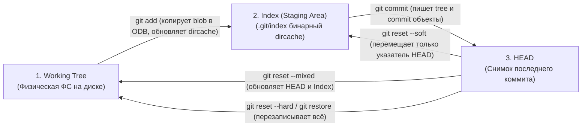
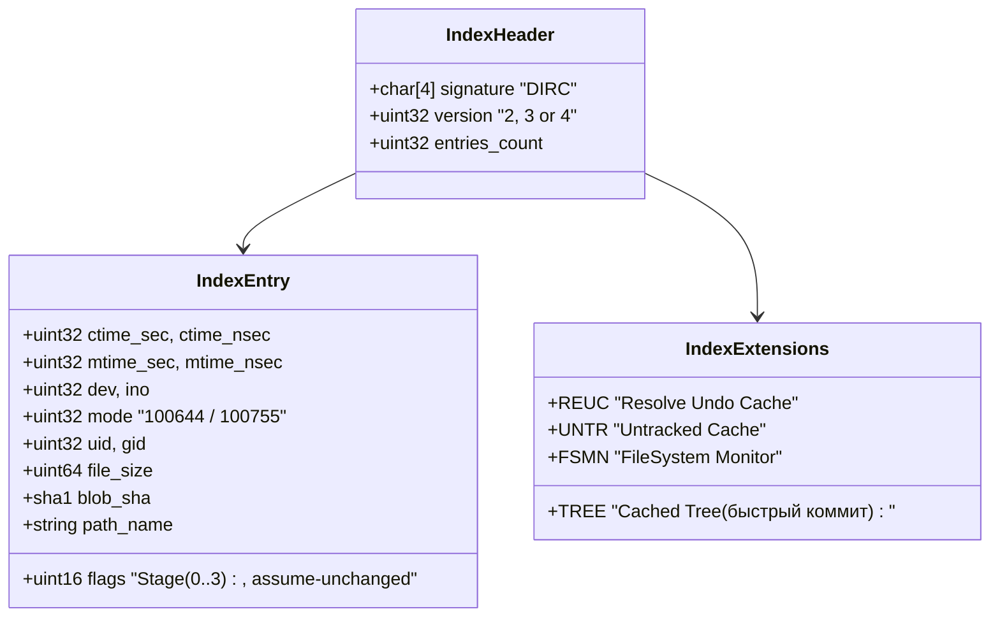

# 📑 12. Git Index и Working Tree: Архитектура трех состояний и Dircache

Git принципиально отличается от традиционных VCS (SVN, Mercurial, Perforce) наличием промежуточного слоя между физической файловой системой и историей коммитов — **индекса (Staging Area / Dircache)**.

---

## 🏛️ 1. Архитектура трех деревьев (The Three Trees)

В любой момент времени Git оперирует тремя независимыми состояниями структуры проекта:



| Дерево | Местоположение | Роль |
| :--- | :--- | :--- |
| **Working Tree** | Каталог проекта на диске | Фактические файлы, с которыми работает разработчик и IDE. |
| **Index (Dircache)** | Бинарный файл `.git/index` | Подготовленный снимок следующего коммита; кэш метаданных ФС. |
| **HEAD** | `.git/refs/heads/<branch>` | Неизменяемый снимок дерева последнего зарегистрированного коммита. |

---

## 🔬 2. Внутренняя структура файла `.git/index` (DIRC Format)

Файл `.git/index` представляет собой высокооптимизированную структуру данных `DIRC` (Directory Cache):



### Как `git status` работает мгновенно (Stat Cache)
Чтобы определить, изменился ли файл, Git не читает и не пересчитывает SHA каждого файла. Вместо этого вызывается системный вызов `stat()` (или `lstat()`):
1. Git сравнивает текущий `mtime` (время модификации), `file_size`, `inode`, `mode` файла на диске со значениями, сохраненными в `.git/index`.
2. Если метаданные совпадают, Git гарантирует, что файл не изменился, минуя дорогостоящее чтение содержимого.
3. Если метаданные изменились, Git вычисляет SHA-хэш нового содержимого. Если хэш совпал со старым Blob — файл помечается чистым, а метаданные в `.git/index` обновляются (решение проблемы `Racy Git`).

---

## 🔀 3. Стадии разрешения конфликтов (Stages 0–3)

Во время merge-конфликта `.git/index` может содержать до четырех версий одного и того же файла:

```text
.git/index entry flags (2-bit stage):
 ├── Stage 0: Обычный файл (нет конфликта)
 ├── Stage 1: Общий предок (Base / Merge Base)
 ├── Stage 2: Наша версия (Ours / Target Branch)
 └── Stage 3: Чужая версия (Theirs / Incoming Branch)
```

При выполнении `git add <file>` все три стадии 1..3 удаляются из индекса, и записывается единый файл в **Stage 0**.

---

## 🛠️ 4. Инженерный CLI Cheat Sheet: Управление Индексом

| Команда | Назначение |
| :--- | :--- |
| `git ls-files -s` | Показать все записи индекса (права, SHA blob, stage, имя) |
| `git ls-files -u` | Показать только неразрешенные конфликты (стадии 1, 2, 3) |
| `git diff --staged` (или `--cached`) | Сравнить изменения между `Index` и `HEAD` |
| `git diff` | Сравнить изменения между `Working Tree` и `Index` |
| `git diff HEAD` | Сравнить изменения между `Working Tree` и `HEAD` |
| `git update-index --assume-unchanged <path>` | Сказать Git игнорировать проверку файла в Working Tree (для локальных оверайдов) |
| `git update-index --no-assume-unchanged <path>` | Вернуть отслеживание файла |
| `git update-index --skip-worktree <path>` | Указать Git не перезаписывать файл при pull/merge (для локальных конфигов) |
| `git checkout-index -f -a` | Экспортировать все файлы из индекса в рабочую директорию |

---

## ⚙️ 5. Production-конфигурация для ускорения статуса в больших репозиториях

В репозиториях с >500 000 файлов стандартный `git status` тратит секунды на системные вызовы `lstat()`. Оптимизация через `.gitconfig`:

```ini
[core]
    # Включение кэширования неотслеживаемых файлов (использует mtime директорий)
    untrackedCache = true

    # Интеграция со встроенным демоном отслеживания событий ФС (Watchman / inotify)
    fsmonitor = true

    # Предварительная загрузка метаданных индексов в параллельных потоках
    preloadindex = true

    # Автоматическая нормализация окончаний строк
    autocrlf = input
```

Включение демона мониторинга:
```bash
# Запуск встроенного FS-монитора Git (начиная с Git 2.37+)
git fsmonitor--daemon start
```

---

## 🚨 6. Production Troubleshooting & Break-Fix

### Сценарий 1: `git status` показывает весь репозиторий как измененный (FileMode / CRLF)
- **Симптом:** После `git clone` или смены ОС все файлы числятся как `modified`, хотя код не менялся.
- **Причина:** Изменение прав доступа к файлам (POSIX permissions в WSL/NTFS) или расхождение CRLF/LF.
- **Диагностика:**
  ```bash
  # Проверка, что именно изменилось (содержимое или только filemode)
  git diff --summary
  # Вывод: mode change 100644 => 100755 script.sh
  ```
- **Исправление:**
  ```bash
  # 1. Отключить учет прав выполнения в репозитории (если работаем на NTFS/SMB/WSL)
  git config core.fileMode false

  # 2. Пересчитать нормализацию окончаний строк
  git add --renormalize .
  git status
  ```

### Сценарий 2: Повреждение бинарного файла индекса (`fatal: index file corrupt`)
- **Симптом:** Любая команда (`git status`, `git add`) падает с `fatal: index file corrupt`.
- **Причина:** Прерывание процесса записи в `.git/index` из-за `OOM Killer` или жесткой перезагрузки хоста.
- **Диагностика и восстановление:**
  ```bash
  # 1. Удалить поврежденный индекс (это НЕ удаляет ваши файлы в Working Tree!)
  rm -f .git/index

  # 2. Восстановить индекс из состояния HEAD
  git reset

  # 3. Убедиться, что индекс консистентен
  git status
  ```
