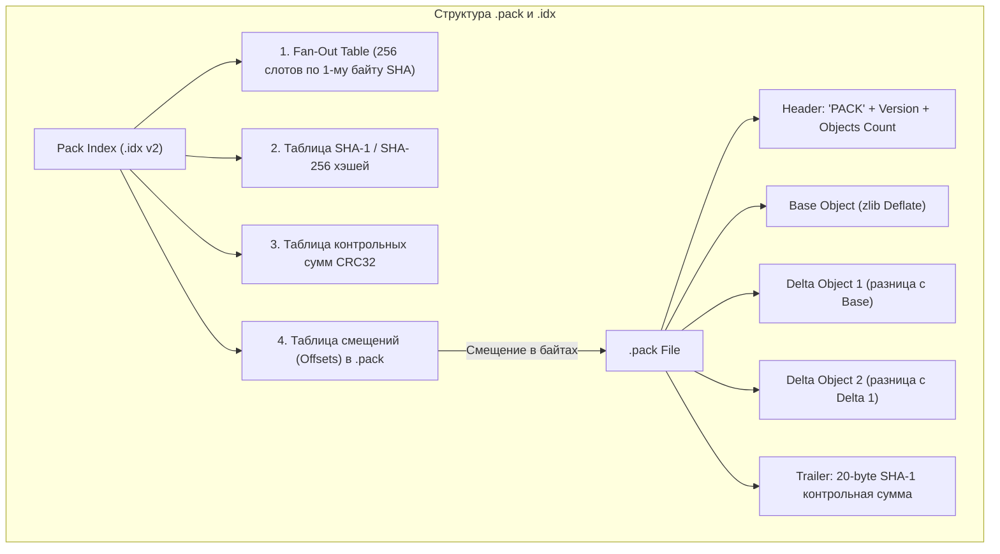
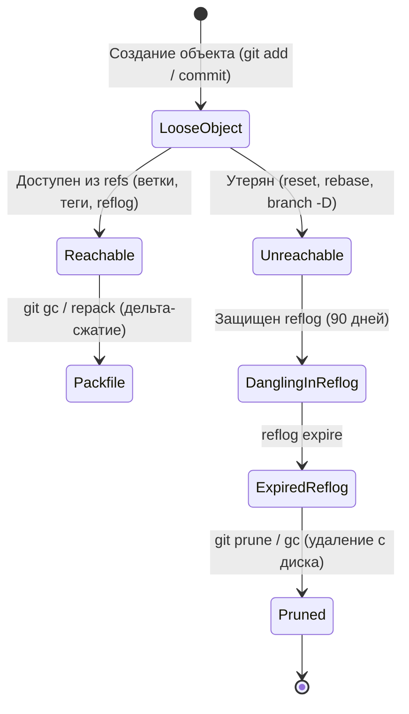

# 🗜️ 13. Git Packfiles, Дельта-компрессия и Garbage Collection (git gc)

Хранение каждого объекта в виде отдельного loose-файла приводит к исчерпанию дескрипторов inodes файловой системы и неэффективному использованию диска. Для решения этой проблемы Git использует бинарные **Packfiles** и механизм направленной **дельта-компрессии**.

---

## 🏛️ 1. Архитектура Packfile и Pack Index (`.idx`)

Когда количество свободных объектов превышает лимит (по умолчанию 6700 loose-объектов) или при вызове `git push`/`git gc`, Git упаковывает объекты в пару файлов:
- `.pack` — монолитный бинарный архив сжатых данных.
- `.idx` — бинарный индекс для $O(1)$ поиска объекта в `.pack` по его SHA-хэшу.



### Формат поиска в `.idx` (Fan-Out Table)
1. Git берет первый байт искомого SHA (например, `0x4b`).
2. В Fan-out таблице по смещению `0x4b * 4` читается диапазон индексов в таблице хэшей.
3. Внутри ограниченного диапазона выполняется двоичный поиск (binary search) по полному SHA.
4. По найденному индексу извлекается точное смещение (offset) в байтах внутри `.pack` файла.

---

## 🧬 2. Дельта-компрессия (Directed Delta Compression)

Git не просто сжимает отдельные файлы через `zlib`, он находит схожие объекты (обычно разные версии одного и того же файла в истории) и сохраняет один как **Base Object**, а остальные — как компактные последовательности инструкций вставки и копирования байтов (**Deltas**).


> [!NOTE]
> В отличие от многих систем, сохраняющих базовую начальную версию и накатывающих прямые диффы вперед, Git делает **самую свежую версию базовой (Base)**, а старые версии — дельтами. Это гарантирует максимальную скорость для свежего кода (`HEAD`).

### Параметры окна дельта-компрессии:
- `pack.window` (по умолчанию 10): количество кандидатов для сравнения в скользящем окне при поиске наилучшей дельты.
- `pack.depth` (по умолчанию 50): максимальная глубина цепочки дельт (Delta chain depth).

---

## 🧹 3. Механизм Garbage Collection (`git gc`)

Жизненный цикл объектов и очистка неиспользуемых данных:



### Сроки хранения по умолчанию:
- `gc.reflogExpire = 90.days.ago`: срок хранения записей reflog для доступных объектов.
- `gc.reflogExpireUnreachable = 30.days.ago`: срок хранения записей reflog для недостижимых коммитов.
- `gc.pruneExpire = 2.weeks.ago`: защитный интервал для `git prune` против случайного удаления объектов, создаваемых параллельными процессами.

---

## 🛠️ 4. Инженерный CLI Cheat Sheet

| Команда | Описание |
| :--- | :--- |
| `git count-objects -vH` | Детальная статистика по количеству и размеру loose и packed объектов |
| `git verify-pack -v .git/objects/pack/*.idx` | Показать размер, тип и цепочки дельт каждого объекта внутри packfile |
| `git gc` | Стандартная сборка мусора (сжатие loose-объектов, упаковка refs) |
| `git gc --auto` | Фоновая сборка мусора (срабатывает, только если превышены пороги) |
| `git gc --aggressive --prune=now` | Полная агрессивная перепаковка с глубоким окном дельт и немедленным удалением мусора |
| `git repack -a -d -f --depth=250 --window=250` | Максимально возможное сжатие репозитория (требует CPU/RAM) |
| `git multi-pack-index write` | Создать объединенный индекс для нескольких `.pack` файлов (MIDX) |
| `git prune --dry-run --verbose` | Показать, какие недостижимые объекты готовы к удалению |

---

## ⚙️ 5. Production Конфигурация для CI/CD серверов и больших репозиториев

```ini
[gc]
    # Отключение автоматического gc на высоконагруженных CI runner (запускается по cron ночью)
    auto = 0
    # Срок жизни недостижимых объектов перед удалением
    pruneExpire = 14.days
    # Включение Multi-Pack Index для ускорения поиска
    writeCommitGraph = true

[pack]
    # Лимит оперативной памяти на один поток упаковки (предотвращает OOM)
    packSizeLimit = 2g
    windowMemory = 1g
    # Использование всех доступных ядер CPU
    threads = 0
    # Глубина поиска дельт при ручной агрессивной упаковке
    depth = 50
    window = 100
    # Использование формата смещений delta (уменьшает размер .pack на 5-10%)
    useDeltaBaseOffset = true
```

---

## 🚨 6. Production Troubleshooting & Break-Fix

### Сценарий 1: Репозиторий вырос до десятков гигабайт из-за случайно закоммиченных бинарников
- **Симптом:** `git clone` и `git fetch` выполняются экстремально медленно, `.git` весит гигабайты.
- **Диагностика:**
  ```bash
  # Найти 10 самых тяжелых объектов в packfile
  git verify-pack -v .git/objects/pack/*.idx \
    | sort -k 3 -n -r \
    | head -n 10 \
    | awk '{print $1}' \
    | while read -r sha; do git rev-list --objects --all | grep "$sha"; done
  ```
- **Исправление:** Очистка истории с помощью высокопроизводительной утилиты `git-filter-repo` (быстрее устаревшего `git filter-branch` в 100+ раз):
  ```bash
  # 1. Установка утилиты
  pip install git-filter-repo

  # 2. Полное удаление тяжелого файла из всей истории репозитория
  git filter-repo --invert-paths --path "build/large_binary.tar.gz" --force

  # 3. Принудительная сборка мусора и очистка reflog
  git reflog expire --expire=now --all
  git gc --prune=now --aggressive
  ```

### Сценарий 2: Повреждение индекса пак-файла (`fatal: index-pack failed / bad pack file`)
- **Симптом:** Git сообщает о повреждении `.idx` файла.
- **Исправление:** Пересоздание `.idx` из существующего `.pack` файла:
  ```bash
  # Перегенерация Pack Index v2 напрямую из файла пакета
  cd .git/objects/pack
  git index-pack pack-abcdef0123456789.pack
  ```
