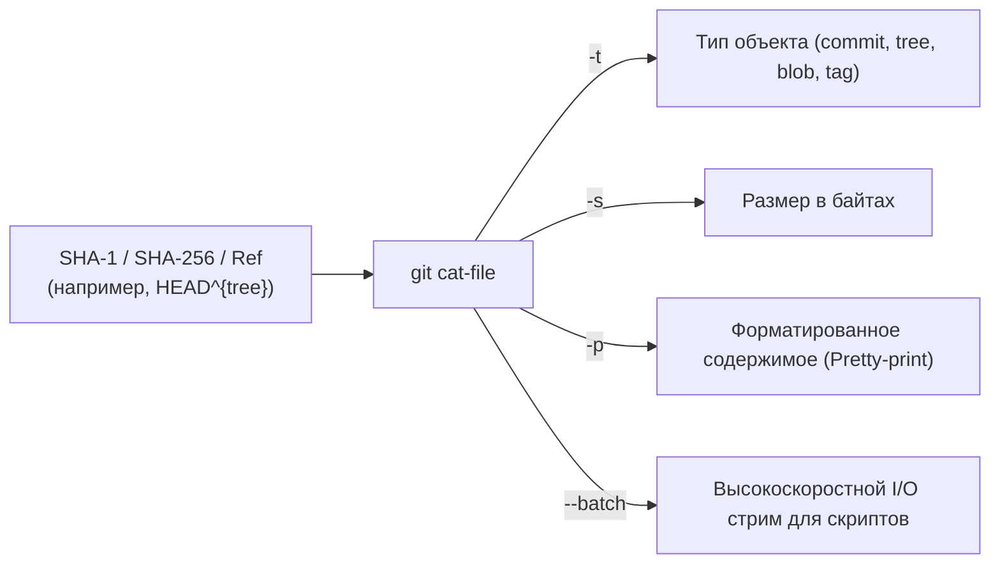
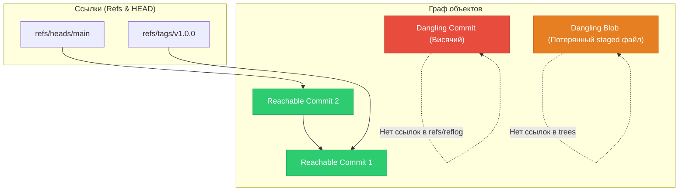

# 🔍 14. Git Объекты: Инспекция через git cat-file и Проверка целостности через git fsck

Для глубокого аудита репозитория, автоматизации CI/CD пайплайнов и аварийного восстановления удаленных данных Git предоставляет два ключевых инструмента: низкоуровневый инспектор объектов `git cat-file` и верификатор целостности графа `git fsck`.

---

## 🔬 1. Низкоуровневая инспекция через `git cat-file`

`git cat-file` — универсальный шлюз к контентно-адресуемому хранилищу объектов Git.



### Режим пакетной обработки (`--batch` и `--batch-check`)
В production-скриптах и CI вызов отдельного процесса `git cat-file` на каждый объект создает недопустимый overhead (fork/exec). Флаг `--batch` открывает постоянный пайплайн через `stdin`/`stdout`:

```bash
# Пакетная проверка существования и размера объектов
git rev-list --all | git cat-file --batch-check="%(objectname) %(objecttype) %(objectsize) %(rest)"
```

Формат вывода:
```text
4b825dc642cb6eb9a060e54bf8d69288fbee4904 tree 0
a1b2c3d4e5f60718293a4b5c6d7e8f9012345678 commit 248
```

---

## 🛡️ 2. Проверка целостности графа через `git fsck`

Команда `git fsck` (File System Check) верифицирует целостность базы данных объектов, вычисляет SHA каждого объекта на диске для обнаружения битовых повреждений (bit rot) и строит граф достижимости.



### Классификация состояний объектов:
- **Reachable (Достижимый):** Объект прямо или косвенно доступен по ссылкам из веток, тегов или `HEAD`.
- **Dangling Commit / Blob:** Объект корректен, но на него нет ссылок ни из одной ветки, тега или активного reflog.
- **Missing Object:** Объект упомянут в коммите или дереве, но физически отсутствует в `.git/objects/`.
- **Corrupt Object:** SHA-хэш распакованного содержимого не совпадает с именем файла или контрольной суммой.

---

## 🛠️ 3. Инженерный CLI Cheat Sheet

| Команда | Описание |
| :--- | :--- |
| `git cat-file -t <object>` | Вывести тип объекта (`blob`, `tree`, `commit`, `tag`) |
| `git cat-file -s <object>` | Вывести размер объекта в байтах |
| `git cat-file -p <object>` | Распечатать объект (для tree — структуру каталога, для commit — метаданные) |
| `git cat-file -e <object>` | Проверить существование объекта (код возврата 0 или 1) |
| `git fsck --full` | Полная валидация всех объектов, включая packfiles |
| `git fsck --unreachable` | Показать все недостижимые объекты |
| `git fsck --lost-found` | Найти все висячие объекты и экспортировать их в `.git/lost-found/` |
| `git fsck --strict` | Строгая проверка (запрет некорректных email в авторах, пробелов в именах файлов) |

---

## 💻 4. Bash-скрипт: Аварийное восстановление несохраненных файлов (`git add` rescue)

Если разработчик выполнил `git add .`, но затем случайно сбросил состояние командой `git reset --hard HEAD` **до создания коммита**, файлы сохранены в базе Git как `dangling blob`:

```bash
#!/usr/bin/env bash
set -euo pipefail

RESCUE_DIR="./git_rescued_blobs_$(date +%s)"
mkdir -p "$RESCUE_DIR"

echo "🔍 Поиск висячих (dangling) blob-объектов в репозитории..."

# Извлекаем все dangling blobs через git fsck
DANGLING_BLOBS=$(git fsck --lost-found | awk '/dangling blob/ {print $3}')

if [ -z "$DANGLING_BLOBS" ]; then
    echo "✅ Потерянных staged объектов не обнаружено."
    exit 0
fi

COUNT=0
for BLOB_SHA in $DANGLING_BLOBS; do
    COUNT=$((COUNT + 1))
    TARGET_FILE="$RESCUE_DIR/blob_${COUNT}_${BLOB_SHA:0:8}.txt"
    
    # Извлекаем содержимое объекта через git cat-file
    git cat-file -p "$BLOB_SHA" > "$TARGET_FILE"
    
    # Определяем MIME-тип файла
    MIME_TYPE=$(file --brief --mime "$TARGET_FILE")
    echo "💾 Восстановлен объект: $BLOB_SHA -> $TARGET_FILE ($MIME_TYPE)"
done

echo "🎉 Успешно восстановлено файлов: $COUNT в каталоге $RESCUE_DIR"
```

---

## 🚨 5. Production Troubleshooting & Break-Fix

### Сценарий 1: Восстановление ветки после случайного удаления и очистки `git reflog`
- **Симптом:** Ветка удалена (`git branch -D feature`), и `git reflog` был очищен.
- **Диагностика:**
  ```bash
  # 1. Поиск всех висячих коммитов в репозитории
  git fsck --lost-found | awk '/dangling commit/ {print $3}' > dangling_commits.txt

  # 2. Инспекция коммитов: вывод последнего сообщения и автора
  while read -r sha; do
      echo "=== Commit: $sha ==="
      git cat-file -p "$sha" | head -n 6
  done < dangling_commits.txt
  ```
- **Восстановление:**
  ```bash
  # Восстановление ветки на найденный SHA коммита
  git branch feature-recovered <COMMIT_SHA>
  ```

### Сценарий 2: Повреждение блока данных (`error: inflate: data stream error`)
- **Симптом:** При попытке прочитать объект `git cat-file -p <sha>` падает с ошибкой `zlib inflate error`.
- **Причина:** Сбой диска или прерывание записи.
- **Восстановление:**
  ```bash
  # 1. Проверяем точный путь поврежденного объекта
  SHA="8a3b5c1234567890abcdef1234567890abcdef12"
  OBJ_PATH=".git/objects/${SHA:0:2}/${SHA:2}"

  # 2. Проверяем наличие объекта в remote origin
  git fetch origin

  # 3. Распаковываем объект из удаленного пакфайла или пересоздаем из локальной рабочей копии
  git checkout origin/main -- path/to/file.ext
  git hash-object -w path/to/file.ext
  ```
