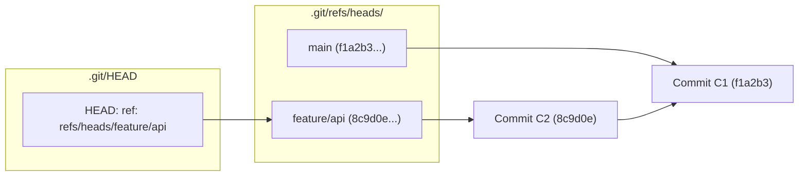
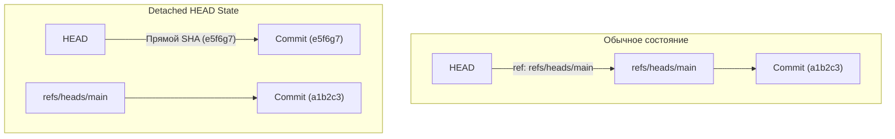
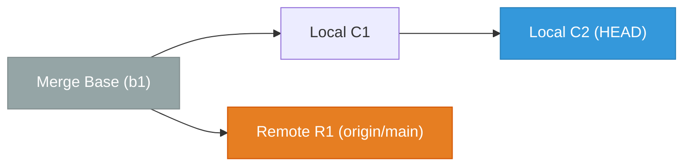

# 🌿 15. Ветвление в Git: Анатомия refs/heads, Upstream Tracking и Detached HEAD

Ветка в Git — это не копия директории и не набор диффов, а легковесный перемещаемый указатель (указатель размером 41 байт) на конкретный объект коммита в графе DAG.

---

## 🏛️ 1. Внутреннее устройство веток (`.git/refs/heads/`)

Создание ветки в Git имеет временную сложность $O(1)$ и не зависит от размера проекта:
1. Git создает обычный текстовый файл в `.git/refs/heads/<имя_ветки>`.
2. Записывает в него 40-символьный SHA-1 коммита и символ перевода строки.



При каждом новом `git commit`:
- Создается новый объект коммита с родителем `HEAD`.
- Git обновляет файл `.git/refs/heads/<текущая_ветка>`, записывая в него SHA нового коммита.
- Символическая ссылка `.git/HEAD` остается неизменной (указывает на ветку).

---

## 🧭 2. Механика Detached HEAD (Оторванный HEAD)

Состояние **Detached HEAD** возникает, когда `.git/HEAD` указывает напрямую на SHA-хэш коммита или тег, а не на символическую ссылку ветки:



### Опасность Detached HEAD:
Если сделать новые коммиты в состоянии Detached HEAD, они создаются в базе объектов корректно, но ни одна именованная ветка на них не ссылается. При переключении на другую ветку (`git checkout main`) эти коммиты становятся **висячими (orphaned)** и будут удалены сборщиком мусора `git gc`.

---

## 📡 3. Upstream Tracking и расчет расхождения веток

Когда локальная ветка отслеживает удаленную ветку, Git настраивает связку в `.git/config`:

```ini
[branch "main"]
    remote = origin
    merge = refs/heads/main
```

На основе анализа графа DAG Git вычисляет метрики **Ahead** и **Behind**:


*В данном состоянии ветка `main`: `ahead 2, behind 1` (ветки разошлись / diverged).*

---

## 🛠️ 4. Инженерный CLI Cheat Sheet

| Команда | Описание |
| :--- | :--- |
| `git branch -vv` | Показать все локальные ветки, текущие коммиты и статус относительно upstream |
| `git branch -a` | Показать все ветки (локальные и `remotes/`) |
| `git branch -r` | Показать только remote-tracking ветки |
| `git branch -d <branch>` | Безопасное удаление ветки (только если она полностью влита в upstream) |
| `git branch -D <branch>` | Принудительное удаление ветки в обход проверок слияния |
| `git branch --merged` | Список веток, чей код уже интегрирован в текущий `HEAD` |
| `git branch --no-merged` | Список веток с уникальными коммитами, которых нет в текущем `HEAD` |
| `git branch -u origin/<branch>` | Привязать текущую ветку к удаленной (set upstream) |
| `git checkout --detach <sha>` | Явный переход в состояние Detached HEAD для инспекции |
| `git remote prune origin` | Удалить локальные ссылки на ветки, удаленные на сервере (`origin`) |

---

## ⚙️ 5. Production Конфигурация для работы с ветками

```ini
[push]
    # Автоматически создавать upstream ветку на сервере при первом push
    autoSetupRemote = true
    # Пушить только текущую ветку с тем же именем
    default = current

[branch]
    # Автоматически настраивать rebase при pull для новых веток
    autoSetupRebase = always
    # Всегда настраивать upstream при создании ветки от remote
    autoSetupMerge = always

[fetch]
    # Автоматически удалять устаревшие ссылки на ветки при каждом fetch
    prune = true
    pruneTags = false
```

---

## 🚨 6. Production Troubleshooting & Break-Fix

### Сценарий 1: Случайное переключение из Detached HEAD с потерей коммитов
- **Симптом:** Разработчик сделал 3 коммита в состоянии Detached HEAD, затем ввел `git checkout main` и потерял свои изменения.
- **Диагностика:**
  ```bash
  # Просмотр истории перемещения указателя HEAD
  git reflog -n 10
  ```
  Вывод:
  ```text
  a1b2c3d (HEAD -> main) HEAD@{0}: checkout: moving from e5f6g7a to main
  e5f6g7a HEAD@{1}: commit: feat: crucial hotfix logic
  c4d5e6f HEAD@{2}: commit: fix: auth bypass
  ```
- **Восстановление:**
  ```bash
  # Создаем постоянную ветку на базе потерянного коммита
  git branch feature-recovered e5f6g7a
  git checkout feature-recovered
  ```

### Сценарий 2: Ошибка создания ветки из-за конфликта имен директорий в refs
- **Симптом:** `fatal: cannot force update the ref 'refs/heads/feature/login': 'refs/heads/feature' exists; cannot create 'refs/heads/feature/login'`.
- **Причина:** В файловой системе `.git/refs/heads/feature` является файлом, поэтому Git не может создать каталог `feature/` для вложенной ветки `feature/login`.
- **Исправление:**
  ```bash
  # 1. Проверить существующие ветки
  git branch | grep feature

  # 2. Переименовать родительскую ветку
  git branch -m feature feature-root

  # 3. Теперь создание ветки feature/login разрешено
  git branch feature/login
  ```
