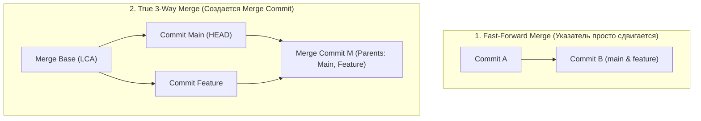
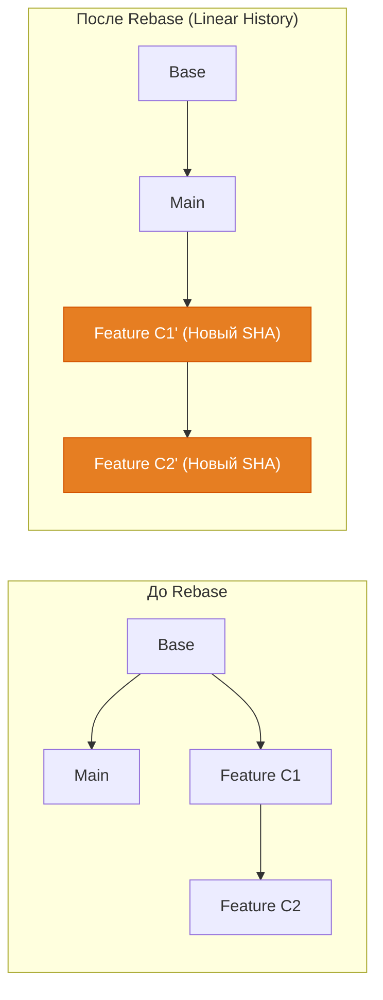

# 🔀 16. Merge vs Rebase: Стратегии слияния, Алгоритм ORT и Топология истории

Интеграция изменений между ветками в Git строится вокруг двух фундаментальных подходов: **Merge** (сохранение истинной нелинейной топологии графа) и **Rebase** (линеаризация истории путем перебазирования коммитов).

---

## 🏛️ 1. Механика 3-Way Merge и Fast-Forward



### Алгоритм 3-Way Merge:
1. Git находит **наименьшего общего предка (Lowest Common Ancestor, LCA)** между ветками — так называемый `Merge Base`.
2. Вычисляется дельта $D_1 = \text{Base} \to \text{Ours}$ (изменения в текущей ветке).
3. Вычисляется дельта $D_2 = \text{Base} \to \text{Theirs}$ (изменения в целевой ветке).
4. Дельты объединяются. Если изменения не затрагивают одни и те же строки, Git автоматически формирует снимок `tree` и создает коммит с **двумя родителями**.

---

## ⚡ 2. Стратегии слияния: Алгоритм ORT против Recursive

С версии Git 2.33+ стратегией слияния по умолчанию стал алгоритм **`ort`** (*Ostensibly Recursive's Twin*), заменивший устаревший `recursive`:

| Характеристика | Алгоритм `recursive` (legacy) | Алгоритм `ort` (modern) |
| :--- | :--- | :--- |
| **Производительность** | Медленный на больших деревьях | В 10-100 раз быстрее за счет кэширования и ленивого разрешения |
| **Переименования** | Часто порождает ложные конфликты | Продвинутое отслеживание переименований каталогов и файлов |
| **Рекурсивные предки** | Создает временный merge commit в ODB | Вычисляет виртуального предка в оперативной памяти |
| **Конфликты Rebase** | Пересчитывает слияния с нуля при каждом шаге | Запоминает промежуточные результаты для ускорения |

---

## 🔄 3. Механика Rebase: Перебазирование коммитов

Команда `git rebase <upstream>` переносит цепочку коммитов текущей ветки, создавая их заново поверх последнего коммита указанной целевой ветки.



> [!CAUTION]
> **Золотое правило Rebase:** Никогда не выполняйте `rebase` над ветками, которые уже были отправлены в публичный удаленный репозиторий и используются другими инженерами. Перебазирование меняет SHA всех коммитов!

---

## ⚖️ 4. Сравнительная матрица: Merge vs Rebase

| Критерий | Merge (`git merge`) | Rebase (`git rebase`) |
| :--- | :--- | :--- |
| **Топология истории** | Нелинейная, отражает реальный ход разработки | Идеально плоская, линейная |
| **Сохранение контекста** | Сохраняет точное время коммитов и связи | Создает новые коммиты с новыми датами коммитера |
| **Разрешение конфликтов** | Конфликты решаются один раз в Merge-коммите | Конфликты могут возникать по очереди на каждом коммите |
| **Откат функционала** | Легко откатить весь feature-набор через откат одного merge-коммита | Требуется интерактивный rebase или откат цепочки коммитов |
| **Использование в DevOps** | Релизные ветки, интеграция окружений (`staging`) | Фиче-ветки перед созданием Pull/Merge Request (PR/MR) |

---

## 🛠️ 5. Инженерный CLI Cheat Sheet

| Команда | Описание |
| :--- | :--- |
| `git merge-base main feature` | Найти точный SHA общего предка двух веток |
| `git merge --no-ff feature` | Принудительно создать merge commit даже при возможности fast-forward |
| `git merge --ff-only feature` | Выполнить слияние только в режиме fast-forward; упасть с ошибкой при дивергенции |
| `git merge --abort` | Полный откат состояния при возникновении конфликта во время слияния |
| `git merge -X ours feature` | Автоматически отдавать приоритет текущей ветке при строковых конфликтах (в рамках ORT) |
| `git merge -X theirs feature` | Автоматически отдавать приоритет вливаемой ветке |
| `git rebase main` | Перебазировать текущую ветку поверх `main` |
| `git rebase --onto main legacy-feature new-feature` | Вырезать ветку `new-feature` от `legacy-feature` и пересадить на `main` |
| `git rebase --abort` | Полная отмена процесса перебазирования и возврат к исходному состоянию |

---

## 🚨 6. Production Troubleshooting & Break-Fix

### Сценарий 1: Случайный `git push --force` после Rebase затер чужую работу
- **Симптом:** Инженер выполнил `git rebase origin/main` и запушил с флагом `-f`, перезаписав коммиты коллеги, запушенные 5 минут назад.
- **Предотвращение:** Всегда использовать безопасный флаг `--force-with-lease`:
  ```bash
  # Отклонит отправку, если remote ветка обновилась кем-то другим
  git push --force-with-lease
  ```
- **Восстановление затертых коммитов через reflog удаленного репозитория (или локального коллеги):**
  ```bash
  # 1. Коллега находит потерянный коммит в своем локальном reflog
  git reflog show origin/main

  # 2. Восстанавливает правильную ветку
  git checkout -b rescue-branch origin/main@{1}
  git push origin rescue-branch
  ```

### Сценарий 2: Застревание в циклическом конфликте во время многокоммитного Rebase
- **Симптом:** Ветка из 20 коммитов перебазируется, и один и тот же блок кода конфликтует на каждом втором коммите.
- **Решение:** Включение механизма повторного использования разрешений конфликтов (**git rerere**):
  ```bash
  # Включение глобального кэша разрешений конфликтов
  git config --global rerere.enabled true
  git config --global rerere.autoupdate true
  ```
  После включения Git запоминает, как вы разрешили конфликт в первый раз, и автоматически применяет то же решение на всех последующих шагах rebase.
