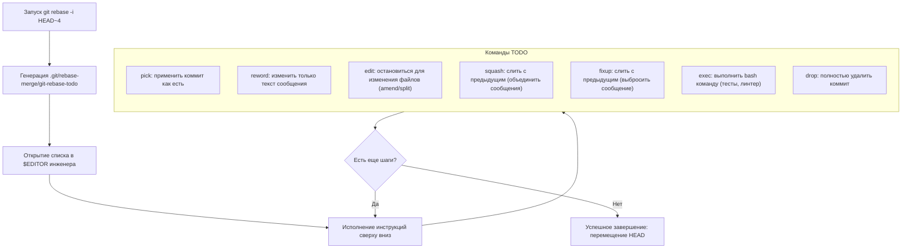
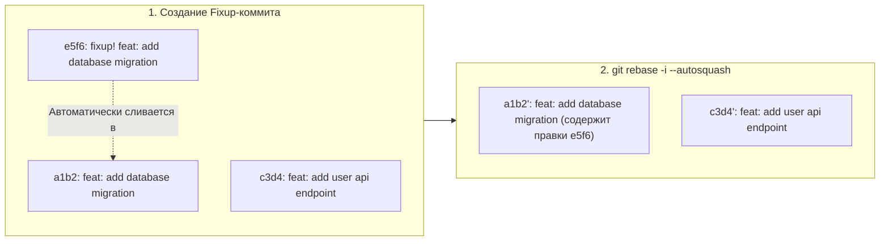

# 🛠️ 17. Интерактивный Rebase: Мастеринг git rebase -i и Autosquash

Интерактивный Rebase (`git rebase -i`) — это мощный инструмент рефакторинга истории Git, позволяющий объединять, разделять, редактировать, переупорядочивать и валидировать коммиты перед публикацией в upstream.

---

## 🏛️ 1. Архитектура движка Rebase TODO

При запуске `git rebase -i <upstream>` Git создает служебный каталог `.git/rebase-merge/` и генерирует файл инструкций `git-rebase-todo`:



---

## ⚡ 2. Профессиональный Workflow: `git commit --fixup` и `--autosquash`

Ручное перетаскивание строк в `git-rebase-todo` чревато ошибками. Лучшая DevOps-практика для точечного исправления старых коммитов — использование **autosquash**:



### Пошаговое выполнение:
1. Вы находите коммит, в котором допущена ошибка: `git log --oneline`.
2. Вносите исправления в файлы и выполняете:
   ```bash
   git add .
   git commit --fixup a1b2c3d
   ```
   *Git автоматически создаст коммит с сообщением `fixup! <оригинальное сообщение>`.*
3. Запускаете перебазирование:
   ```bash
   git rebase -i --autosquash origin/main
   ```
   *Git сам расставит фиксап-коммиты на нужные позиции и переведет их в статус `fixup`.*

---

## 🧪 3. Автоматизированное тестирование каждого коммита (`--exec`)

Чтобы гарантировать, что ни один коммит в ветке не ломает билд (что критично для чистого `git bisect`), используйте команду `exec`:

```bash
# Запуск линтера и unit-тестов после применения каждого отдельного коммита
git rebase origin/main --exec "npm test" --exec "golangci-lint run"
```

Если на коммите `X` тесты упадут, rebase автоматически прервется на этом шаге, позволяя сразу исправить дефект.

---

## ✂️ 4. Разделение одного коммита на несколько (Commit Splitting)

Если в один коммит случайно попали две разные фичи:
1. В `git rebase -i` замените `pick` на `edit` для нужного коммита.
2. Когда Git остановится на этом шаге:
   ```bash
   # Сбрасываем коммит, оставляя файлы измененными в Working Tree
   git reset HEAD~1

   # Добавляем первую логическую группу файлов
   git add src/auth/
   git commit -m "feat(auth): implement JWT validation"

   # Добавляем вторую логическую группу файлов
   git add src/database/
   git commit -m "feat(db): add user token table schema"

   # Продолжаем процесс rebase
   git rebase --continue
   ```

---

## 🛠️ 5. Инженерный CLI Cheat Sheet

| Команда | Назначение |
| :--- | :--- |
| `git rebase -i HEAD~N` | Интерактивный rebase последних $N$ коммитов |
| `git rebase -i --root` | Интерактивный rebase всей истории с первого (root) коммита |
| `git rebase -i --autosquash main` | Rebase с автоматической группировкой fixup/squash коммитов |
| `git rebase --continue` | Продолжить выполнение цепочки после разрешения конфликтов |
| `git rebase --skip` | Пропустить проблемный коммит |
| `git rebase --abort` | Полный сброс и отмена rebase (возврат в исходную точку) |
| `git rebase --edit-todo` | Изменить оставшийся список TODO прямо во время паузы |

---

## ⚙️ 6. Production-конфигурация `.gitconfig`

```ini
[rebase]
    # Всегда автоматически применять autosquash при интерактивном rebase
    autoSquash = true
    # Автоматически сохранять незакоммиченные файлы в stash перед rebase и восстанавливать после
    autoStash = true
    # Автоматически включать отслеживание шагов
    stat = true
    # Показывать diff при открытии todo-листа
    instructionFormat = (%an) %s
```

---

## 🚨 7. Production Troubleshooting & Break-Fix

### Сценарий 1: Случайно удалена вся строка коммита в редакторе TODO
- **Симптом:** Инженер удалил строку в редакторе, и коммит пропал из ветки.
- **Причина:** Удаление строки из списка TODO в Git эквивалентно действию `drop`.
- **Восстановление:**
  ```bash
  # 1. Отменить текущий rebase, если он еще не завершен
  git rebase --abort

  # 2. Если rebase уже завершился, восстановить из reflog
  git reset --hard ORIG_HEAD
  ```

### Сценарий 2: Ошибка "Cannot rebase: You have unstaged changes"
- **Симптом:** При попытке запустить `git rebase` Git отказывается работать из-за наличия грязного рабочего дерева.
- **Решение:**
  ```bash
  # Запуск с авто-стэшем
  git rebase -i --autostash origin/main
  ```
