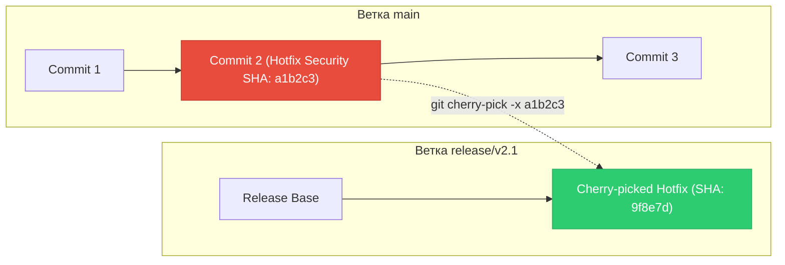
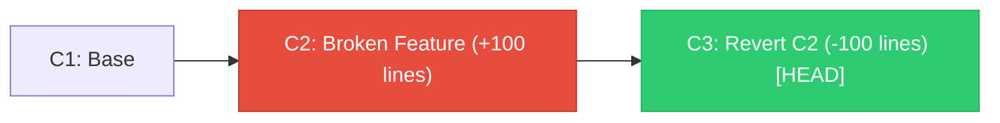
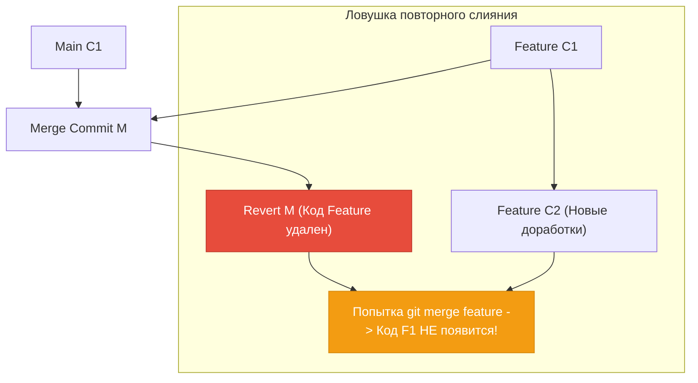

# 🍒 18. Cherry-Pick и Revert: Точечный перенос изменений и Безопасный откат

В процессе релизного менеджмента и эксплуатации production возникают две частые задачи: перенос единичного патча безопасности в релизную ветку (**Cherry-Pick**) и безопасная отмена ошибочного функционала на рабочей ветке без перезаписи истории (**Revert**).

---

## 🎯 1. Архитектура и механика `git cherry-pick`

Команда `git cherry-pick <SHA>` берет дифференциал конкретного коммита по отношению к его родителю ($D = C - C_{parent}$) и накладывает его на текущий `HEAD` как новый коммит.



### Важность флага `-x` для DevOps:
При вызове `git cherry-pick -x <SHA>` Git автоматически добавляет в тело сообщения футер:
```text
(cherry picked from commit a1b2c3d4e5f60718293a4b5c6d7e8f9012345678)
```
Это исключает дублирование баг-репортов и позволяет автоматизированным CI/CD сканерам сверять бэкпортированные патчи уязвимостей (CVE).

---

## ↩️ 2. Безопасный откат через `git revert`

В отличие от `git reset`, который удаляет коммиты из истории и требует опасного `git push --force`, `git revert` создает **новый прямой коммит**, содержащий зеркально противоположный дифференциал.



---

## ⚠️ 3. Откат Merge-коммитов (`git revert -m`) и Проблема повторного слияния

Merge-коммит имеет двух (или более) родителей. Git не знает, относительно какой ветки вычислять обратный дифф, поэтому требует флаг `-m <parent-number>`:
- `-m 1` — основной родитель (ветка, *куда* сливали, например `main`).
- `-m 2` — вливаемый родитель (ветка, *откуда* сливали, например `feature`).

```bash
git revert -m 1 <MERGE_COMMIT_SHA>
```



### 💣 Ловушка Re-Merge (Почему код пропадает при повторном слиянии):
Так как коммит `M` уже есть в истории `main`, коммиты ветки `feature` считаются Git'ом уже объединенными. Повторный `merge feature` принесет **только коммит F2**, а код коммита `F1` будет навсегда отсутствовать в `main`!

### Решение: Откат самого отката (Reverting the Revert):
Перед повторным вливанием фичи необходимо откатить коммит отката:
```bash
# 1. Откатываем коммит, который ранее отменил мерж
git revert <SHA_OF_REVERT_M>

# 2. Теперь спокойно сливаем доработанную фичу
git merge feature
```

---

## 🛠️ 4. Инженерный CLI Cheat Sheet

| Команда | Назначение |
| :--- | :--- |
| `git cherry-pick <sha>` | Применить коммит к текущей ветке |
| `git cherry-pick -x <sha>` | Применить коммит с добавлением аудиторской ссылки на оригинал |
| `git cherry-pick -n <sha>` | Применить изменения в Staging (Index) без автоматического коммита |
| `git cherry-pick A..B` | Перенести диапазон коммитов (от A не включая до B включительно) |
| `git cherry-pick A^..B` | Перенести диапазон коммитов (включая коммит A) |
| `git revert <sha>` | Создать коммит, отменяющий изменения коммита `<sha>` |
| `git revert -n <sha>` | Подготовить инвертированные изменения в индексе без коммита |
| `git revert -m 1 <merge-sha>` | Откатить merge-коммит относительно базовой ветки |
| `git cherry-pick --abort` | Прервать cherry-pick при конфликте и вернуть репозиторий в исходный вид |

---

## 💻 5. Bash-скрипт: Автоматизированный бэкпорт Hotfix во все релизные ветки

```bash
#!/usr/bin/env bash
set -euo pipefail

HOTFIX_SHA="${1:-}"
if [ -z "$HOTFIX_SHA" ]; then
    echo "❌ Ошибка: Укажите SHA хотфикса. Пример: $0 a1b2c3d"
    exit 1
fi

# Список поддерживаемых LTS веток
RELEASE_BRANCHES=("release/v1.8" "release/v1.9" "release/v2.0")

CURRENT_BRANCH=$(git rev-parse --abbrev-ref HEAD)

for BRANCH in "${RELEASE_BRANCHES[@]}"; do
    echo "🚀 Перенос hotfix $HOTFIX_SHA в ветку $BRANCH..."
    git checkout "$BRANCH"
    git pull --ff-only origin "$BRANCH"
    
    if git cherry-pick -x "$HOTFIX_SHA"; then
        echo "✅ Успешно применен в $BRANCH"
        git push origin "$BRANCH"
    else
        echo "❌ Конфликт при переносе в $BRANCH! Требуется ручное вмешательство."
        git cherry-pick --abort
    fi
done

git checkout "$CURRENT_BRANCH"
echo "🎉 Процесс бэкпорта завершен."
```

---

## 🚨 6. Production Troubleshooting & Break-Fix

### Сценарий: Ошибка `fatal: commit ... is a merge but no -m option was given`
- **Симптом:** При попытке `git revert <sha>` или `git cherry-pick <sha>` Git падает с ошибкой о мерж-коммите.
- **Причина:** Целевой коммит имеет 2 родителя.
- **Диагностика:**
  ```bash
  # Проверяем родителей коммита
  git cat-file -p <sha> | grep parent
  ```
  Вывод:
  ```text
  parent 1111111111111111111111111111111111111111
  parent 2222222222222222222222222222222222222222
  ```
- **Исправление:**
  ```bash
  # Для отката с сохранением ветки parent 1:
  git revert -m 1 <sha>
  ```
