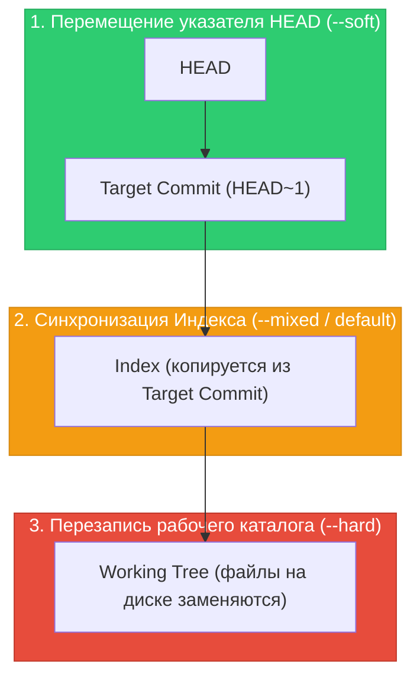

# 🔄 19. Reset, Restore и Checkout: Управление состоянием трех деревьев

Исторически команда `git checkout` выполняла слишком много разнородных функций: переключение веток, создание веток, откат файлов в рабочем каталоге и извлечение файлов из других коммитов.

Начиная с версии Git 2.23+, ответственность была четко разделена:
- **`git switch`** — исключительно для навигации по веткам.
- **`git restore`** — исключительно для манипуляции содержимым файлов в `Index` и `Working Tree`.
- **`git reset`** — для перемещения указателей веток (`HEAD`) и синхронизации трех деревьев.

---

## 🏛️ 1. Матрица переходов трех деревьев для `git reset`

Команда `git reset <commit>` выполняет до трех последовательных шагов в зависимости от указанного флага:



### Сравнительная таблица режимов `git reset`:

| Режим флага | Перемещает `HEAD`? | Обновляет `Index`? | Перезаписывает `Working Tree`? | Уровень опасности |
| :--- | :---: | :---: | :---: | :--- |
| `git reset --soft` | **Да** | Нет | Нет | 🟢 Безопасно (изменения остаются в Stage) |
| `git reset --mixed` *(default)* | **Да** | **Да** | Нет | 🟡 Безопасно (изменения остаются в виде файлов на диске) |
| `git reset --hard` | **Да** | **Да** | **Да** | 🔴 **Опасно** (незакоммиченные файлы уничтожаются) |
| `git reset --keep` | **Да** | **Да** | Только если нет конфликтов | 🟢 Безопасно (падает с ошибкой, если затронет грязные файлы) |

---

## 🎯 2. Анатомия и возможности `git restore`

`git restore` позволяет точечно управлять состоянием файлов без перемещения `HEAD`:


### Основные кейсы `git restore`:
1. **Отмена локальных правок в файле (Discard changes):**
   ```bash
   # Заменяет файл в рабочей директории версией из Index
   git restore main.go
   ```
2. **Удаление файла из Staging (Unstage):**
   ```bash
   # Убирает файл из Index, сохраняя физические изменения в файле
   git restore --staged main.go
   ```
3. **Восстановление файла из конкретного коммита или другой ветки:**
   ```bash
   # Берет файл из ветки main и обновляет и индекс, и рабочую копию
   git restore --source=main --staged --worktree config/app.yaml
   ```

---

## ⚠️ 3. Разница между `git reset` для коммитов и для путей (Paths)

Когда `git reset` вызывается с указанием пути к файлу:
```bash
git reset HEAD~1 path/to/file.go
```
- **`HEAD` НЕ ПЕРЕМЕЩАЕТСЯ!**
- Git копирует версию `path/to/file.go` из коммита `HEAD~1` только в **Index** (Staging area).
- Файл в рабочей директории остается неизменным.

---

## 🛠️ 4. Инженерный CLI Cheat Sheet

| Команда | Описание |
| :--- | :--- |
| `git reset --soft HEAD~1` | Отменить последний коммит, оставив все изменения застейдженными |
| `git reset --mixed HEAD~1` | Отменить последний коммит, оставив изменения в Working Tree (unstaged) |
| `git reset --hard HEAD~1` | Полностью уничтожить последний коммит и все изменения в файлах |
| `git reset --hard ORIG_HEAD` | Мгновенно вернуть состояние до выполнения опасного reset / rebase / merge |
| `git restore --staged .` | Снять все файлы со стейджинга (unstage all) |
| `git restore .` | Отменить все незакоммиченные изменения в рабочей директории |
| `git restore --source=v1.0.0 -- file.txt` | Извлечь версию файла из тега `v1.0.0` |
| `git clean -fd` | Удалить все неотслеживаемые (untracked) файлы и директории |
| `git clean -nd` | Dry-run: показать, какие untracked файлы будут удалены |

---

## 🚨 5. Production Troubleshooting & Break-Fix

### Сценарий: Случайное выполнение `git reset --hard` и потеря ценных коммитов
- **Симптом:** Инженер выполнил `git reset --hard HEAD~5`, стер 5 рабочих коммитов.
- **Диагностика:**
  ```bash
  # Git сохраняет все перемещения указателя HEAD в журнале reflog
  git reflog -n 5
  ```
  Вывод:
  ```text
  9a8b7c6 (HEAD -> main) HEAD@{0}: reset: moving to HEAD~5
  1e2d3c4 HEAD@{1}: commit: feat(api): finalize billing integration
  ```
- **Восстановление:**
  ```bash
  # Мгновенный возврат к коммиту до reset
  git reset --hard HEAD@{1}
  # Или через специальную ссылку ORIG_HEAD
  git reset --hard ORIG_HEAD
  ```

### Сценарий: Как защитить себя от потери данных при `git reset --hard` с незакоммиченным кодом
Если в рабочей копии были файлы, которые **никогда не были добавлены в git (`git add`)**, `git reset --hard` и `git clean -fd` удалят их безвозвратно.
- **Правило безопасности:** Перед любыми деструктивными операциями всегда делайте временный snapshot:
  ```bash
  git stash push -u -m "backup before hard reset"
  ```
