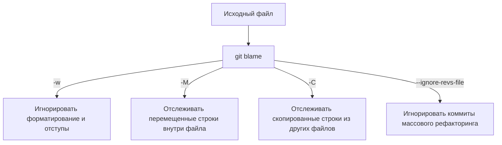

# 🕵️ 20. Git Bisect и Blame: Археология кода, Поиск регрессий и Pickaxe

Поиск первопричины (Root Cause Analysis, RCA) багов и регрессий в монорепозиториях с сотнями тысяч коммитов требует применения специализированных алгоритмических инструментов Git: двоичного поиска **`git bisect`**, контекстной аннотации строк **`git blame`** и механизма точечного поиска изменений **Pickaxe (`-S`/`-G`)**.

---

## ⚡ 1. Алгоритм и автоматизация `git bisect`

`git bisect` использует двоичный поиск ($O(\log_2 N)$) по направленному графу коммитов:


| Количество коммитов в истории | Максимальное число шагов проверки |
| :---: | :---: |
| 100 | ~7 шагов |
| 1 000 | ~10 шагов |
| 10 000 | ~14 шагов |
| 100 000 | ~17 шагов |

---

## 🤖 2. Полностью автоматический поиск багов (`git bisect run`)

Git позволяет передать скрипт-валидатор, который будет исполняться на каждом шаге бисекции:

### Коды возврата скрипта для `git bisect run`:
- **`0`**: Коммит корректен (`good` / `old`).
- **`1..127` (кроме 125)**: В коммите обнаружен баг (`bad` / `new`).
- **`125`**: Коммит невозможно протестировать (например, код не компилируется из-за опечатки) — Git пропустит его (`skip`).

### Production-скрипт тестирования (`bisect_validator.sh`):
```bash
#!/usr/bin/env bash
set -euo pipefail

# 1. Попытка сборки проекта
if ! go build -o /dev/null ./cmd/api 2>/dev/null; then
    # Код 125 указывает Git пропустить некомпилируемый коммит
    exit 125
fi

# 2. Запуск интеграционного теста, выявляющего конкретный баг
# Если тест упал -> exit code > 0 (bad commit)
# Если тест прошел -> exit code 0 (good commit)
go test -run TestOrderIdempotency ./tests/integration/...
```

Запуск одной командой:
```bash
git bisect start HEAD v2.1.0
git bisect run ./bisect_validator.sh
```
*Git самостоятельно найдет проблемный коммит за секунды и выведет его полный SHA и автора.*

---

## 🔬 3. Продвинутый `git blame` и игнорирование форматирования

Команда `git blame` показывает автора и коммит для каждой строки файла.



### Игнорирование коммитов массового линтинга (`.git-blame-ignore-revs`):
Когда в репозитории запускают `Prettier`, `black` или `gofmt` на весь проект, обычный `git blame` начинает показывать коммит линтера на всех строках.
Создайте файл `.git-blame-ignore-revs`:
```text
# Mass formatting after Prettier migration
e987654321fedcba0987654321abcdef01234567
# Convert tabs to spaces
a1b2c3d4e5f60718293a4b5c6d7e8f9012345678
```
Настройка Git для автоматического учета файла:
```bash
git config blame.ignoreRevsFile .git-blame-ignore-revs
```

---

## ⛏️ 4. Механизм Pickaxe Search: `-S` против `-G`

Когда нужно узнать, какой коммит добавил или удалил вызов определенной функции:

- **`git log -S "processPayment"` (Pickaxe):** Ищет только те коммиты, где **количество вхождений** строки изменилось (добавление или удаление вызова функции). Если строка была просто перемещена без изменения числа вхождений, коммит не покажется.
- **`git log -G "^func.*processPayment"` (Regex Diff):** Ищет любые коммиты, в которых патч (diff) удовлетворяет регулярному выражению (включая изменение аргументов или перемещение).
- **`git log -L 45,70:src/auth.go` (Line Evolution):** Отслеживает эволюцию конкретного диапазона строк в файле сквозь всю историю коммитов.

---

## 🛠️ 5. Инженерный CLI Cheat Sheet

| Команда | Описание |
| :--- | :--- |
| `git bisect start <bad_rev> <good_rev>` | Начать процесс бисекции |
| `git bisect good` / `git bisect bad` | Вручную пометить текущий коммит |
| `git bisect skip` | Пропустить текущий непроверяемый коммит |
| `git bisect reset` | Завершить бисекцию и вернуться на исходную ветку |
| `git bisect terms --term-old fast --term-new slow` | Настроить кастомные термины (для поиска падений производительности) |
| `git blame -L 120,150 path/to/file.go` | Аннотировать только строки с 120 по 150 |
| `git blame -w -C -C path/to/file.go` | Blame с глубоким поиском копипасты между всеми файлами |
| `git log -S "secret_api_token" --source --all` | Найти точный коммит, добавивший секрет во всех ветках |

---

## 🚨 6. Production Troubleshooting & Break-Fix

### Сценарий: Зависание `git bisect` в бесконечном цикле или некорректная остановка
- **Симптом:** При ручной бисекции инженер случайно пометил коммит как `good`, хотя он был `bad`, из-за чего бисекция зашла в тупик.
- **Диагностика и восстановление:**
  ```bash
  # 1. Посмотреть журнал выполненных шагов бисекции
  git bisect log

  # 2. Сохранить журнал, отредактировать ошибочный шаг
  git bisect log > bisect_steps.txt
  sed -i 's/git bisect good a1b2c3d/git bisect bad a1b2c3d/' bisect_steps.txt

  # 3. Перезапустить бисекцию по исправленному журналу
  git bisect reset
  git bisect replay bisect_steps.txt
  ```
