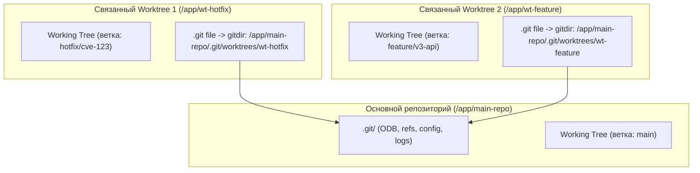

# 🌳 21. Git Worktree: Параллельная разработка и Архитектура общих объектов

`git worktree` позволяет одновременно подключать несколько рабочих каталогов (Working Trees) к **одному общему репозиторию** `.git`. Это исключает необходимость повторного клонирования репозитория и позволяет параллельно собирать разные ветки без переключения контекста и сброса кэшей сборки.

---

## 🏛️ 1. Архитектура Linked Worktrees

При создании связанного worktree Git не дублирует базу объектов (`.git/objects`) и ссылки (`.git/refs`), а создает легковесный мета-каталог:



### Структура каталога `.git/worktrees/<name>/`:
Для каждого связанного worktree создается отдельный изолированный набор служебных файлов:
- **`HEAD`** — собственный указатель текущей ветки worktree.
- **`index`** — собственный staging area (индекс файлов).
- **`commondir`** — текстовый файл с относительным путем к общей базе объектов.
- **`gitdir`** — абсолютный путь к файлу `.git` внутри рабочего каталога.
- **`locked`** — файл-маркер, защищающий worktree от сборки мусора.

---

## 🔒 2. Правило исключительной блокировки ветки

> [!IMPORTANT]
> Git **категорически запрещает** чекаутить одну и ту же ветку более чем в одном worktree одновременно. Это предотвращает race condition и повреждение файла `.git/refs/heads/<branch>` при параллельных коммитах.

Если вам необходимо посмотреть ту же ветку в другом каталоге, создайте временную ветку или используйте Detached HEAD:
```bash
git worktree add --detach /path/to/review-wt origin/main
```

---

## 🛠️ 3. Инженерный CLI Cheat Sheet

| Команда | Описание |
| :--- | :--- |
| `git worktree add ../hotfix-dir hotfix/api` | Создать worktree с веткой `hotfix/api` в соседней директории |
| `git worktree add -b feat-new ../feat-dir main` | Создать новую ветку `feat-new` от `main` и подключить в worktree |
| `git worktree list` | Показать все активные worktree, их пути, коммиты и ветки |
| `git worktree lock --reason="Build in progress" ../hotfix-dir` | Заблокировать worktree от случайного удаления через `prune` |
| `git worktree unlock ../hotfix-dir` | Разблокировать worktree |
| `git worktree remove ../hotfix-dir` | Корректно удалить worktree и его метаданные в `.git/worktrees/` |
| `git worktree prune` | Очистить записи о worktrees, чьи директории были удалены через `rm -rf` |

---

## 💻 4. Bash-скрипт: Эфемерные изолированные окружения для CI/CD и тестов

Скрипт создает изолированный worktree для запуска тяжелых интеграционных тестов в RAM-диске (`/dev/shm`), исключая влияние на основную ветку:

```bash
#!/usr/bin/env bash
set -euo pipefail

TARGET_BRANCH="${1:-origin/main}"
WT_ID="test_$(date +%s)_$RANDOM"
WT_PATH="/dev/shm/$WT_ID"

echo "🚀 Развертывание эфемерного Worktree в RAM ($WT_PATH)..."

# Создаем worktree в оперативной памяти в состоянии Detached HEAD
git worktree add --detach "$WT_PATH" "$TARGET_BRANCH"

# Гарантируем корректную очистку при любом завершении скрипта (EXIT/ERR)
cleanup() {
    echo "🧹 Удаление эфемерного Worktree..."
    git worktree remove --force "$WT_PATH" 2>/dev/null || true
    rm -rf "$WT_PATH"
}
trap cleanup EXIT

# Переходим в worktree и выполняем параллельный билд
cd "$WT_PATH"
echo "⚙️ Запуск тестов в изолированном дереве (Commit: $(git rev-parse --short HEAD))..."
go test -v -race ./...

echo "✅ Тесты успешно пройдены."
```

---

## 🚨 5. Production Troubleshooting & Break-Fix

### Сценарий 1: Ошибка `fatal: '<branch>' is already checked out at '...'`
- **Симптом:** Инженер пытается переключиться на ветку в основном каталоге, но Git выдает ошибку, что ветка уже занята другим worktree.
- **Диагностика:**
  ```bash
  # Находим, в каком именно каталоге открыта эта ветка
  git worktree list
  ```
  Вывод:
  ```text
  /home/dev/project          a1b2c3d [main]
  /home/dev/project-feature  f4e5d6c [feature/billing]
  ```
- **Исправление:**
  ```bash
  # Удаляем неиспользуемый worktree
  git worktree remove /home/dev/project-feature
  # Или переключаем его на другую временную ветку
  git -C /home/dev/project-feature switch --detach
  ```

### Сценарий 2: Зависшие метаданные после удаления каталога через `rm -rf`
- **Симптом:** Директория была удалена системной командой `rm -rf`, но `git worktree list` все еще показывает ее как активную, блокируя ветку.
- **Исправление:**
  ```bash
  # Очистка всех битых ссылок в .git/worktrees/
  git worktree prune -v
  ```
