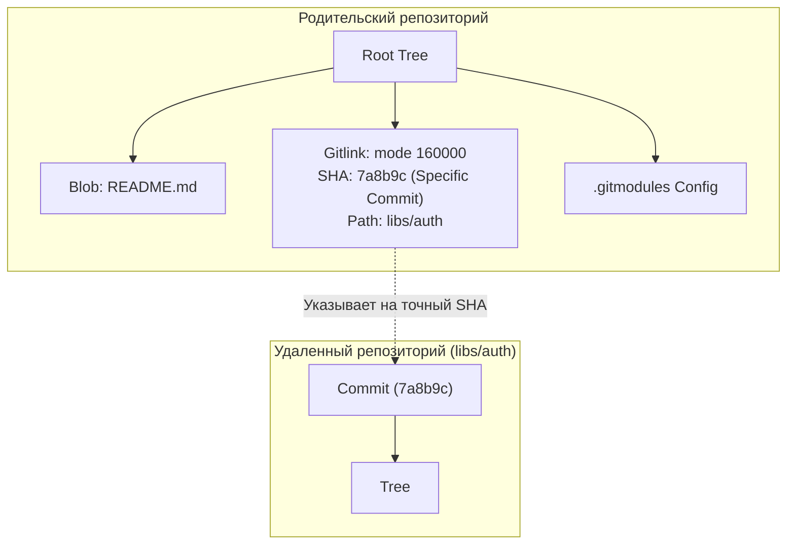
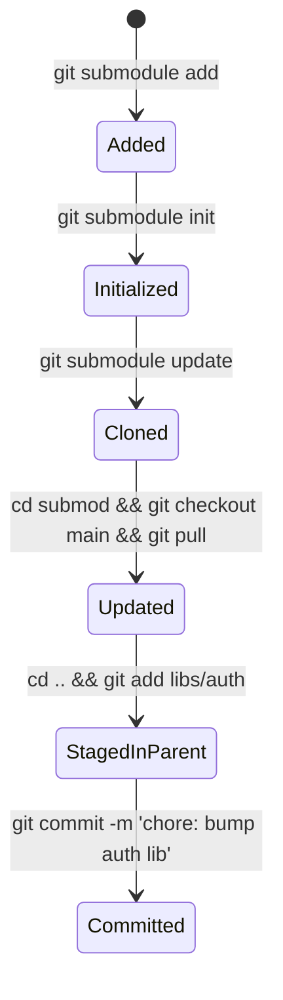

# 📦 22. Git Submodules: Жизненный цикл, Gitlink и альтернатива Git Subtree

В сложных микросервисных архитектурах и монорепозиториях часто требуется подключать внешние библиотеки или общие компоненты. Git решает эту задачу через механизм **Submodules** (подмодулей) и **Subtrees** (поддеревьев).

---

## 🏛️ 1. Архитектура Submodule: Запись типа `160000` (Gitlink)

Подмодуль в Git — это не копия внешнего репозитория, а специальная запись типа **`gitlink`** с восьмеричным режимом доступа `160000` внутри объекта `tree` родительского репозитория:



### Конфигурационные файлы:
1. **`.gitmodules`** (отслеживается в git): хранит маппинг локального пути и публичного URL:
   ```ini
   [submodule "libs/auth"]
       path = libs/auth
       url = https://github.com/company/auth-lib.git
       branch = main
   ```
2. **`.git/config`** (локальный): регистрирует активные подмодули после `git submodule init`.
3. **`.git/modules/`**: хранит физическую базу данных `.git` для каждого подмодуля.

---

## 🔄 2. Полный жизненный цикл Git Submodule



### 1. Добавление подмодуля:
```bash
git submodule add https://github.com/company/auth-lib.git libs/auth
git commit -m "feat: add auth-lib submodule"
```

### 2. Клонирование репозитория с подмодулями:
```bash
# Клонирование родительского репозитория и всех вложенных подмодулей за один шаг
git clone --recurse-submodules https://github.com/company/main-app.git
```

### 3. Обновление подмодулей в существующем репозитории:
```bash
# Инициализация и рекурсивное скачивание всех зафиксированных коммитов
git submodule update --init --recursive
```

### 4. Подтягивание свежих версий из upstream-веток подмодулей:
```bash
git submodule update --remote --merge
```

---

## ⚖️ 3. Сравнительная матрица: Git Submodule против Git Subtree

| Параметр | Git Submodule | Git Subtree |
| :--- | :--- | :--- |
| **Принцип работы** | Ссылка на конкретный SHA (Gitlink `160000`) | Полная копия дерева файлов в репозитории |
| **Клонирование** | Требует `--recurse-submodules` или `update --init` | Обычный `git clone`, всё доступно сразу |
| **CI/CD пайплайны** | Требуются SSH-ключи с доступом ко всем подмодулям | Дополнительные доступы не требуются |
| **Сложность работы** | Высокая (частые ошибки с Detached HEAD) | Низкая для потребителей, средняя для ментейнеров |
| **Размер репозитория** | Минимальный | Увеличивается на размер импортируемого дерева |

---

## 🛠️ 4. Инженерный CLI Cheat Sheet

| Команда | Описание |
| :--- | :--- |
| `git submodule status --recursive` | Показать текущие SHA коммитов всех подмодулей и их статус |
| `git submodule sync --recursive` | Синхронизировать URL из `.gitmodules` в локальный `.git/config` |
| `git submodule foreach --recursive '<cmd>'` | Выполнить bash-команду во всех подмодулях (например, `git fetch`) |
| `git diff --submodule=diff` | Показать подробный дифф кода внутри измененных подмодулей |
| `git push --recurse-submodules=check` | Запретить push родителя, если коммиты подмодуля не запушены в upstream |

---

## 🧹 5. Полное и корректное удаление подмодуля (Clean Deletion)

Ручное удаление каталога ломает репозиторий. Безопасный алгоритм:

```bash
SUBMOD_PATH="libs/auth"

# 1. Деинициализировать подмодуль (удаляет из .git/config)
git submodule deinit -f "$SUBMOD_PATH"

# 2. Удалить директорию из индекса и рабочего дерева
git rm -f "$SUBMOD_PATH"

# 3. Удалить физическое хранилище объектов подмодуля
rm -rf ".git/modules/$SUBMOD_PATH"

# 4. Закоммитить изменения
git commit -m "chore: remove $SUBMOD_PATH submodule"
```

---

## 🚨 6. Production Troubleshooting & Break-Fix

### Сценарий: Ошибка `fatal: reference is not a tree` при сборке в CI/CD
- **Симптом:** Runner в CI падает на шаге `git submodule update`:
  ```text
  fatal: reference is not a tree: a1b2c3d4e5f60718293a4b5c6d7e8f9012345678
  Unable to checkout 'a1b2c3d...' in submodule path 'libs/auth'
  ```
- **Причина:** Разработчик сделал коммит внутри подмодуля `libs/auth`, обновил ссылку в родительском репозитории и запушил родительский проект, **забыв сделать `git push` внутри подмодуля**. В итоге удаленный сервер подмодуля не знает о коммите `a1b2c3d`.
- **Исправление:**
  ```bash
  # 1. Разработчик локально переходит в подмодуль и пушит забытый коммит
  cd libs/auth
  git push origin HEAD:main

  # 2. Перезапуск упавшего CI/CD пайплайна
  ```
- **Предотвращение в `.gitconfig`:**
  ```ini
  [push]
      # Запретит push родителя, если подмодули не запушены
      recurseSubmodules = on-demand
  ```
