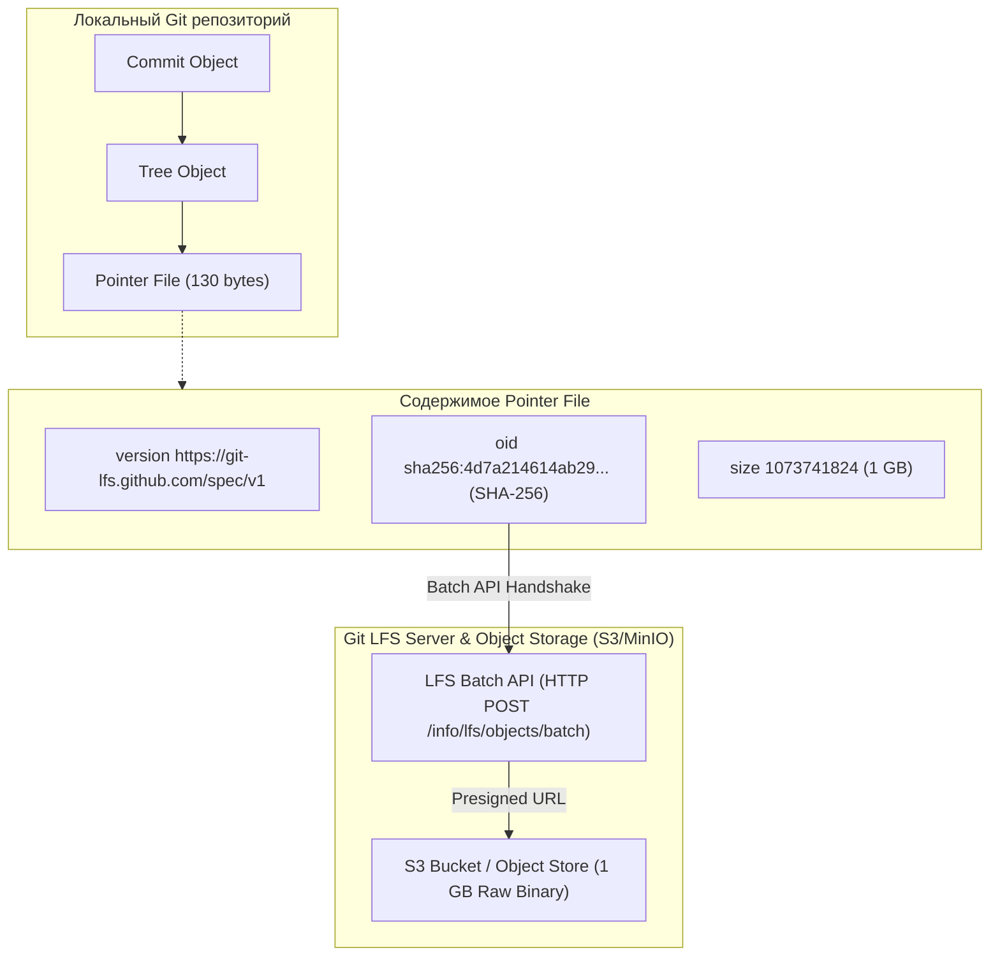
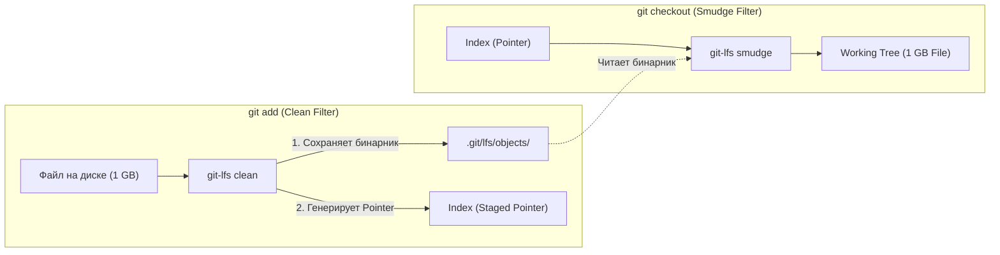

# 📦 23. Git Large File Storage (LFS): Архитектура, Clean/Smudge фильтры и Миграция

Хранение тяжелых бинарных артефактов (ML-модели, видео, базы данных SQLite, архивы `.tar.gz`) в стандартном Git приводит к взрывному росту `.git/objects` и замедлению `clone/fetch`. Для решения этой проблемы используется расширение **Git LFS (Large File Storage)**.

---

## 🏛️ 1. Архитектура Git LFS и Pointer Files

Вместо сохранения тяжелого файла в базу объектов Git LFS сохраняет в дерево коммита легковесный текстовый **указатель (Pointer File)** размером около 130 байт. Сам бинарный файл загружается на внешний сервер хранения LFS (S3, MinIO, Nexus, Artifactory).



---

## ⚙️ 2. Механизм фильтров Clean и Smudge

Git взаимодействует с LFS через механизм потоковых фильтров `filter` в `.gitattributes`:



- **Clean Filter:** Срабатывает при `git add`. Вычисляет `SHA-256` файла, перемещает бинарник в `.git/lfs/objects/` и передает в индекс короткий Pointer.
- **Smudge Filter:** Срабатывает при `git checkout`. Берет указатель из индекса, находит локальный бинарник в кэше (или запрашивает скачивание с сервера) и разворачивает полный файл на диске.

---

## 📝 3. Конфигурация `.gitattributes`

Файл `.gitattributes` фиксирует правила перехвата файлов и должен находиться в корне репозитория под контролем версий:

```ini
# ML-модели и бинарные веса
*.onnx filter=lfs diff=lfs merge=lfs -text
*.bin  filter=lfs diff=lfs merge=lfs -text
*.pt   filter=lfs diff=lfs merge=lfs -text

# Медиа-ресурсы и графика
*.mp4  filter=lfs diff=lfs merge=lfs -text
*.psd  filter=lfs diff=lfs merge=lfs -text

# Архивы и пакеты
*.tar.gz filter=lfs diff=lfs merge=lfs -text
*.zip    filter=lfs diff=lfs merge=lfs -text
```

---

## 🚀 4. Миграция существующей истории на Git LFS (`git lfs migrate`)

Если в истории репозитория уже накопились гигабайты бинарников, их добавление в `.gitattributes` не уменьшит размер репозитория. Требуется полная миграция истории:

```bash
# 1. Анализ репозитория (поиск типов файлов, раздувающих историю)
git lfs migrate info --top=10

# 2. Полная миграция всей истории на LFS для всех веток и тегов
git lfs migrate import \
  --everything \
  --include="*.onnx,*.tar.gz,*.bin,*.iso"

# 3. Очистка неиспользуемых loose-объектов
git reflog expire --expire=now --all
git gc --prune=now --aggressive

# 4. Принудительная отправка переписанной истории и LFS-объектов
git push --force --all
git push --force --tags
git lfs push origin --all
```

---

## 🛠️ 5. Инженерный CLI Cheat Sheet

| Команда | Описание |
| :--- | :--- |
| `git lfs install` | Установить глобальные hooks и фильтры в систему |
| `git lfs track "*.onnx"` | Добавить шаблон файлов под управление Git LFS (обновит `.gitattributes`) |
| `git lfs ls-files` | Показать список отслеживаемых LFS-файлов в текущем коммите |
| `git lfs fetch --all` | Скачать абсолютно все LFS-объекты для всех веток |
| `git lfs pull` | Скачать и развернуть (smudge) LFS-объекты для текущего чекаута |
| `git lfs prune --dry-run` | Проверить, сколько старых локальных LFS файлов можно удалить из кэша |
| `git lfs prune` | Очистить локальный кэш `.git/lfs/objects/`, оставив только актуальные файлы |

---

## ⚙️ 6. Оптимизация сетевого трафика и выборочная загрузка

Для ускорения CI/CD пайплайнов, которым не нужны тяжелые медиа-файлы или видео:

```ini
[lfs]
    # Параллельное скачивание в 8 потоков
    concurrenttransfers = 8
    # Игнорировать загрузку тяжелых каталогов в CI runner
    fetchexclude = "assets/raw_video/*,models/legacy/*"
```

---

## 🚨 7. Production Troubleshooting & Break-Fix

### Сценарий 1: Вместо реального файла в рабочей копии лежит 3 строчки текста (Pointer)
- **Симптом:** Приложение падает с ошибкой `Invalid binary format`, открыв файл модели, видим:
  ```text
  version https://git-lfs.github.com/spec/v1
  oid sha256:4d7a214614ab2935c943f9e0ff69d22eadbb8f32b1218126f3039f5061f187a4
  size 12345678
  ```
- **Причина:** На машине не был выполнен `git lfs install`, либо репозиторий клонировался без LFS-клиента.
- **Исправление:**
  ```bash
  # 1. Установка и регистрация фильтров
  git lfs install

  # 2. Принудительное скачивание и разворачивание бинарных данных
  git lfs pull
  ```

### Сценарий 2: Ошибка `413 Request Entity Too Large` при `git push`
- **Симптом:** LFS push падает с HTTP кодом 413.
- **Причина:** Nginx / Ingress контроллер перед Git-сервером (GitLab/Gitea) имеет дефолтный `client_max_body_size 1m`.
- **Исправление на Nginx Reverse Proxy:**
  ```nginx
  client_max_body_size 0; # Отключение лимита на размер LFS чанков
  proxy_request_buffering off;
  ```
