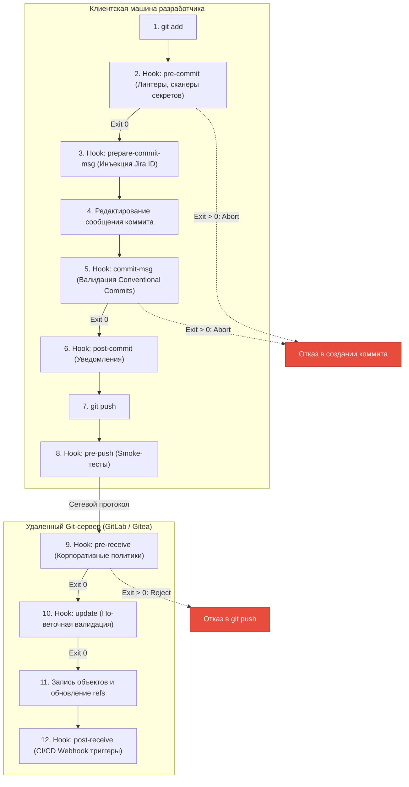

# 🪝 24. Git Hooks: Клиентские и Серверные хуки, Pre-Commit и Автоматизация безопасности

Git Hooks — это скрипты-триггеры, автоматически исполняемые Git на ключевых этапах жизненного цикла коммита, ветвления и отправки данных. Хуки разделяются на **клиентские (Client-side)** и **серверные (Server-side)**.

---

## 🏛️ 1. Архитектура и цепочка исполнения Hooks



> [!CAUTION]
> **Принцип безопасности:** Клиентские хуки не являются рубежом защиты, так как разработчик может обойти их флагом `git commit --no-verify`. **Единственным надежным барьером** для соблюдения политик безопасности и комплаенса являются **серверные хуки (pre-receive)**.

---

## 💻 2. Production Hook: Валидация Conventional Commits (`commit-msg`)

Сохраните в `.githooks/commit-msg` и сделайте исполняемым (`chmod +x`):

```bash
#!/usr/bin/env bash
set -euo pipefail

# Файл с текстом сообщения коммита передается первым аргументом
MSG_FILE="$1"
COMMIT_MSG=$(head -n 1 "$MSG_FILE")

# Регулярное выражение для формата: type(scope)!: subject
REGEX="^(feat|fix|docs|style|refactor|perf|test|build|ci|chore|revert)(\([a-z0-9_-]+\))?!?: .+$"

# Исключаем автоматические merge-коммиты
if [[ "$COMMIT_MSG" =~ ^Merge ]]; then
    exit 0
fi

if ! [[ "$COMMIT_MSG" =~ $REGEX ]]; then
    echo "❌ ОШИБКА: Сообщение коммита не соответствует спецификации Conventional Commits!"
    echo "📌 Пример: feat(auth): add OAuth2 JWT validation"
    echo "📌 Ваш ввод: \"$COMMIT_MSG\""
    exit 1
fi

echo "✅ Сообщение коммита валидно."
```

Подключение общего каталога хуков для всей команды:
```bash
git config core.hooksPath .githooks
```

---

## 🛡️ 3. Серверный Hook безопасности: `pre-receive` (Защита от утечки секретов и некорректных email)

Этот скрипт размещается на сервере (GitLab Custom Hooks / Gitea) и блокирует отправку коммитов, содержащих секреты или созданных с неавторизованных корпоративных email-адресов:

```bash
#!/usr/bin/env bash
set -euo pipefail

# Читаем строки из stdin: <oldrev> <newrev> <refname>
while read -r OLDREV NEWREV REFNAME; do
    # Игнорируем удаление веток
    if [ "$NEWREV" = "0000000000000000000000000000000000000000" ]; then
        continue
    fi

    # Для новых веток сравниваем с базовой веткой main
    if [ "$OLDREV" = "0000000000000000000000000000000000000000" ]; then
        SPAN="$NEWREV --not $(git for-each-ref --format='%(refname)' refs/heads/ | grep -v "^$REFNAME$")"
    else
        SPAN="$OLDREV..$NEWREV"
    fi

    # 1. Проверка корпоративного домена автора email
    AUTHORS=$(git log --format='%ae' $SPAN | sort -u)
    for AUTHOR in $AUTHORS; do
        if ! [[ "$AUTHOR" =~ @company\.com$ ]]; then
            echo "❌ ОШИБКА: Запрещен push коммитов с не-корпоративным email: $AUTHOR"
            exit 1
        fi
    done

    # 2. Сканирование коммитов на наличие захардкоженных приватных ключей и токенов
    for COMMIT in $(git rev-list $SPAN); do
        DIFF_CONTENT=$(git diff-tree -p "$COMMIT")
        if echo "$DIFF_CONTENT" | grep -Eq "BEGIN RSA PRIVATE KEY|BEGIN OPENSSH PRIVATE KEY|AKIA[0-9A-Z]{16}"; then
            echo "🚨 КРИТИЧЕСКАЯ УЯЗВИМОСТЬ: В коммите $COMMIT обнаружен секретный ключ или токен AWS!"
            exit 1
        fi
    done
done

echo "✅ Серверные проверки пройдены успешно."
exit 0
```

---

## 📦 4. Enterprise Framework: Конфигурация `.pre-commit-config.yaml`

Стандарт индустрии для управления клиентскими проверками:

```yaml
repos:
  - repo: https://github.com/pre-commit/pre-commit-hooks
    rev: v4.6.0
    hooks:
      - id: trailing-whitespace
      - id: end-of-file-fixer
      - id: check-yaml
      - id: check-added-large-files
        args: ['--maxkb=500']
      - id: check-merge-conflict

  - repo: https://github.com/gitleaks/gitleaks
    rev: v8.18.2
    hooks:
      - id: gitleaks

  - repo: https://github.com/golangci/golangci-lint
    rev: v1.59.1
    hooks:
      - id: golangci-lint
```

Установка и запуск:
```bash
# Установка хуков в репозиторий
pre-commit install --hook-type pre-commit --hook-type commit-msg

# Прогон по всей кодовой базе (например, в CI)
pre-commit run --all-files
```

---

## 🛠️ 5. Инженерный CLI Cheat Sheet

| Команда | Описание |
| :--- | :--- |
| `git config core.hooksPath .githooks` | Задать версионируемый каталог для хуков вместо `.git/hooks/` |
| `git commit --no-verify` (или `-n`) | Обойти клиентские хуки `pre-commit` и `commit-msg` |
| `git push --no-verify` | Обойти клиентский хук `pre-push` |
| `chmod +x .git/hooks/*` | Сделать все хуки исполняемыми в Linux/macOS |
| `pre-commit autoupdate` | Автоматически обновить версии репозиториев в `.pre-commit-config.yaml` |

---

## 🚨 6. Production Troubleshooting & Break-Fix

### Сценарий: Хуки не запускаются после клонирования репозитория
- **Симптом:** Файлы хуков лежат в репозитории, но Git их игнорирует.
- **Причина:** 
  1. Каталог `.git/hooks` не версионируется Git в целях безопасности.
  2. Файлы скриптов не имеют флага исполнения (`+x`).
- **Исправление:**
  ```bash
  # 1. Задаем путь к версионируемой папке хуков
  git config core.hooksPath .githooks

  # 2. Выставляем права на исполнение
  chmod +x .githooks/*
  ```
