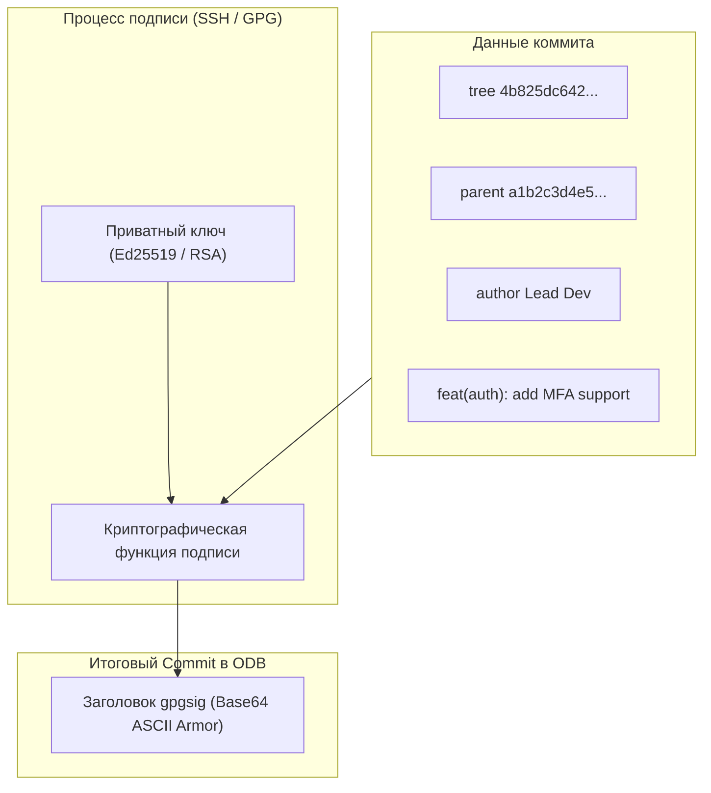
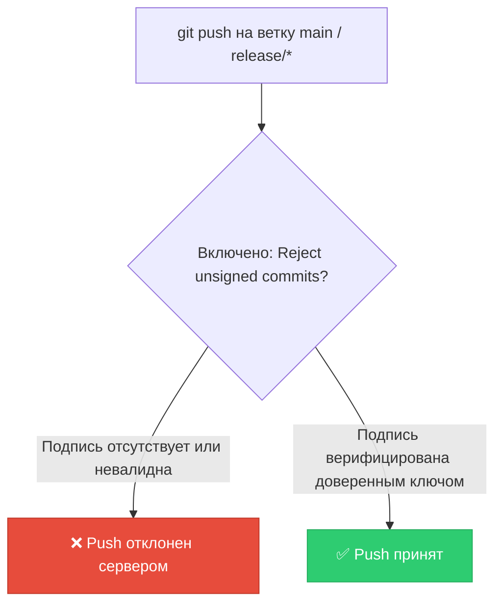

# 🔐 25. Подпись коммитов и тегов: GPG, SSH и S/MIME криптографическая верификация

В стандартном Git имя и email автора коммита (`Author` и `Committer`) являются произвольными текстовыми строками. Любой злоумышленник может создать коммит от имени `CEO` или ведущего инженера безопасности.

Для защиты цепочки поставок ПО (Software Supply Chain Security, SLSA, SOC 2) используется **криптографическая подпись коммитов и тегов**.

---

## 🏛️ 1. Архитектура криптографической подписи

При создании подписанного коммита Git берет хэш дерева `tree`, хэши родителей `parent`, метаданные автора и текст сообщения, вычисляет цифровую подпись приватным ключом и внедряет ее прямо в заголовок объекта коммита:



---

## 🔑 2. Современный стандарт: Подпись через SSH-ключи (Git 2.34+)

Вместо сложного в настройке `GPG Agent` современный Git позволяет подписывать коммиты теми же SSH-ключами, которые используются для авторизации в GitHub/GitLab:


### Пошаговая настройка SSH-подписи:
1. **Генерация SSH ключа Ed25519:**
   ```bash
   ssh-keygen -t ed25519 -C "dev@company.com" -f ~/.ssh/id_ed25519_signing
   ```
2. **Конфигурация Git:**
   ```bash
   # Переключение формата подписи на SSH
   git config --global gpg.format ssh

   # Указание публичного ключа подписи
   git config --global user.signingkey ~/.ssh/id_ed25519_signing.pub

   # Включение обязательной автоподписи для всех коммитов и тегов
   git config --global commit.gpgsign true
   git config --global tag.gpgsign true
   ```

---

## 🛡️ 3. Локальная верификация подписей коллег (`allowed_signers`)

Чтобы Git мог локально проверять SSH-подписи других разработчиков, создается файл доверенных ключей `allowed_signers`:

```text
# ~/.ssh/allowed_signers
dev@company.com ssh-ed25519 AAAAC3NzaC1lZDI1NTE5AAAAIG7...
lead@company.com ssh-ed25519 AAAAC3NzaC1lZDI1NTE5AAAAIOr...
```

Регистрация файла в Git:
```bash
git config --global gpg.ssh.allowedSignersFile ~/.ssh/allowed_signers
```

---

## 🛠️ 4. Инженерный CLI Cheat Sheet

| Команда | Описание |
| :--- | :--- |
| `git commit -S -m "msg"` | Создать подписанный коммит вручную (если автоподпись выключена) |
| `git tag -s v1.0.0 -m "Release"` | Создать подписанный аннотированный тег |
| `git verify-commit <commit-sha>` | Проверить криптографическую подпись коммита |
| `git verify-tag <tag-name>` | Проверить криптографическую подпись тега |
| `git log --show-signature -n 5` | Вывести историю коммитов с полной информацией о подписях и валидности |
| `git cat-file -p <commit-sha>` | Показать сырой блок подписи `gpgsig` внутри коммита |

---

## ⚙️ 5. Серверный комплаенс: Принудительная подпись в GitLab/GitHub

Для соответствия стандартам SOC2 и PCI-DSS на сервере настраиваются **Push Rules / Branch Protection Rules**:



---

## 🚨 6. Production Troubleshooting & Break-Fix

### Сценарий 1: Ошибка `error: gpg failed to sign the data: Inappropriate ioctl for device`
- **Симптом:** При использовании GPG команда `git commit` падает в терминале.
- **Причина:** Утилита `gpg-agent` не может открыть интерактивное окно для ввода парольной фразы (PIN), так как не установлена переменная `GPG_TTY`.
- **Исправление:**
  ```bash
  # Добавьте в ~/.bashrc или ~/.zshrc:
  export GPG_TTY=$(tty)

  # Перезапуск агента
  gpg-connect-agent reloadagent /bye
  ```

### Сценарий 2: Git показывает подпись как `error: gpg.ssh.allowedSignersFile needs to be configured`
- **Симптом:** `git log --show-signature` ругается на отсутствие доверенных ключей.
- **Исправление:**
  ```bash
  touch ~/.ssh/allowed_signers
  # Добавляем публичный ключ своего автора:
  echo "$(git config user.email) $(cat ~/.ssh/id_ed25519_signing.pub)" >> ~/.ssh/allowed_signers
  git config --global gpg.ssh.allowedSignersFile ~/.ssh/allowed_signers
  ```
