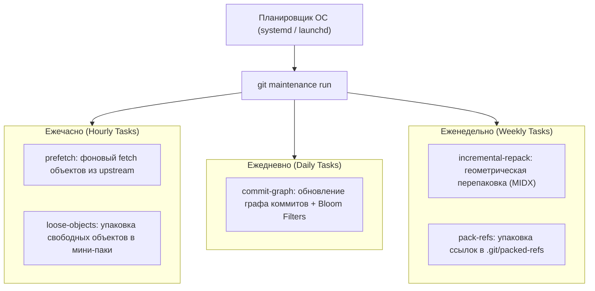
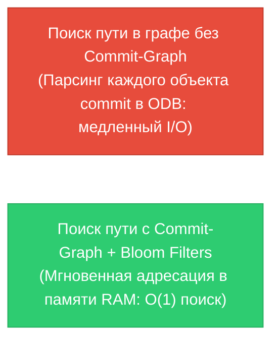

# ⚙️ 26. Git Maintenance: Фоновая оптимизация, Commit-Graph и Incremental MIDX

В монорепозиториях и крупных проектах с тысячами веток и миллионами коммитов традиционный `git gc` становится слишком ресурсоемким и приводит к зависаниям терминала разработчика.

Для решения этой проблемы в Git 2.30+ появилась встроенная подсистема **`git maintenance`**, работающая в фоновом режиме через планировщики ОС (`systemd timers`, `cron`, `launchd`).

---

## 🏛️ 1. Архитектура задач `git maintenance`



### Задачи оптимизации:
1. **`prefetch`:** Скачивает новые объекты из удаленного репозитория в скрытое пространство ссылок `refs/prefetch/`, не блокируя рабочую ветку. Когда инженер вводит `git fetch` или `git pull`, все объекты уже лежат на диске, и операция завершается мгновенно.
2. **`commit-graph`:** Генерирует бинарный файл структуры графа с вычислением номеров поколений коммитов (generation numbers), ускоряя `git log`, `git merge-base` и `git branch --contains` в 10–50 раз.
3. **`loose-objects`:** Очищает директорию `.git/objects/` от сотен мелких файлов.
4. **`incremental-repack`:** Выполняет перепаковку по алгоритму геометрической прогрессии (geometric repacking), предотвращая необходимость перезаписи гигабайтных пакфайлов.

---

## 🚀 2. Ускорение истории через Commit-Graph и фильтры Блума

Бинарный файл `.git/objects/info/commit-graph` содержит оптимизированную матрицу связей DAG:



### Включение фильтров Блума для ускорения `git log <path>`:
Фильтры Блума (Bloom Filters) позволяют Git мгновенно отвечать на вопрос: *«Менял ли коммит X путь Y?»* без распаковки дерева объектов `tree`.

```bash
git config --global commitGraph.readChangedPaths true
git config --global commitGraph.generationVersion 2
```

---

## 🛠️ 3. Инженерный CLI Cheat Sheet

| Команда | Описание |
| :--- | :--- |
| `git maintenance start` | Зарегистрировать репозиторий и активировать фоновые таймеры ОС |
| `git maintenance stop` | Отключить фоновые таймеры и дерегистрировать репозиторий |
| `git maintenance run --task=commit-graph` | Принудительно пересчитать Commit-Graph прямо сейчас |
| `git maintenance run --task=prefetch` | Выполнить фоновый prefetch объектов |
| `git maintenance run --task=incremental-repack` | Запустить геометрическую упаковку packfile-ов |
| `git commit-graph verify` | Проверить целостность файла commit-graph |
| `systemctl --user list-timers | grep git` | Проверить статус фоновых systemd-таймеров Git в Linux |

---

## ⚙️ 4. Production Конфигурация для Monorepo

```ini
[maintenance]
    # Автоматически регистрировать репозитории
    auto = true
    strategy = incremental

[maintenance "prefetch"]
    enabled = true

[maintenance "commit-graph"]
    enabled = true

[maintenance "incremental-repack"]
    enabled = true

[commitGraph]
    generationVersion = 2
    readChangedPaths = true

[core]
    # Многопоточная запись индекса
    threads = 0
```

---

## 🚨 5. Production Troubleshooting & Break-Fix

### Сценарий 1: Ошибка `error: commit-graph file is corrupt`
- **Симптом:** Любые команды чтения истории (`git log`, `git status`) выводят предупреждение о повреждении файла графа.
- **Причина:** Некорректное завершение фонового процесса записи при выключении машины.
- **Исправление:**
  ```bash
  # 1. Удаление поврежденного файла графа
  rm -f .git/objects/info/commit-graph
  rm -rf .git/objects/info/commit-graphs/

  # 2. Полная перегенерация с фильтрами Блума
  git commit-graph write --reachable --changed-paths
  ```

### Сценарий 2: Фоновое обслуживание Git тратит батарею или ресурсы ноутбука
- **Симптом:** Фоновые процессы `git-maintenance` грузят CPU во время ресурсоемких задач.
- **Исправление:**
  ```bash
  # Отключение prefetch или ограничение запуска только вручную
  git config maintenance.prefetch.enabled false
  ```
