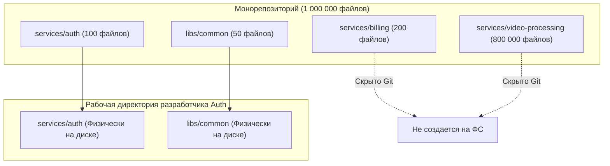

# 🚀 27. Оптимизация больших репозиториев: Sparse Checkout, Shallow и Partial Clones, Scalar

В корпоративных монорепозиториях (сотни гигабайт истории, миллионы файлов и коммитов) стандартный `git clone` становится невозможным: он исчерпывает память RAM, перегружает сеть и забивает дисковый I/O.

Git предоставляет четыре уровня оптимизации для работы с гигантскими кодовыми базами.

---

## 🏛️ 1. Уровни оптимизации клонирования


### Сравнительная таблица методов:

| Метод | Что скачивается по сети | Полнота истории коммитов | Возможность Rebase/Blame | Идеальный сценарий |
| :--- | :--- | :---: | :---: | :--- |
| **Full Clone** | 100% данных | Полная | Да | Небольшие проекты (< 2 GB) |
| **Shallow Clone** (`--depth=N`) | Только $N$ последних коммитов | Усеченная | Нет | Одноразовые CI/CD билды |
| **Blobless Clone** (`--filter=blob:none`) | Все коммиты и деревья, блобы лениво | Полная | **Да** | **Рабочая станция инженера** |
| **Treeless Clone** (`--filter=tree:0`) | Только коммиты | Полная | Ограниченно | Быстрые CI билды с полным DAG |

---

## 🌲 2. Sparse Checkout (Cone Mode)

Механизм **Sparse Checkout** позволяет разработчику извлекать в рабочую директорию только те каталоги, которые нужны для его сервиса, игнорируя остальные миллионы файлов:



### Включение Cone Mode (Режим конуса путей):
Cone mode оптимизирует сопоставление путей с алгоритмической сложности $O(N)$ до $O(1)$ по префиксу каталогов.

```bash
# Инициализация sparse-checkout в режиме конуса
git sparse-checkout init --cone

# Выбор только необходимых сервисов и библиотек
git sparse-checkout set services/auth libs/common

# Проверка активного списка путей
git sparse-checkout list
```

---

## ⚡ 3. Идеальный сетап для разработчика: Blobless Clone + Sparse Checkout

Скрипт развертывания рабочего места в огромном монорепозитории:

```bash
#!/usr/bin/env bash
set -euo pipefail

REPO_URL="https://github.com/company/mega-monorepo.git"
TARGET_DIR="mega-monorepo"

echo "🚀 Клонирование метаданных монорепозитория без тяжелых блобов..."

# 1. Скачиваем все коммиты и структуры каталогов, но БЕЗ содержимого файлов
git clone --filter=blob:none --no-checkout "$REPO_URL" "$TARGET_DIR"
cd "$TARGET_DIR"

# 2. Активируем режим выборки директорий
git sparse-checkout init --cone

# 3. Выбираем только свой сервис
git sparse-checkout set services/order-service libs/proto

# 4. Извлекаем файлы на диск (Git скачает блобы только для выбранных папок)
git checkout main

echo "✅ Монорепозиторий готов к мгновенной работе!"
```

---

## 🎛️ 4. Инструмент Microsoft Scalar (Встроен в Git 2.38+)

Утилита **Scalar** автоматически настраивает десятки низкоуровневых параметров производительности Git (fsmonitor, commit-graph, untracked cache, geometric repack, sparse-checkout) одной командой:

```bash
# Клонирование и автонастройка гигантского репозитория через Scalar
scalar clone https://github.com/company/mega-monorepo.git

# Проверка статуса фонового обслуживания
scalar list
```

---

## 🛠️ 5. Инженерный CLI Cheat Sheet

| Команда | Описание |
| :--- | :--- |
| `git clone --depth=1 --no-single-branch <url>` | Быстрый shallow clone всех веток на глубину 1 коммита |
| `git clone --filter=blob:none <url>` | Blobless clone (рекомендуемый стандарт для разработчиков) |
| `git clone --filter=tree:0 <url>` | Treeless clone (максимально быстрый для CI) |
| `git fetch --unshallow` | Преобразовать shallow clone в полноценный репозиторий с полной историей |
| `git sparse-checkout set <dir1> <dir2>` | Задать список отслеживаемых папок |
| `git sparse-checkout add <dir3>` | Добавить папку к текущему sparse списку |
| `git sparse-checkout disable` | Отключить sparse checkout и извлечь весь репозиторий на диск |

---

## 🚨 6. Production Troubleshooting & Break-Fix

### Сценарий 1: CI/CD пайплайн падает на `git describe` или вычислении версии в Shallow clone
- **Симптом:** Шаг генерации SemVer падает с ошибкой `fatal: No names found, cannot describe anything`.
- **Причина:** Shallow clone (`--depth=1`) не содержит объектов тегов и коммитов в прошлом.
- **Исправление в CI пайплайне:**
  ```bash
  # Докачать историю и теги перед расчетом версии
  git fetch --tags --unshallow || git fetch --tags
  ```

### Сценарий 2: Тесты в CI падают из-за отсутствия конфигурационного файла вне sparse-конуса
- **Симптом:** Тесты требуют `configs/global.yaml`, но sparse checkout его не загрузил.
- **Исправление:**
  ```bash
  git sparse-checkout add configs
  ```
