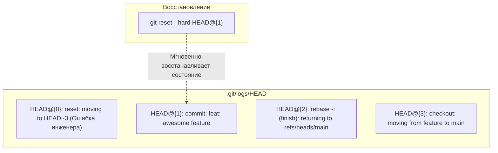
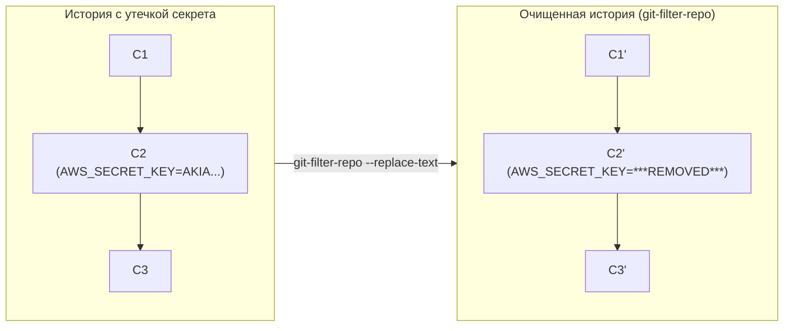

# 🚑 28. Git Recovery Handbook: Reflog, Восстановление истории и Очистка секретов

В Git практически невозможно безвозвратно уничтожить данные по ошибке: любая операция изменения ссылок протоколируется в журнале **Reflog**, а объекты остаются в базе данных до срабатывания сборщика мусора.

---

## 🧭 1. Машина времени: Анатомия `git reflog`

Файлы `.git/logs/HEAD` и `.git/logs/refs/heads/<branch>` хранят упорядоченный список всех изменений указателей:



### Формат записи в Reflog:
```text
<old-sha> <new-sha> <author-name> <email> <timestamp> <command-action>: <description>
```

---

## 🛠️ 2. Плейбуки восстановления данных (Disaster Recovery Playbooks)

### Плейбук 1: Восстановление случайно удаленной локальной ветки
```bash
# 1. Находим SHA последнего коммита в удаленной ветке
git reflog | grep "checkout: moving from feature-billing"
# Вывод: a1b2c3d HEAD@{4}: checkout: moving from feature-billing to main

# 2. Пересоздаем ветку на базе найденного SHA
git branch feature-billing a1b2c3d
```

### Плейбук 2: Откат неудачного Rebase или Merge
```bash
# Git автоматически сохраняет точку до начала операции в ссылке ORIG_HEAD
git reset --hard ORIG_HEAD
```

### Плейбук 3: Восстановление потерянного Stash (`git stash drop`)
```bash
# 1. Находим висячий коммит дропнутого стэша
git fsck --unreachable | awk '/commit/ {print $3}' | xargs git log --merges --no-walk --grep="WIP on"

# 2. Применяем найденный хэш стэша
git stash apply e5f6g7h
```

---

## 🚨 3. Аварийная очистка секретов из всей истории (`git-filter-repo`)

> [!CAUTION]
> Создание коммита `fix: remove api key` **НЕ УДАЛЯЕТ** секрет из истории. Злоумышленник скачает старый blob за секунду. Токен должен быть немедленно отозван (revoked) у провайдера, а история репозитория переписана.

Устаревшая утилита `git filter-branch` медленна и опасна. Стандарт индустрии — **`git-filter-repo`**:



### Скрипт полной зачистки секрета:
```bash
#!/usr/bin/env bash
set -euo pipefail

# 1. Создаем файл выражений для замены
cat << 'EOF' > expressions.txt
regex:AKIA[0-9A-Z]{16}==>***AWS_KEY_REMOVED***
password123==>***PASSWORD_REMOVED***
EOF

# 2. Устанавливаем утилиту
pip install --user git-filter-repo

# 3. Переписываем всю историю для всех веток и тегов
git-filter-repo --replace-text expressions.txt --force

# 4. Очищаем локальные мусорные ссылки и reflog
rm -rf .git/refs/original/
git reflog expire --expire=now --all
git gc --prune=now --aggressive

# 5. Принудительный push в upstream
echo "⚠️ ВНИМАНИЕ: Требуется git push --force --all && git push --force --tags"
```

---

## 🔒 4. Снятие блокировок Lock-файлов (`index.lock`)

Если процесс Git упал в середине операции, в каталоге остается файл блокировки:
```text
fatal: Unable to create '/path/to/.git/index.lock': File exists.
Another git process seems to be running in this repository.
```

### Безопасное снятие блокировки:
```bash
# 1. Проверяем, действительно ли запущен фоновый git-процесс
pgrep -fl git || true

# 2. Если процессов нет, удаляем зависший lock-файл
rm -f .git/index.lock .git/refs/heads/*.lock
```

---

## 🛠️ 5. Инженерный CLI Cheat Sheet

| Команда | Описание |
| :--- | :--- |
| `git reflog show HEAD -n 20` | Вывести последние 20 действий с указателем `HEAD` |
| `git reflog show refs/heads/main` | Показать историю перемещения конкретной ветки `main` |
| `git reset --hard HEAD@{2}` | Откатить состояние репозитория на 2 шага reflog назад |
| `git reset --hard "HEAD@{yesterday}"` | Откатить состояние на вчерашний день |
| `git filter-repo --invert-paths --path "secrets.env"` | Полностью удалить файл `secrets.env` из всей истории проекта |
| `git fsck --lost-found` | Выгрузить все потерянные коммиты и блобы в `.git/lost-found/` |

---

## 🚨 6. Production Troubleshooting & Break-Fix

### Сценарий: Повреждение журнала `fatal: reflog for 'HEAD' is corrupt`
- **Симптом:** Файл reflog поврежден из-за аппаратного сбоя диска.
- **Исправление:**
  ```bash
  # 1. Делаем резервную копию
  cp .git/logs/HEAD .git/logs/HEAD.bak

  # 2. Очищаем битый reflog
  rm -f .git/logs/HEAD

  # 3. Git автоматически начнет вести журнал заново с текущего коммита
  git status
  ```
